# 素材剪辑：从当前单轨阶段到完整 MVP 的分阶段技术方案

| 属性 | 内容 |
| --- | --- |
| 日期 | 2026-08-10 |
| 状态 | 调研完成，待按阶段实施 |
| 唯一上位验收 | [`21-video-material-editor-spec.md` 第 7 节](../21-video-material-editor-spec.md#7-mvp-验收) |
| 当前实施基线 | [`2026-08-10-video-material-editor-phase1-technical-plan.md`](2026-08-10-video-material-editor-phase1-technical-plan.md) |
| 一手资料 | [`2026-08-10-video-editor-mvp-completion-primary-sources.md`](../research/2026-08-10-video-editor-mvp-completion-primary-sources.md) |
| 产品形态 | Project 内独立通用剪辑器；短剧前贴只是第一个快捷入口 |
| 默认输出 | MP4 / H.264 / AAC / 720×1280 / 9:16 / 30fps / 48kHz |

## 1. 结论

当前代码已经从静态原型进入了**单主视频轨可用阶段**：可以创建空 EditTask，从 Project 素材箱加入或拖入视频，排序、裁切、分割、删除、吸附、缩放、撤销重做，保存不可变 TimelineVersion，刷新恢复，并创建带进度、取消、失败和重试的 RenderJob。短剧前贴 V2 和已冻结广告成片也已有进入编辑器的服务端入口。

这还不是上位规格定义的完整 MVP。完整 MVP 的剩余主线不是继续在现有扁平 `clips[]` 上堆按钮，而是依次完成：

1. 统一的素材使用策略、代理和派生资产基础；
2. 永久兼容 v1 的 `editing-timeline/v2` 多轨领域模型和 operation API；
3. 三条视觉轨、图片、三种画布比例与可直接操控的画面变换；
4. 自动字幕、人工校对、品牌字体和确定性烧录；
5. 原声、配音、音乐、音效、波形、音量、静音和淡入淡出；
6. 同一冻结时间线驱动低清预览、正式导出、CreativeVersion 和完整血缘；
7. 跨设备、授权失效、固定媒体 golden、性能和全链路 E2E 的最终验收。

建议从现在起按 **C0–C7 八个阶段**实施。每个阶段都有用户可见结果、文件级改造、数据迁移、自动化测试和退出门槛；任何阶段没有通过退出门槛，都不进入下一阶段。

## 2. 已确认且不再反复讨论的产品决策

1. 素材剪辑是 Project 级通用工具，不是第三种广告类型，也不绑定“前贴 + 原视频”这一种用法。
2. 用户可以独立进入；短剧前贴 V2 生成后可携带素材进入；已冻结品牌/效果广告成片通过 CreativeVersion 通用入口进入。
3. 素材上传、素材预览、加入时间线、保存和渲染是五个独立动作。上传或预览不得隐式改变时间线。
4. 原始 AssetVersion 永不覆盖；所有编辑是非破坏性的 source range、transform、text style 和 audio mix 参数。
5. cookies 的 TimelineVersion、AssetVersion、Project 权限和 Go RenderJob 是事实源；OpenCut 只提供固定版本上的交互算法来源。
6. 浏览器即时预览用于编辑反馈，不是权威成片；低清权威预览和正式导出必须由同一 compiler/renderer 产生。
7. v1 历史任务永久可读、可渲染；多轨能力新增 v2，不在 v1 中偷加未声明字段。
8. 现有左素材箱、中央预览、右属性检查器、底部时间线的视觉骨架保留，不另造一套页面。

## 3. 当前代码基线审计

### 3.1 已完成能力

| 能力 | 当前实现证据 | 判断 |
| --- | --- | --- |
| 独立空任务 | [`VideoEditingWorkspace.tsx`](../../src/features/video-editing/VideoEditingWorkspace.tsx)、[`edit_task.go`](../../internal/systems/creative/edit_task.go) | 已完成；空任务与可渲染时间线已分离 |
| 短剧前贴入口 | [`ShortDramaPrerollWorkspace.tsx`](../../src/features/short-drama-preroll-v2/ShortDramaPrerollWorkspace.tsx) | 已完成首个自动入口 |
| 品牌/效果成片入口 | [`editing_handlers.go`](../../internal/platform/httpserver/editing_handlers.go)、[`SpecializedPages.tsx`](../../src/components/SpecializedPages.tsx) | 服务和通用入口已存在，仍需正式 E2E |
| 稳定素材引用 | `AssetVersionRef`、不可变 TimelineVersion | 单轨范围完成 |
| 单主轨编辑 | [`timeline.ts`](../../src/features/video-editing/timeline.ts)、[`VideoTimeline.tsx`](../../src/features/video-editing/VideoTimeline.tsx) | add/move/trim/split/delete/snap/zoom/undo/redo 已实现 |
| 保存与冲突 | [`saveCoordinator.ts`](../../src/features/video-editing/saveCoordinator.ts) | latest-wins 串行保存、409 UI 已有 |
| RenderJob 生命周期 | [`editing_render.go`](../../internal/systems/creative/editing_render.go) | queue/progress/cancel/fail/retry/reuse 已有，入队失败会终结 |
| 输出血缘 | `IngestRenderedVideoWithSources` | 已记录输入 AssetVersion 与 TimelineVersion |
| OpenCut 治理 | [`third_party/opencut-timeline`](../../third_party/opencut-timeline) | 固定 SHA、MIT、NOTICE、SBOM、性能与退出文档已具备 |
| 单轨 E2E | [`video-editor-phase1.spec.ts`](../../e2e/video-editor-phase1.spec.ts) | 空任务→加素材→保存 v1→刷新恢复已通过 |

### 3.2 仍未完成的能力

| 缺口 | 当前限制 | 对上位验收的影响 |
| --- | --- | --- |
| 正式任务列表与稳定深链 | 当前主要依靠视频创作页 query/context；EditTask 只有 `draft` | 入口、换设备恢复、任务状态页不完整 |
| 多视觉轨与图片 | v1 只有唯一连续 `primary_video`，Render IR 只有线性视频 | 无法达到 3 条视频/叠加轨、图片和画布定位 |
| 字幕样式和字体 | v1 只有纯文本；ASS 使用固定样式 | 第 4 项无法证明字体和字幕一致 |
| 完整音频编辑 | v1 后端能表达基础 gain/loop，但前端无音频轨、波形、fade、mute | 第 4 项音轨一致性未完成 |
| 代理与派生资产 | Assets 当前没有完整 AssetDerivative/ProcessingJob 产品链路 | 大素材预览、波形和代理复用不足 |
| 权利策略 | Project/ready/source range 已校验；Assets 尚无统一版本化 rights policy | 第 6 项过期、地域、渠道和用途无法验收 |
| 权威 golden | 已有 gated FFmpeg 集成测试，但本机无 FFmpeg 和真实 fixture | 第 4 项无真实运行证据 |
| CreativeVersion 回流 | 编辑成片回到 Asset，但 EditTask 输出尚未正式冻结为 CreativeVersion | 后续检查、评审、交付链路未闭合 |
| 逐帧评审与渠道检查 | 尚未接入编辑成片 | P0 范围仍缺 |
| 浏览器真实性能基线 | 当前主要是纯函数 Node benchmark | 多轨 pointer、波形、字幕场景尚无浏览器基线 |

### 3.3 第 7 节七项 MVP 当前完成度

| # | 验收项 | 当前状态 | 完整通过还缺什么 |
| --- | --- | --- | --- |
| 1 | 独立创建；品牌/效果任务携带素材进入 | 部分完成 | 稳定任务列表/深链；品牌、效果、短剧三入口 E2E；来源版本展示 |
| 2 | 全部媒体稳定 Asset ID/Version，原片不覆盖 | 单轨完成 | v2 的视频、图片、音频、字体全部使用版本引用；派生资产与原件关系 |
| 3 | 刷新/换设备恢复；冲突不静默覆盖 | 基础完成 | 两个浏览器 context 的跨设备冲突验收；稳定路由恢复；操作审计 |
| 4 | 低清预览与导出在时序、裁切、字幕、字体、音轨上一致 | 未完成 | v2 compiler、同字体包、字幕/音频 UI、真实 FFmpeg golden |
| 5 | RenderJob 排队、取消、进度、失败、重试、部分代理复用 | 大部分完成 | 代理派生缓存、renderer fingerprint、队列超时/心跳、容量与取消集成测 |
| 6 | 无权、过期、范围不符素材无法预览/导出/跨 Project | 部分完成 | AssetRights、用途决策、地域/渠道/期限、短期 URL、执行前二次校验 |
| 7 | OpenCut 固定版本、许可证、性能、上游策略和退出方案 | 基础完成 | 多轨浏览器性能基线、CI 治理检查、定期升级/退出演练记录 |

## 4. 目标架构

```mermaid
flowchart LR
  ENTRY["独立入口 / 品牌 / 效果 / 短剧前贴"] --> TASK["EditTask + 稳定深链"]
  CATALOG["Project Asset Catalog"] --> POLICY["AssetUsePolicy"]
  POLICY --> DERIV["Proxy / Poster / Waveform / Font Derivative"]
  DERIV --> UI["React Editor Workspace"]
  UI --> KERNEL["Editor Kernel + Operation History"]
  KERNEL --> CODEC["Timeline Codec Registry v1/v2"]
  CODEC --> API["Go Editing API"]
  API --> VERSION["Immutable TimelineVersion + Operation Audit"]
  VERSION --> COMPILER["Compiler Registry → RenderIR"]
  POLICY --> COMPILER
  COMPILER --> JOB["RenderJob + JobRuntime"]
  JOB --> FFMPEG["Controlled FFmpeg Worker"]
  FFMPEG --> OUTPUT["Output AssetVersion + CreativeVersion"]
  OUTPUT --> CATALOG
  OUTPUT --> REVIEW["检查 / 逐帧评审 / 交付"]
```



### 4.1 深模块与稳定 seam

| 模块 | 对外 interface | 隐藏内容 |
| --- | --- | --- |
| Editor Kernel | `apply(document, operation)` | 帧时间、轨道不变量、ID、move/trim/split/delete/transform/text/audio |
| Codec Registry | `decode/encode/migrate` | v1/v2 映射、兼容诊断、未知版本拒绝 |
| Asset Catalog | `list/resolve/upload` | Project 查询、短期 URL、proxy 状态、分页检索 |
| AssetUsePolicy | `authorize(actor, project, refs, purpose, target)` | scope、Project、ready、rights、expiry、channel、territory、derivative permission |
| Derivative Service | `ensure(assetRef, profile)` | 代理、封面、波形、字体转换、去重、处理 Job |
| Preview Scheduler | `resolve(document, playhead)` | 当前可见层、媒体时钟、代理切换、音频同步 |
| Save Coordinator | `submit(operations, baseVersion)` | debounce、单飞、latest pending、409、离开保护 |
| Compiler Registry | `compile(envelope, profile)` | v1/v2→RenderIR、诊断、版本指纹 |
| Render Orchestrator | `create/get/cancel/retry` | 冻结、幂等、outbox/补偿、心跳、临时目录 |
| Output Lineage Writer | `ingest(output, provenance)` | AssetVersion、关系、CreativeVersion、幂等回流 |

这些 seam 允许后续增加转场、速度、关键帧和 AI EditOperation，而不修改 Asset、EditTask、TimelineVersion 和 RenderJob 的所有权边界。

## 5. `editing-timeline/v2` 数据合同

### 5.1 为什么必须新增 v2

v1 的不变量是“恰好一条从 0 连续闭合到总时长的主视频轨”，且字幕没有样式、音频没有 fade/mute、没有图片/叠加/transform。直接向 v1 加字段会让历史 content hash、旧 validator、旧 compiler 和旧 RenderJob 语义漂移。因此：

- v1 永久只读其原语义；
- v1 任务仍可继续编辑单轨并导出；
- 当用户第一次使用多轨、图片、画布、字幕样式或完整音频时，显式创建 v2 的下一 TimelineVersion；
- 迁移是 `v1 → v2` 单向、确定性且有测试，不原地覆盖 v1 快照。

### 5.2 建议合同

```ts
type EditingTimelineV2 = {
  schema_version: 'editing-timeline/v2'
  timebase: { frame_rate_num: 30; frame_rate_den: 1 }
  canvas: {
    profile_id: 'vertical-720p-v1' | 'landscape-720p-v1' | 'square-1080-v1'
    width: number
    height: number
    sample_rate: 48000
    background: { type: 'color'; value: string }
  }
  duration_frames: number
  tracks: Array<VisualTrack | CaptionTrack | AudioTrack>
}

type VisualTrack = {
  id: string
  kind: 'visual'
  role: 'primary' | 'overlay'
  z_index: 0 | 1 | 2
  muted: boolean
  locked: boolean
  clips: Array<VideoClip | ImageClip>
}

type VideoClip = {
  id: string
  kind: 'video'
  asset_ref: AssetVersionRef
  timeline: { start_frame: number; duration_frames: number }
  source: { in_us: number; out_us: number }
  transform: VisualTransform
  original_audio: { enabled: boolean; gain_db: number; fade_in_frames: number; fade_out_frames: number }
}

type ImageClip = {
  id: string
  kind: 'image'
  asset_ref: AssetVersionRef
  timeline: { start_frame: number; duration_frames: number }
  transform: VisualTransform
}

type VisualTransform = {
  fit: 'contain' | 'cover'
  position_x: number
  position_y: number
  scale: number
  crop: { left: number; top: number; right: number; bottom: number }
  opacity: number
}

type CaptionTrack = {
  id: string
  kind: 'caption'
  language: string
  clips: CaptionClip[]
}

type CaptionClip = {
  id: string
  timeline: { start_frame: number; duration_frames: number }
  text: string
  style_ref: { style_id: string; version: number }
}

type AudioTrack = {
  id: string
  kind: 'audio'
  role: 'voiceover' | 'music' | 'sfx'
  muted: boolean
  clips: AudioClip[]
}

type AudioClip = {
  id: string
  asset_ref: AssetVersionRef
  timeline: { start_frame: number; duration_frames: number }
  source: { in_us: number; out_us: number }
  gain_db: number
  fade_in_frames: number
  fade_out_frames: number
  loop: boolean
}
```

### 5.3 时间与数值规则

- master timeline 只使用整数 frame；30fps 下不保存 33.333ms 这种累计误差；
- source time 使用整数微秒，避免 FFmpeg seek 和不同源 fps 的反复换算漂移；
- UI 像素只用于 pointer session，提交 operation 前必须通过 TimeMath 转为 frame；
- transform 的位置、scale、crop、opacity 使用有限范围定点精度，序列化前规范化；
- 所有数组有稳定 ID 和稳定排序；canonical JSON 后得到 content hash；
- 临时 URL、素材名称、缩略图、波形缓存地址、选中态和播放头不进入 TimelineVersion。

### 5.4 v2 P0 不包含

速度、反向、转场、滤镜、blend mode、关键帧和任意 effect graph 不进入首版 v2。以后以 `editing-timeline/v3` 或经过评审的 v2 minor capability envelope 增加，不能先放无语义的 `effects: any[]`。

## 6. EditOperation 与 API

### 6.1 操作合同

P0 至少支持：

```text
InsertAsset(track_id, asset_ref, at_frame, source_range?, initial_transform?)
MoveClip(clip_id, target_track_id, target_frame)
TrimClip(clip_id, edge, target_source_us)
SplitClip(clip_id, at_frame, left_id, right_id)
DeleteClip(clip_id)
UpdateVisualTransform(clip_id, patch)
UpdateOriginalAudio(clip_id, patch)
UpsertCaption(caption_id, range, text, style_ref)
DeleteCaption(caption_id)
UpdateAudioClip(clip_id, range/source/gain/fades/loop)
SetTrackMuted(track_id, muted)
SetCanvasProfile(profile_id)
```

每个 operation 必须：

- 携带 `operation_id`、`actor`、`base_timeline_version`；
- 完整校验后原子应用，失败时不部分修改；
- 返回新 TimelineVersion、规范化后的 operation 和 diagnostics；
- 可由人工或未来 Codex 产生，但 AI operation 必须先形成 diff，用户确认后提交；
- undo/redo 在客户端回放 inverse operation；保存后仍产生新的不可变版本，不删除历史。

### 6.2 推荐 API

```text
POST   /api/creative/v1/projects/{projectId}/edit-tasks
GET    /api/creative/v1/projects/{projectId}/edit-tasks?status=&cursor=
GET    /api/creative/v1/projects/{projectId}/edit-tasks/{editTaskId}
PATCH  /api/creative/v1/projects/{projectId}/edit-tasks/{editTaskId}
POST   /api/creative/v1/projects/{projectId}/edit-tasks/{editTaskId}/operations:batch
GET    /api/creative/v1/projects/{projectId}/edit-tasks/{editTaskId}/timeline-versions
POST   /api/creative/v1/projects/{projectId}/edit-tasks/{editTaskId}/renders
GET    /api/creative/v1/projects/{projectId}/edit-renders/{renderJobId}
POST   /api/creative/v1/projects/{projectId}/edit-renders/{renderJobId}/cancel
POST   /api/creative/v1/projects/{projectId}/edit-renders/{renderJobId}/retry
POST   /api/creative/v1/projects/{projectId}/edit-tasks/{editTaskId}/versions:submit
```

现有整份 timeline `PATCH` 保留给 v1 和兼容恢复；v2 UI 默认提交 operation batch。服务端从 `expected_version` 的不可变快照执行 reducer，写 operation audit 和下一版本。这样未来 Codex、批量变体和版本 diff 不需要解析前端私有状态。

### 6.3 数据库演进

建议新增或调整：

- `creative_edit_tasks`：扩展状态 `draft/rendering/review_ready/completed/failed/archived`，增加 `target_channel`、`canvas_profile_id`、`last_render_job_id`；
- `creative_edit_timeline_versions`：增加 `schema_version`、`parent_version`、`change_summary`、`operation_batch_id`、`compiler_compatibility`；旧数据回填 v1；
- `creative_edit_operation_batches`：append-only，保存 base/result version、actor、operation JSON、content hash、created_at；
- `creative_edit_render_jobs`：增加 `output_profile_id`、`compiler_version`、`renderer_fingerprint`、`heartbeat_at`、`cancel_requested_at`、`attempt`；
- 不把 Project、Asset、字体二进制或 OpenCut JSON复制进 Creative 表。

所有 migration 必须有 down 或明确的 forward-only 理由；旧 v1 行和现有 RenderJob 读取不能中断。

## 7. Assets、代理与授权

### 7.1 AssetDerivative

当前素材平台规格已经声明代理、封面、波形和字幕派生文件，但代码尚未完整产品化。MVP 建议新增：

```text
AssetDerivative
  id, organization_id, project_id
  source_asset_id, source_version
  kind: video_proxy | poster | waveform | font_web | font_render | subtitle
  profile_id, processor_fingerprint, status
  output_asset_ref/blob_ref, error_code, created_at
```

唯一缓存键：`source AssetVersionRef + derivative kind + profile + processor fingerprint`。同一输入可复用代理，不允许只按文件名或 Asset ID 复用。生成失败可单独重试；代理永远是派生版本，不覆盖原件。

首批 profile：

- `editing-proxy-540p-h264-aac-v1`：浏览器即时预览；
- `editing-preview-360p-v1`：权威低清 RenderJob 输出；
- `poster-jpeg-v1`；
- `waveform-json-100pps-v1`；
- `font-web-woff2-v1` 与 `font-render-original-v1`。

### 7.2 AssetUsePolicy

统一用途枚举：

```text
catalog_list | browser_preview | timeline_save | proxy_generate |
authoritative_preview | export | submit_creative_version
```

统一决策输入：actor、organization、project、AssetVersionRef、用途、目标渠道、地域、时间。统一输出：

```json
{
  "allowed": false,
  "code": "ASSET_RIGHTS_EXPIRED",
  "message": "素材授权已于 2026-08-01 到期",
  "rights_version": 3,
  "remediation": "替换素材或更新授权证明"
}
```

校验必须覆盖：

- actor scope、Organization、Project 精确一致；
- AssetVersion ready、未隔离、未删除、探测成功；
- source range 不越界，媒体类型适合轨道；
- rights 状态、是否允许改编、有效期、地域、渠道和用途；
- preview URL 为短期签名 URL，缓存键含 AssetVersion；
- 保存、创建 RenderJob、Worker 真正开始执行、提交 CreativeVersion 四个时点重新校验。

推荐默认策略：Project 内用户上传素材在完成权利声明后可编辑和低清预览；正式导出与提交必须满足项目配置的 verified/self-attested 规则；unknown/unverified 默认不能正式交付。无权、revoked、expired、跨 Project 在预览阶段就拒绝。

### 7.3 授权数据模型

Assets 模块拥有版本化 `AssetRightsVersion`，至少包含：

- source、rights_holder、status；
- derivative_work_allowed、generative_ai_allowed；
- allowed_channels、territories、purposes；
- valid_from、valid_until、revoked_at；
- portrait/voice/music/font/trademark evidence AssetVersionRef；
- asserted_by、verified_by、created_at。

TimelineVersion 不复制整份授权，只记录 AssetVersionRef；RenderJob 和 CreativeVersion 冻结本次使用的 rights decision/version，便于审计。权利更新不会改写历史时间线，但撤销后会阻断新的预览、导出和交付。

## 8. 预览和确定性渲染

### 8.1 两级预览

1. **浏览器即时预览**：使用 Project 授权后的代理 URL，按 v2 document 合成视觉层、字幕和音频；允许性能降级提示，不作为验收母版。
2. **低清权威预览**：冻结 TimelineVersion，通过和正式导出相同的 Compiler Registry、RenderIR、字体包和 FFmpeg filtergraph，只改变受控输出 profile/码率。

### 8.2 RenderIR

Compiler 输出结构化 IR，而不是在业务服务里拼 shell 字符串：

```text
RenderIR
  inputs[]: asset ref, local resolved path, stream metadata
  visual_layers[]: trim, pts, normalize, crop, scale, position, opacity, enable
  captions[]: range, text, resolved font asset/hash, style
  audio_inputs[]: trim, pts, resample, gain, fade, loop, bus
  output: profile, codec policy, duration, metadata
  fingerprint: schema/compiler/font/ffmpeg/profile versions
```

FFmpeg adapter 使用 filtergraph：视频 `trim/setpts/scale/pad/crop/overlay/concat`，音频 `atrim/asetpts/aresample/volume/afade/amix`，字幕由固定 ASS 生成器和同一字体资产烧录。不能把 concat demuxer + stream copy 作为主渲染路径。

### 8.3 RenderJob 可靠性

- 创建 RenderJob 冻结 timeline version/hash、output profile、compiler version、font package、rights decision；
- repository + outbox 是最终方案；在 outbox 完成前继续保留现有 scheduler 失败补偿；
- Worker 定期更新 heartbeat 和进度；超过租约的 running job 可恢复或终结；
- 取消必须终止 FFmpeg 子进程并清理 job 专属临时目录；
- retry 创建新 job 并保留 `retry_of`；不得覆盖失败记录；
- reusable key 包含 timeline hash、kind、profile、compiler 和 renderer fingerprint；
- 只复用完整匹配的代理或 RenderJob 输出；任一输入版本、字体、profile 或 compiler 改变都失效。

### 8.4 输出和 CreativeVersion

正式导出成功后写：

```text
output AssetVersion
  derived_from -> all input AssetVersions
  derived_from -> TimelineVersion
  produced_by -> RenderJob
  renderer fingerprint / profile / rights decisions
```

用户点击“提交评审”才从成功的 export RenderJob 冻结 CreativeVersion；低清 preview 不能提交。CreativeVersion 继续进入现有 check、approve、CreativePackage 和 delivery 流程。编辑器刷新素材箱并选中成片，但不自动把成片插回当前时间线，避免自引用。

## 9. 字幕、字体与音频

### 9.1 字幕

P0 用户链路：

1. 从视频原声创建自动转写任务，或导入 SRT/ASS；
2. 转写结果作为可编辑 caption draft，不直接覆盖时间线；
3. 用户在字幕列表和字幕轨校对、拆分、合并、改时间；
4. 选择版本化品牌字幕样式；关键词强调保存为显式 span/style 数据；
5. 保存产生新的 TimelineVersion；低清预览与导出用同一字幕 compiler。

字体不能只保存本机 `font-family` 字符串。`CaptionStyleVersion` 应引用获准的字体 AssetVersion/字体包 hash，并定义字号、颜色、描边、阴影、行宽、对齐、安全区和强调样式。浏览器加载 WOFF2 derivative，Worker 使用同源 TTF/OTF；renderer fingerprint 写字体 hash。

### 9.2 音频

P0 轨道：原视频音频、配音、音乐、音效。每个 clip 支持 source range、gain、fade in/out、mute、loop；轨道支持 mute。前端显示波形 derivative，波形只辅助交互，不进入权威时间线。

音频 compiler 必须：

- 所有输入统一 48kHz、立体声和时间基准；
- 无音轨视频补静音，不让 concat/amix 结构变化；
- 先 trim/loop，再 gain/fade，再按 bus 混合；
- 输出做响度分析并产生渠道检查结果；是否自动 loudness normalization 由 profile 明确，不能暗中改变音量；
- golden 同时校验音频 stream metadata、时长、字幕区间和可重复 digest/容差。

## 10. 分阶段开发计划

## C0：验收环境和基线冻结

### 目标

先让最终验收可重复运行，避免所有功能做完才发现没有真实媒体、字体或 FFmpeg 环境。

### 开发内容

- 提供开发/CI Render Worker 镜像，固定 FFmpeg、ffprobe、configure flags 和字体依赖；
- 建立可访问的本地 BlobStore fixture，不再只有数据库占位记录；
- 入库一套有授权的固定 fixture：前贴、原视频、横版视频、透明/非透明图片、配音、音乐、音效、中文字体、预期字幕；
- 建立 manifest，记录 SHA-256、时长、关键裁切点、预期画面和授权；
- 让现有 gated golden 在本地和 CI 均可运行；
- 记录当前 v1 单轨输出作为回归基线。

### 用户效果

不新增产品按钮，但从本阶段起“预览/导出成功”有真实媒体证据，不再依赖假 URL 或数据库占位。

### 退出门槛

- `ffmpeg -version`、`ffprobe -version` 和 configure flags 被构建产物记录；
- 固定 fixture 可以从 Asset API 预览；
- v1 两视频 + 字幕 + 音乐 golden 实际通过；
- CI 中 golden 不再默认 skip。

### 需要用户提供

允许长期保存在测试仓库/对象存储的样例媒体与字体授权；若没有，可先使用团队自制测试素材，但不能使用权利不明的网上视频。

## C1：资产代理、授权策略与稳定任务入口

### 目标

先建立所有后续轨道共用的资产、安全和恢复边界。

### 开发内容

- AssetDerivative/ProcessingJob repository、migration、API、worker；
- 视频代理、poster、waveform、font derivatives；
- AssetRightsVersion 与 AssetUsePolicy；
- 预览/保存/渲染/提交统一 policy 调用和稳定错误码；
- EditTask 列表、筛选、状态与 Project 稳定深链；
- 规范路由为 `/projects/:projectId/creative/video/editing/:editTaskId`，旧 query URL 兼容重定向；
- 品牌、效果、短剧、独立入口的来源卡片和 lineage 展示。

### 用户效果

用户可以从“全部任务/最近/草稿/渲染中/失败”找到剪辑任务；换浏览器可直接打开 URL；素材箱显示代理和授权状态；不可使用的素材显示具体原因，不再只是按钮失效。

### 退出门槛

- 跨 Project、revoked、expired、channel/territory mismatch 的预览和保存均被拒绝；
- 同一 AssetVersion 的代理去重，处理失败可重试；
- 三类来源入口与独立入口 E2E 通过；
- 深链在新 browser context 中恢复同一任务。

## C2：Timeline v2、Operation API 与 Compiler Registry

### 目标

在不破坏 v1 的前提下建立多轨、字幕、字体和音频共用的权威合同。

### 开发内容

- v2 JSON Schema、Go/TS domain、validator、canonical codec；
- v1→EditorDocument→v1 往返和 v1→v2 显式迁移；
- operation batch reducer、审计表、expected version、inverse operation；
- Save Coordinator 从整份 snapshot 演进为 operation batch；
- Compiler Registry 和 RenderIR v2 骨架；
- v1 compiler 保持不动，并加入历史 fixture compatibility suite；
- property tests：随机多轨操作后 ID、时间、source range、z-order、duration 不变量。

### 用户效果

页面外观变化较小，但版本历史会显示“加入素材/移动/裁切/修改画布”等变更摘要；冲突可以解释具体 base/result version，为后续 Codex diff 做好准备。

### 退出门槛

- 所有历史 v1 fixture 继续可读、可渲染；
- v1→v2 迁移确定性、重复执行 hash 相同；
- 两个客户端基于同一版本提交时，一个成功、一个稳定 409，不静默覆盖；
- operation audit 可重放得到相同 content hash。

## C3：三视觉轨、图片和画布

### 目标

交付规格 P0 的三条视频/叠加轨、图片、画布比例、裁切、定位和安全区。

### 开发内容

- 时间线从单主轨扩展为 1 主轨 + 2 overlay 视觉轨；
- 素材箱增加视频/图片筛选、检索、代理状态；
- 跨轨拖放、自由时间位置、gap、z-order、锁定、静音/隐藏；
- 图片 duration 和 transform；视频/图片 contain/cover、crop、position、scale、opacity；
- 中央画布选中对象直接拖动/缩放，检查器显示精确数值；
- 9:16、16:9、1:1 profile registry 与安全区；默认仍为 9:16；
- 浏览器 preview scheduler 合成多视觉层；
- v2 visual RenderIR 与 FFmpeg overlay/filtergraph。

### 用户效果

用户可以把前贴、原片、产品图或第二段视频放到不同轨道，做画中画、位置和基础裁切，并切换三种画布比例；中央大屏实时反馈，导出仍由后台完成。

### 退出门槛

- 3 视觉轨的 add/move/trim/split/delete/snap/undo/redo 全部真实可操作；
- 1366×768、1440×900、1920×1080 下无遮挡；
- 浏览器 preview 与低清 RenderJob 的位置/裁切/层级固定样例一致；
- 20/50/100 clips 浏览器交互性能留档，目标 pointer update p95 < 16ms。

## C4：自动字幕、校对和品牌字体

### 目标

完成第 4 项中字幕和字体的一致性闭环。

### 开发内容

- ASR job、SRT/ASS 导入、caption draft；
- 字幕列表 + 时间线字幕轨双向选择；
- 文本编辑、拆分、合并、移动、裁切和关键词强调；
- CaptionStyleVersion、字体 AssetVersion、品牌模板和安全区；
- 浏览器 WOFF2 与 Worker TTF/OTF 同源解析；
- ASS compiler、转义、换行、缺字和 fallback 诊断；
- 固定中英文/数字/标点 golden。

### 用户效果

用户可一键生成字幕、逐条校对、调整出现时间、选择品牌样式和强调词；低清预览和正式导出的字体、换行、位置和时间一致。

### 退出门槛

- 无 ASR 凭据时可导入字幕且 UI 明确提示，不伪装自动生成；
- 未授权字体不能预览或导出；
- 字幕 golden 校验帧区间、字体 hash、换行和安全区；
- 预览与导出字幕 framemd5/截图容差通过。

## C5：音频轨、波形和混音

### 目标

完成原声、配音、音乐、音效、音量、fade、mute、loop 和响度检查。

### 开发内容

- 配音/音乐/音效三轨和原视频音频属性；
- 音频素材上传、预览、waveform derivative；
- source trim、移动、分割、gain、fade in/out、mute、loop；
- 音频时钟与视频播放头同步；
- v2 audio RenderIR，统一 48kHz stereo，补静音，按 bus amix；
- 响度分析和渠道检查，不满足时给建议或按 profile 显式规范化；
- 无音频、单声道、不同采样率、短音乐 loop、重叠音效 golden。

### 用户效果

用户可保留/关闭原声，加入配音、音乐和音效，查看波形，调节音量和淡入淡出；右侧看到响度检查结果。

### 退出门槛

- 浏览器播放与权威预览的音频起止误差不超过约定容差；
- preview/export 音轨、采样率、时长和 mix golden 通过；
- 取消播放、切片和拖动播放头不会留下重复音频实例；
- 长音乐 loop 和缺失音轨场景不导致渲染失败。

## C6：权威预览、正式导出、CreativeVersion 与评审

### 目标

把编辑器从“能剪和导出”接回 cookies 的检查、评审、交付主链路。

### 开发内容

- preview/export 共用 v2 compiler 与 renderer fingerprint；
- Render outbox、heartbeat/lease、超时恢复、精确取消和临时目录清理；
- 代理/完整 render 复用 key；
- 固定渠道规格检查：codec、分辨率、fps、sample rate、时长、安全区、响度、授权；
- export → output AssetVersion → `versions:submit` → CreativeVersion；
- 逐帧评审使用成功的权威预览或 export，不使用浏览器临时画面；
- EditTask 状态流转和任务列表 badge；
- 输出回流素材箱和完整 provenance UI。

### 用户效果

用户可以创建低清预览、查看进度、取消、失败重试，再正式导出；通过检查后提交评审。成片回到素材箱，并能查看所有输入素材、时间线版本、字体、渲染器和授权决策。

### 退出门槛

- RenderJob 所有路径都有终态；worker 崩溃可恢复或明确失败；
- 同一 fingerprint 可复用，不同输入/字体/compiler 不误复用；
- export 成功后可冻结 CreativeVersion 并进入现有 check/approve/package 流程；
- 产物血缘可从输出反查全部输入和 TimelineVersion。

## C7：七项 MVP 最终验收与发布硬化

### 目标

不再增加功能，只清零第 7 节七项验收证据和发布风险。

### 开发内容

- 两个 browser context 的换设备恢复与冲突 E2E；
- 独立、品牌、效果、短剧入口矩阵；
- 真实多轨 + 字幕 + 字体 + 音频 preview/export golden；
- 权利撤销发生在保存后、渲染前的 TOCTOU 安全测试；
- queue/cancel/retry/reuse/worker crash 集成测试；
- 1280/1366/1440/1920 视觉回归、键盘与无障碍；
- 10/50/100 clip 性能、长任务、内存、代理命中率；
- OpenCut CI 治理、升级评审和一次退出演练；
- 全量测试、构建、migration、远端 required checks。

### 用户效果

这是可以交给真实用户验收的完整 MVP：入口可恢复、素材有权限边界、多轨字幕音频可编辑、预览与导出一致、失败可解释、成片可评审交付。

### 退出门槛

第 13 节的七项证据表全部为绿色；任何 golden skip、required CI pending、隐藏按钮、人工改数据库或只靠源码正则断言，均不能宣告完成。

## 11. 文件级演进建议

```text
src/features/video-editing/
├── VideoEditingWorkspace.tsx
├── domain/
│   ├── documentV2.ts
│   ├── operations.ts
│   ├── editorKernel.ts
│   └── timeMath.ts
├── codecs/
│   ├── registry.ts
│   ├── editingTimelineV1.ts
│   └── editingTimelineV2.ts
├── timeline/
│   ├── MultiTrackTimeline.tsx
│   ├── pointerSession.ts
│   ├── snapping.ts
│   └── virtualization.ts
├── canvas/
│   ├── VideoCanvas.tsx
│   └── transformController.ts
├── captions/
│   ├── CaptionTrack.tsx
│   ├── CaptionList.tsx
│   └── CaptionInspector.tsx
├── audio/
│   ├── AudioTrack.tsx
│   ├── Waveform.tsx
│   └── AudioInspector.tsx
├── assets/
│   ├── AssetLibrary.tsx
│   ├── AssetUseDecision.tsx
│   └── derivatives.ts
├── persistence/saveCoordinator.ts
└── preview/previewScheduler.ts

internal/systems/creative/
├── editing_document_v2.go
├── editing_operations.go
├── editing_codec_registry.go
├── editing_asset_policy.go
├── editing_compiler_registry.go
├── editing_compiler_v2.go
├── editing_render.go
├── editing_submission.go
└── editing_lineage.go

internal/platform/assets/
├── rights.go / rights_mysql.go
├── derivatives.go / derivatives_mysql.go
├── derivative_worker.go
└── policy_adapter.go

internal/platform/media/
├── render_ir.go
├── ffmpeg_render_ir.go
├── ass_subtitles.go
└── loudness.go
```

Workspace 只组合模块，不重新长成包含所有 pointer、字幕、音频、保存和渲染逻辑的巨型组件。

## 12. 测试矩阵

| 层级 | 必须覆盖 |
| --- | --- |
| Unit | TimeMath、operation 不变量、codec、style、audio mix、policy decision、cache key |
| Property | 随机多轨操作后 ID 唯一、范围有效、hash 稳定、迁移确定性 |
| Component | 上传不入轨、预览不入轨、跨轨拖动、canvas transform、字幕校对、波形、快捷键、disabled reason |
| Contract | v1/v2 envelope、nullable timeline、operations batch、409、稳定错误码、rights、derivative、render fingerprint |
| MySQL integration | migration、空任务首版本、operation append、outbox、rights version、derivative reuse |
| Security | 无 scope、跨 org/project、not ready、quarantined、revoked、expired、region/channel/purpose deny、TOCTOU |
| Render integration | worker queue/cancel/retry/crash、临时目录、output ingest、lineage、CreativeVersion submit |
| Golden | 多视觉层、contain/cover/crop、字幕/字体、音频/fade/loop、preview/export、metadata |
| E2E | C0–C7 的用户链路，使用真实 API、MySQL、BlobStore、FFmpeg，不 mock 核心编辑接口 |
| Visual/a11y | 视口、滚动、遮挡、焦点、键盘、ARIA、对比度 |
| Performance | 10/50/100 clip pointer p50/p95、long task、首次绘制、内存、代理命中率、render throughput |

## 13. 最终七项验收证据表

### 1. 入口

- 独立新建 EditTask E2E；
- 品牌 CreativeVersion、效果 CreativeVersion、短剧前贴 V2 携带素材进入 E2E；
- 稳定 URL 在新浏览器直接恢复；
- 来源任务、来源版本和 seed assets 可见。

### 2. 稳定媒体引用

- v1/v2 Schema 和 DB 只保存 Asset ID/Version；
- 视频、图片、音频、字体均覆盖；
- 编辑、代理、导出不修改原 AssetVersion；
- 输出 `derived_from` 关系完整。

### 3. 恢复与冲突

- 刷新恢复最后确认版本；
- 两个 browser context 同时编辑，一个成功、一个 409；
- UI 提供加载服务端版本或另存任务；
- operation audit 与 content hash 可重放。

### 4. 预览/导出一致

- 同一冻结 TimelineVersion、compiler、font、profile；
- 固定 fixture 覆盖时序、裁切、多视觉层、字幕、字体、原声、配音、音乐、音效和 fade；
- ffprobe metadata、framemd5/图片容差、音频/字幕区间均通过；
- CI 不 skip。

### 5. RenderJob

- queue/running/succeeded/failed/cancelled；
- 进度、heartbeat、失败原因、retry_of；
- scheduler/outbox、worker crash 和取消集成证据；
- proxy/render cache 命中与失效证据。

### 6. 权限授权

- 无 scope、跨 Project、无权、revoked、expired、region/channel/purpose mismatch 全部拒绝；
- 预览 URL 短期有效且含版本；
- Worker 开始前再次校验；
- 错误码和修复建议在 UI 可见。

### 7. OpenCut 治理

- 固定 Classic SHA、完整 MIT、NOTICE、SBOM；
- 实际移植文件清单和修改说明；
- 多轨浏览器性能基线；
- 上游监控/升级评审记录；
- 删除 ported/adapter 后 v1/v2 数据与 Go render 仍可运行的退出演练。

## 14. 外部条件和用户需要提供的内容

| 最晚阶段 | 外部条件 | 没有时的影响 |
| --- | --- | --- |
| C0 | 可运行的 FFmpeg/ffprobe build，含 H.264、AAC、libass/字体支持 | 无法跑权威预览/导出 golden |
| C0 | 5 秒前贴、约 20 秒原视频、横版视频、图片、配音、音乐、音效测试素材 | 无法建立真实多轨固定样例 |
| C0 | 对上述测试媒体和字体的保存、改编、自动化测试授权 | 不能合法进入长期 fixture/CI |
| C0 | MySQL、JobRuntime、可读写 BlobStore/对象存储 | 只能做 UI 模拟，不能验收 |
| C1 | 授权状态、有效期、地域、渠道、用途和 unknown 默认策略 | 无法完整实现第 6 项 |
| C3 | 16:9 与 1:1 的精确输出分辨率和渠道安全区确认 | 只能保留 9:16 profile |
| C4 | 可商用中文品牌字体；自动字幕 ASR 路由/凭据或允许只用固定 fake 做 CI | 无法验收自动字幕或真实字体 |
| C5 | 渠道响度目标和是否允许自动规范化 | 只能显示分析结果，不能自动处理 |
| C6 | CreativeVersion 检查、评审和交付责任人/状态规则确认 | 成片只能回流素材箱，不能闭合业务生命周期 |
| C7 | 目标浏览器/最低设备和发布环境 worker 容量 | 无法签署性能与容量验收 |

推荐现在就先提供 C0 素材和授权矩阵；其他条件按阶段到位，不需要一次全部准备。

## 15. 交付门禁

每阶段至少执行：

1. `git diff --check`；
2. `npm test`；
3. `npm run build`；
4. 变更相关 Go tests；
5. 本阶段 Playwright E2E；
6. 涉及渲染则运行固定 golden，不得以环境变量缺失跳过后宣告完成；
7. 涉及 migration 则在空库和升级库各跑一次；
8. 推送后持续检查 GitHub Actions，所有 required checks 全绿才完成。

主 bundle 目前仍有约 1.1 MB 警告。C3 多轨 UI 开始前应把素材剪辑工作区做 route-level lazy loading，并为字幕、波形等重组件拆 chunk；否则功能继续增长会恶化首屏和编辑器内存。

## 16. 风险与控制

| 风险 | 控制 |
| --- | --- |
| v2 过度设计 | 只放 P0 有明确语义的 visual/caption/audio 字段；速度/转场/关键帧不提前进入 |
| v1 被破坏 | 历史 fixture、codec round-trip、v1 compiler compatibility 成为硬门禁 |
| 浏览器和 FFmpeg 漂移 | 同一 TimelineVersion、profile、font package；权威 preview/export 同 compiler |
| 多轨 UI 卡顿 | selector/memo、pointer ref、轨道虚拟化；10/50/100 clip 浏览器基线 |
| 自动保存重现竞态 | operation batch 单飞、latest pending、revision token；双 context E2E |
| 权利规则散落 | 所有用途只调用 AssetUsePolicy；UI 只解释 decision，不自行判定 |
| 代理误复用 | cache key 包含 AssetVersion、profile、processor fingerprint |
| Worker 永久 running | outbox、heartbeat/lease、超时恢复、终态补偿 |
| 字体不一致 | 字体 AssetVersion + hash；Web/Worker 同源；缺字 fail/diagnostic |
| OpenCut 上游失控 | 固定 Classic SHA，只保留 adapter/ported seam，不引入完整应用 |

## 17. 明确拒绝的捷径

- 不把 OpenCut 完整应用、数据库、IndexedDB、Next 路由或浏览器导出接入 cookies；
- 不把 OpenCut JSON 存进 TimelineVersion；
- 不向 v1 偷加多轨/样式字段；
- 不用 DOM/CSS 叠层截图冒充权威视频输出；
- 不用 concat demuxer stream-copy 作为任意用户素材的正式渲染器；
- 不让上传、预览或选择隐式修改时间线；
- 不用永久公开 URL、对象存储 Bucket/Key 或 Provider 临时 URL；
- 不仅在创建 RenderJob 时检查授权，Worker 执行前必须再次检查；
- 不保存本机字体名代替字体资产版本；
- 不用源码正则测试代替组件交互、真实 E2E 和 media golden；
- 不在 required CI pending/failing 或 golden skipped 时宣告 MVP 完成。

## 18. 建议执行顺序

用户后续可以按以下话术逐阶段下达：

1. “按完成方案开发 C0，并跑通真实 FFmpeg fixture 基线。”
2. “继续开发 C1，完成代理、授权策略和稳定任务入口。”
3. “继续开发 C2，完成 timeline v2 和 operation API。”
4. “继续开发 C3，完成三视觉轨、图片和画布。”
5. “继续开发 C4，完成字幕和品牌字体。”
6. “继续开发 C5，完成音频轨、波形和混音。”
7. “继续开发 C6，完成权威导出、CreativeVersion 和评审。”
8. “继续开发 C7，直到第 7 节七项验收全部有绿色证据。”

严格按此顺序的原因是：C1 提供所有轨道共用的资产与授权，C2 冻结未来能力的数据合同，C3–C5 才在稳定合同上增加用户功能，C6 统一成片生命周期，C7 只做证据和硬化。这样不会在字幕、音频或正式导出阶段重新推翻 EditTask、TimelineVersion、AssetVersion 和 RenderJob。
