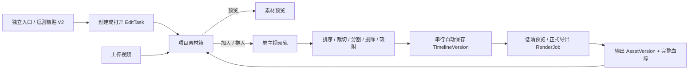
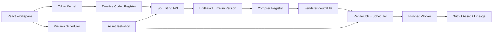

# 素材剪辑第一阶段开发技术方案（MVP 演进基线）

| 属性 | 内容 |
| --- | --- |
| 日期 | 2026-08-10 |
| 状态 | 待评审、可进入实施 |
| 上位规格 | [`21-video-material-editor-spec.md`](../21-video-material-editor-spec.md) |
| 既有方案 | [`2026-08-07-video-material-editor-opencut-integration-plan.md`](2026-08-07-video-material-editor-opencut-integration-plan.md) |
| 一手资料调研 | [`2026-08-10-video-editor-phase1-primary-research.md`](../research/2026-08-10-video-editor-phase1-primary-research.md) |
| 当前首发入口 | 素材剪辑独立入口；短剧前贴 V2 生成完成后可携带素材进入 |
| 第一阶段输出 | MP4 / H.264 / AAC / 720×1280 / 9:16 / 30fps / 48kHz |

## 1. 文档结论

第一阶段不是重新制作一张剪辑器界面，而是把当前已经存在的单主视频轨实现收口为一条**真实、可恢复、可渲染、可验收**的业务链路。完成后，用户可以在项目素材箱中上传或选择视频，加入主轨，进行排序、裁切、分割、删除、吸附、缩放、撤销与重做，保存并恢复版本，生成低清预览和正式成片；短剧前贴 V2 可以预填素材，但素材剪辑本身仍是独立通用工具。

第一阶段继续使用 `editing-timeline/v1` 作为持久化格式，但不再让 v1 的单轨形状渗透到所有前端交互和渲染代码。时间运算、编辑命令、版本编解码、素材使用策略和渲染编译分别形成深模块。第二阶段增加多轨、字幕、音频、画布变换时新增 `editing-timeline/v2` adapter 与 compiler，不破坏已经保存的 v1 任务。

OpenCut 采用策略保持为：固定 OpenCut Classic 提交 `cf5e79e919144200294fb9fed22a222592a0aeea`，选择性移植交互算法并保留 MIT 声明；不嵌入完整应用，不使用 OpenCut 项目 JSON、存储、账号或浏览器导出作为 cookies 的事实源。OpenCut 官方当前仍说明主仓库处于重写阶段，Classic 是既有实现来源；主仓库也明确把预览与导出列为正在重构的区域，因此不能把浮动主线当作稳定运行时依赖。[OpenCut 官方 README](https://github.com/OpenCut-app/OpenCut/blob/main/README.md)

## 2. 与上位 MVP 的关系

上位规格第 7 节七项验收是最终目标，第一阶段不宣称全部完成，但必须建立后续可以直接扩展的基础。

| 上位 MVP 验收 | 第一阶段交付 | 为后续保留的稳定基础 | 第一阶段后仍待完成 |
| --- | --- | --- | --- |
| 1. 独立任务及来源任务入口 | 独立创建空 EditTask；短剧前贴 V2 携带素材进入 | `entry_source + source_task_id`，入口与编辑器解耦 | 品牌广告、其他效果广告入口 |
| 2. 稳定 Asset ID/Version，不覆盖原片 | 所有 Clip 只引用 `AssetVersionRef`；裁切为非破坏性 source range | 资产解析与编辑文档分离 | 图片、音频、字体等更多资产类型 |
| 3. 刷新/换设备恢复，冲突不静默覆盖 | 不可变 TimelineVersion、自动保存、`expected_version`、409 冲突处理 | 串行保存协调器与版本化 codec | 跨设备 Playwright/集成验收 |
| 4. 预览/导出固定样例一致 | 单主轨时序、裁切、画面适配和音视频 metadata golden | 同一 renderer-neutral IR 与 compiler registry | 字幕、字体、多音轨 golden |
| 5. RenderJob 完整生命周期 | 排队、进度、取消、失败、重试、复用及调度失败补偿 | RenderJob 冻结 TimelineVersion | 多轨代理分层复用与容量基线 |
| 6. 无权/过期/范围不符素材阻断 | Project、ready、类型、源时长范围强校验；落地 `AssetUsePolicy` interface | 预览/保存/渲染统一调用同一策略 | 业务授权字段与过期/地域/渠道规则 |
| 7. OpenCut 技术治理 | 固定 SHA、LICENSE、NOTICE、文件来源、SBOM、性能基线、退出测试 | adapter/ported 目录为删除 seam | 后续升级评审与长期维护节奏 |

结论：第一阶段完成时，第 1、2、3、5 项应在“单主轨范围”内形成可验收闭环；第 4、6、7 项交付基础设施和单轨证据。字幕、字体、多轨音频相关的第 4 项完整验收必须在后续阶段完成。

## 3. 当前代码基线（2026-08-10）

### 3.1 已有可复用实现

| 能力 | 当前证据 | 第一阶段处理 |
| --- | --- | --- |
| 素材读取、上传、前端素材箱 | [`VideoEditingWorkspace.tsx`](../../src/features/video-editing/VideoEditingWorkspace.tsx) | 保留业务调用，拆分素材选择与时间线修改 |
| add/move/trim/split/delete | [`timeline.ts`](../../src/features/video-editing/timeline.ts) | 迁入 Editor Kernel，补帧对齐、稳定 ID 和属性测试 |
| Clip 拖动排序、裁切手柄、播放头、缩放 | [`VideoTimeline.tsx`](../../src/features/video-editing/VideoTimeline.tsx) | 保留视图，补素材拖入、吸附和可访问交互 |
| 浏览器即时预览 | [`VideoPreviewPlayer.tsx`](../../src/features/video-editing/VideoPreviewPlayer.tsx) | 经 Preview Scheduler 读取当前文档，不作为权威输出 |
| 撤销/重做 | [`timeline.ts`](../../src/features/video-editing/timeline.ts) | 统一为 operation history，不与服务端版本混用 |
| EditTask、TimelineVersion、乐观并发 | [`edit_task.go`](../../internal/systems/creative/edit_task.go) | 保留聚合和不可变快照，补空任务与素材范围校验 |
| RenderJob 生命周期与冻结版本 | [`editing_render.go`](../../internal/systems/creative/editing_render.go) | 保留，补入队失败终态、产物血缘和素材箱刷新 |
| renderer-neutral request | [`editing_timeline.go`](../../internal/systems/creative/editing_timeline.go)、[`timeline.go`](../../internal/platform/media/timeline.go) | 变为版本化 compiler registry 的首个 adapter |
| OpenCut 固定版本及 MIT 声明 | [`third_party/opencut-timeline`](../../third_party/opencut-timeline) | 补 SBOM、性能基线、复制/改写文件清单 |

### 3.2 当前未达到第一阶段验收的缺口

1. 空时间线无法创建 EditTask；前端和后端都把“可创建任务”与“可渲染时间线”混成同一校验。
2. 素材卡只能点击加入，不能拖到时间线；上传成功还会隐式修改时间线，用户难以区分“入库”和“编辑”。
3. 有缩放和 Clip 拖动，但没有可见的边界/播放头吸附。
4. 当前时间运算直接使用整数毫秒；30fps 一帧是 33.333…ms，反复分割和裁切可能产生不可解释的帧边界漂移。
5. Clip ID 由字符串后缀拼接，重复分割存在碰撞和不稳定风险。
6. 自动保存有并发竞态：旧请求完成后可能把后来产生的修改错误标记为“已保存”。
7. RenderJob 先落库再入队；调度器失败时任务可能永久停留在 `queued`。
8. 保存时验证 Asset 的 Project、ready 和类型，但未明确验证 `source_out` 不超过素材真实时长，也没有完整授权/过期/渠道策略。
9. 渲染产物只通过 RenderJob 间接关联输入，未在产物关系中完整保存输入 AssetVersion 集合和 TimelineVersion；完成后素材箱不自动刷新。
10. 前端测试主要读取源码做正则断言，不是实际组件交互；当前没有覆盖新版编辑器 12 步主场景的真实 E2E。
11. `SpecializedPages.tsx` 仍保留不可达的旧编辑器实现，形成重复修改点。
12. OpenCut 已有 SHA、LICENSE、NOTICE 和退出说明，但尚无 SBOM 与落盘的性能基线。

这些结论分别可由当前 [`VideoEditingWorkspace.tsx`](../../src/features/video-editing/VideoEditingWorkspace.tsx)、[`editing_render.go`](../../internal/systems/creative/editing_render.go)、[`edit_task.go`](../../internal/systems/creative/edit_task.go)、[`video-editing-frontend.test.ts`](../../test/video-editing-frontend.test.ts) 和 [`third_party/opencut-timeline`](../../third_party/opencut-timeline) 复核。

## 4. 第一阶段产品范围

### 4.1 必须交付

1. 独立进入素材剪辑并立即创建空 EditTask。
2. 从短剧前贴 V2 进入时，携带已入库的前贴视频；原视频是否一并预填由入口 payload 明确表达，不靠页面猜测。
3. 浏览 Project 内可用视频，素材预览与“加入时间线”是两个独立动作。
4. 上传视频只完成入库并刷新素材箱；默认不自动改变时间线。
5. 点击加入或拖动素材到单主视频轨。
6. Clip 选中、排序、左右裁切、播放头分割、删除并自动闭合间隙。
7. 时间线缩放、帧对齐、边界/播放头吸附、撤销/重做及键盘操作。
8. 浏览器即时预览与播放头同步；竖版内容完整显示，不因容器裁掉画面。
9. 串行自动保存、手动保存、刷新恢复、409 冲突处理和另存副本。
10. 低清预览和正式导出；任务支持进度、取消、失败原因和重试。
11. 渲染完成后自动刷新素材箱，并显示“打开成片”和来源血缘。
12. 使用一组固定真实视频完成集成、E2E 和输出 golden 验收。

### 4.2 明确不在第一阶段展示为可用

- 视频/图片叠加轨、字幕轨、配音、音乐和音效的可视化编辑；
- 16:9、1:1、自由画布、位置/缩放/旋转、透明度；
- 转场、变速、滤镜、关键帧和 AI 自动剪辑；
- 多人实时协作和可视化版本 diff。

后端现有 v1 能表达部分 caption/audio 数据，不代表第一阶段前端已经交付对应能力。未实现的能力不渲染成可点击按钮或占位轨道。

## 5. 用户主链路



交互原则：素材入库、素材预览、时间线修改、服务端保存和渲染是五种不同动作。每个按钮必须有明确结果；不可执行时显示原因，不能无响应。

## 6. 目标架构与深模块

### 6.1 总体架构



### 6.2 Module、interface 与 seam

| Module | 小 interface | 隐藏的 implementation | seam 价值 |
| --- | --- | --- | --- |
| Editor Kernel | `apply(document, operation) -> result` | add/move/trim/split/delete、normalize、帧对齐、ID、history | UI 和测试只依赖编辑语义；后续多轨复用同一操作入口 |
| Time Math | `fromMs/toMs/snap/duration` | 30fps 帧换算、舍入规则、吸附阈值 | 不让像素与毫秒计算散落在组件中 |
| Timeline Codec Registry | `decode(envelope)`、`encode(document, version)` | v1/v2 映射、兼容校验、迁移诊断 | 新增 v2 不改旧调用方，不把 OpenCut 类型写入数据库 |
| Preview Scheduler | `resolve(document, playhead)` | active clip、source time、切片切换、URL 解析 | 浏览器预览可替换，编辑文档不保存临时 URL |
| Save Coordinator | `submit(document, baseVersion)` | debounce、单飞/串行、latest-wins、409、重试状态 | 消除自动保存竞态，页面只订阅保存状态 |
| AssetUsePolicy | `authorize(actor, project, refs, purpose)` | Project、ready、类型、时长、rights、expiry、channel | 预览、保存、渲染共用同一决策，不在 handler 复制规则 |
| Compiler Registry | `compile(timelineVersion) -> RenderIR` | v1/v2 compiler、固定输出 profile、诊断 | FFmpeg Worker 不理解业务 schema；后续 v2 只新增 adapter |
| Render Orchestrator | `create/cancel/retry/get` | 冻结版本、幂等、调度补偿、进度、产物入库 | 队列实现和 FFmpeg 细节不泄露到 EditTask/UI |
| Output Lineage Writer | `ingest(output, provenance)` | AssetVersion、输入关系、RenderJob/TimelineVersion 关系、幂等 | 成片回流和审计集中处理 |

`Editor Kernel`、`Time Math` 是 in-process module；直接使用行为测试。`AssetUsePolicy`、调度器和产物写入器有 production 与 in-memory test adapter，是实际 seam。不要为了每个 React hook 或 Go function 再造一层浅 interface。

## 7. 数据模型和兼容策略

### 7.1 编辑态文档

第一阶段把当前扁平 `clips[]` 收敛为 cookies 自有的编辑态文档。虽然 UI 只开放一条主轨，但 operation 从一开始携带 `trackId`，避免第二阶段重写全部命令。

```ts
type EditorDocument = {
  documentId: string
  schemaVersion: 1
  timebase: { numerator: 1; denominator: 30 }
  canvas: { width: 720; height: 1280 }
  tracks: EditorTrack[]
}

type EditorTrack = {
  id: string
  kind: 'primary_video'
  clips: EditorClip[]
}

type EditorClip = {
  id: string
  trackId: string
  assetRef: { assetId: string; version: number }
  timeline: { startFrame: number; durationFrames: number }
  source: { inMs: number; outMs: number; durationMs: number }
}
```

说明：第一阶段 master timeline 使用整数帧；source range 继续保留整数毫秒以兼容已有 v1 和素材探测结果，但每次提交操作都通过 `TimeMath` 对齐到 30fps master frame。不能在 React 组件中自行用 `deltaX / width * durationMs` 直接落库。

临时预览 URL、素材名称、缩略图和 UI 选中态不进入持久化文档；它们由 Project Asset Catalog 以 `AssetVersionRef` 解析。OpenCut 类型也不进入此文档。

### 7.2 持久化 timeline

- 已保存的 `editing-timeline/v1` 永久可读、可渲染；不修改其既有语义。
- 第一阶段 codec 负责 `EditorDocument ↔ editing-timeline/v1` 确定性转换。
- 第二阶段新增 `editing-timeline/v2`，引入多视频轨、图片、画布 transform、字幕样式与音频参数。
- API 将 timeline 表达为带 discriminator 的 envelope；前端和后端都使用 registry 分派，禁止在各处硬编码只接受 v1。
- RenderJob 永远引用不可变 `timeline_version + content_hash + compiler_version + output_profile_id`。

### 7.3 空 EditTask

“任务可创建”和“时间线可渲染”必须拆开：

- `POST /edit-tasks` 可以创建 `current_timeline = null` 的 draft EditTask；
- 第一次加入素材并保存后创建 TimelineVersion 1；
- 只有通过 renderable validation 的非空 TimelineVersion 才能创建 RenderJob；
- 现有非空任务响应保持兼容，前端把 `current_timeline` 改为可空类型。

不要伪造 1 秒黑色视频或空 Clip 来满足 v1 validator，否则会污染时长、血缘与导出。

### 7.4 EditOperation

第一阶段 operation 至少包含：

```text
AddClip(track_id, asset_ref, source_range, insertion)
MoveClip(clip_id, target_track_id, target_index)
TrimClip(clip_id, edge, target_source_time)
SplitClip(clip_id, at_frame, left_clip_id, right_clip_id)
DeleteClip(clip_id)
```

ID 由注入的 `IdFactory` 生成，不再从旧 ID 拼接 `-a/-b`。每个 operation 返回新文档和结构化 diagnostics；非法操作不部分修改状态。

## 8. OpenCut 复用边界

### 8.1 本阶段复用

| 能力 | 固定上游来源 | 采用方式 |
| --- | --- | --- |
| move/placement | [move-elements.ts](https://github.com/OpenCut-app/opencut-classic/blob/cf5e79e919144200294fb9fed22a222592a0aeea/apps/web/src/commands/timeline/element/move-elements.ts) | 适配为 Editor Kernel operation，不保留 EditorCore 依赖 |
| split | [split-elements.ts](https://github.com/OpenCut-app/opencut-classic/blob/cf5e79e919144200294fb9fed22a222592a0aeea/apps/web/src/commands/timeline/element/split-elements.ts) | 复用 source-range 不变量，使用 cookies TimeMath/IdFactory |
| resize/trim | [resize-controller.ts](https://github.com/OpenCut-app/opencut-classic/blob/cf5e79e919144200294fb9fed22a222592a0aeea/apps/web/src/timeline/controllers/resize-controller.ts) | 移植 pointer session 思路，视图与纯计算分离 |
| snapping | [snapping 目录](https://github.com/OpenCut-app/opencut-classic/tree/cf5e79e919144200294fb9fed22a222592a0aeea/apps/web/src/timeline/snapping) | 复用候选与阈值算法，补 Clip edge/播放头测试 |
| zoom/playhead | [zoom-controller.ts](https://github.com/OpenCut-app/opencut-classic/blob/cf5e79e919144200294fb9fed22a222592a0aeea/apps/web/src/timeline/controllers/zoom-controller.ts) | 适配 cookies CSS 和状态，不复制完整应用壳 |
| undo/redo | [commands manager](https://github.com/OpenCut-app/opencut-classic/blob/cf5e79e919144200294fb9fed22a222592a0aeea/apps/web/src/core/managers/commands.ts) | 保持客户端 command history，与 TimelineVersion 分离 |

### 8.2 明确不复用

- Next.js 路由、OpenCut 用户/项目/数据库、IndexedDB 事实源；
- OpenCut 上传、对象存储和素材 URL 管理；
- `EditorCore` 全局单例和完整 WASM/Rust 运行时；
- OpenCut 浏览器导出与业务权限模型；
- 浮动 `main` 的任何运行时依赖。

当前 OpenCut 主仓库包含 Web、Desktop、Rust/WASM core 等多种运行形态，并在持续迁移逻辑；完整引入会把 cookies 的 Vite/Go/FFmpeg 边界与上游重构绑定。[OpenCut 官方项目结构](https://github.com/OpenCut-app/OpenCut#project-structure)

### 8.3 治理产物

第一阶段必须在 [`third_party/opencut-timeline`](../../third_party/opencut-timeline) 补齐：

- `SBOM.spdx.json`：实际复制/改写源码和新增依赖；
- `PERFORMANCE.md`：测试设备、浏览器、样例、p50/p95 pointer update、内存峰值；
- `NOTICE.md`：每个适配文件对应的固定上游路径；
- `UPSTREAM.md`：升级门禁、负责人和退出演练；
- CI 校验固定 SHA、MIT 文本和来源清单存在。

OpenCut Classic 的 MIT 许可允许使用和修改，但需要保留版权与许可声明；仓库现有 [`LICENSE`](../../third_party/opencut-timeline/LICENSE) 和 [`NOTICE.md`](../../third_party/opencut-timeline/NOTICE.md) 必须随改写范围同步更新。[固定版本 MIT License](https://github.com/OpenCut-app/opencut-classic/blob/cf5e79e919144200294fb9fed22a222592a0aeea/LICENSE)

## 9. 保存、冲突与恢复

### 9.1 Save Coordinator 状态机

```text
clean → dirty → saving(base_version, revision)
                    ├─ success 且仍是最新 revision → clean
                    ├─ success 但存在更新 revision → dirty → 下一次保存
                    ├─ 409 → conflict（停止自动覆盖）
                    └─ transient error → error（保留 dirty 文档，可重试）
```

约束：

- 同一 EditTask 同时最多一个保存请求；后续修改合并为 latest pending document；
- 保存成功只确认该请求对应的本地 revision，不能无条件把当前页面标为 clean；
- 409 提供“载入服务端版本”和“另存为新任务”，不自动 last-write-wins；
- 路由切换、Project 切换和组件卸载时取消回写过期响应；
- 刷新恢复的是最后确认的 TimelineVersion，不把 local undo history 当作服务端版本。

## 10. 素材安全、授权和源范围

### 10.1 第一阶段强制校验

在加入预览 URL、保存 TimelineVersion、创建 RenderJob 三个阶段都通过 `AssetUsePolicy`：

- actor 具有 Project 与 assets 所需 scope；
- AssetVersion 精确属于当前 Organization/Project；
- `ready=true`，媒体类型为 video，探测成功；
- `0 <= source_in < source_out <= probed_duration`；
- 预览 URL 为短期签名 URL，前端文档不持久化 URL；
- 已知被撤销、隔离、过期或不允许当前用途的素材返回稳定错误码。

当前 Assets module 声明拥有素材版本、来源和授权，但现有可见持久化模型尚未形成完整的 rights/expiry/channel policy，因此第一阶段要先落地 interface、统一调用点和 deny reason；最终 MVP 第 6 项仍需要产品/法务给出授权状态、有效期、地域和渠道规则。[Assets module ownership](../../internal/platform/assets/README.md)

建议稳定错误码：`ASSET_PROJECT_MISMATCH`、`ASSET_NOT_READY`、`ASSET_KIND_UNSUPPORTED`、`ASSET_SOURCE_RANGE_INVALID`、`ASSET_RIGHTS_UNVERIFIED`、`ASSET_RIGHTS_EXPIRED`、`ASSET_USAGE_SCOPE_DENIED`。

## 11. 预览、渲染和产物血缘

### 11.1 两级预览

1. 浏览器即时预览：EditorDocument + Asset URL Resolver + Preview Scheduler，用于低延迟编辑反馈。
2. 低清权威预览：冻结 TimelineVersion，经 Compiler Registry 与 FFmpeg Worker 生成。

正式导出与低清预览使用相同 compiler 和 filtergraph 语义，只允许 output profile/码率等受控参数不同。FFmpeg 官方文档明确提供 `trim`、`setpts/asetpts` 与 `concat` 等 filter；单轨裁切拼接应由 compiler 生成确定性 filtergraph，而不是把任意命令交给浏览器或用户输入。[FFmpeg Filters Documentation](https://ffmpeg.org/ffmpeg-filters.html)

第一阶段的权威渲染路径直接采用解码、裁切、时间戳归零、规格归一和重编码：每个 Clip 经 `trim/atrim → setpts/asetpts → scale/pad/fps/aresample`，再进入 concat filter。不要以 concat demuxer + stream copy 作为主路径，因为 FFmpeg 官方说明 `inpoint/outpoint` 对非帧内编码可能产生裁切范围外的包；用户上传视频也无法保证 GOP、分辨率、像素格式和音频参数同构。[FFmpeg concat demuxer](https://ffmpeg.org/ffmpeg-formats.html#concat)、[FFmpeg concat filter](https://ffmpeg.org/ffmpeg-filters.html#concat)

Compiler 先生成结构化 RenderIR（inputs、trim ranges、normalized streams、compositions、outputs），FFmpeg 命令只是 adapter。第二阶段的视频叠加、字幕烧录和音频混合通过增加 IR 节点实现，不重写 EditTask 或 RenderJob。

输出验收使用 `ffprobe` JSON 读取容器、stream、时长、分辨率、帧率、采样率和 codec；`ffprobe` 官方定位就是以机器可读方式探测媒体流与容器。[ffprobe Documentation](https://ffmpeg.org/ffprobe.html)

### 11.2 RenderJob 调度一致性

当前“先创建 RenderJob、后调用 scheduler”必须补偿：

- 最小改法：scheduler 返回错误时立即把公共 RenderJob 标为 `failed`，写稳定 `SCHEDULER_ENQUEUE_FAILED`；重试创建新 job 并保持 `retry_of`；
- 长期可扩展方案：repository transaction + outbox，由 dispatcher 幂等入队；
- 第一阶段若现有 repository 不具备事务 outbox，先实现失败补偿，但在 interface 中保留 outbox adapter 的替换 seam；
- UI 对 `queued/running` 轮询必须有超时/最后更新时间提示，不能无限显示排队。
- RenderJob 冻结 `timeline_version + content_hash + output_profile + renderer_fingerprint`；fingerprint 至少包含 compiler 版本、FFmpeg 完整版本/configure flags、编码器和字体包版本。
- 取消或失败只保留诊断记录，临时文件不得发布为 Project Asset。

### 11.3 输出血缘

`IngestRenderedVideo` 增加 provenance payload 或新增专用 adapter，至少保存：

```text
output_asset_ref
edit_task_id
timeline_version
timeline_content_hash
render_job_id
render_kind
compiler_version
output_profile_id
input_asset_version_refs[]
```

Render 成功后响应或事件携带新 `AssetVersionRef`；前端重新拉取 Project Asset Catalog，选中成片但不自动把成片加入当前时间线，避免自引用。

## 12. 第一阶段实施分解

### P1-A：领域内核与持久化稳定（先做）

- 建立 `EditorDocument`、`EditOperation`、`TimeMath`、`IdFactory` 和 Editor Kernel；
- 现有 add/move/trim/split/delete 迁入 kernel，补帧对齐、重复分割和性质测试；
- 建立 Timeline Codec Registry，兼容现有 v1；
- 支持空 EditTask 与 nullable current timeline；
- 实现 Save Coordinator，修复自动保存竞态；
- 后端校验 source range 不超过真实素材时长。

**退出门槛：** kernel 与 codec 测试通过；已有 v1 fixture 往返不丢失；空任务可创建；并发保存回归测试通过。

### P1-B：真实交互闭环

- 素材预览、上传、加入、拖入四种动作拆清；
- 上传后只刷新素材箱；
- 移植/适配 OpenCut snapping；
- 补时间尺、帧对齐提示、键盘与 disabled reason；
- 删除 `SpecializedPages.tsx` 中不可达的旧编辑器；
- 修复 1366×768、1440×900、1920×1080 下滚动与遮挡。

**退出门槛：** 组件测试真实触发 pointer/drag/keyboard；主轨所有操作可见且可撤销；页面不存在“看得见但点不了”的占位控件。

### P1-C：渲染可靠性与血缘

- RenderJob 入队失败补偿及测试；
- 低清预览/正式导出共享 compiler；
- 输出 provenance 写入和素材箱刷新；
- 取消、失败、重试、复用与 polling timeout 走查；
- 用固定视频生成可重复 golden，并用 ffprobe 校验。

**退出门槛：** 任一调度路径都有终态；产物可追溯；固定样例预览/导出时序和 metadata 通过。

### P1-D：主链路验收与治理

- 新版编辑器 Playwright 12 步主场景；
- Project/跨 Project/source range/失效素材安全测试；
- OpenCut SBOM、性能基线和退出演练；
- 真实环境人工走查与问题清零。

**退出门槛：** 第 14 节全部通过，才能把第一阶段标记为完成。

## 13. 文件级改造建议

```text
src/features/video-editing/
├── VideoEditingWorkspace.tsx       # 只组合 modules、渲染状态
├── api.ts                          # versioned timeline envelope、nullable timeline
├── domain/
│   ├── document.ts
│   ├── operations.ts
│   ├── editorKernel.ts
│   ├── timeMath.ts
│   └── history.ts
├── codecs/
│   ├── registry.ts
│   └── editingTimelineV1.ts
├── persistence/
│   └── saveCoordinator.ts
├── timeline/
│   ├── VideoTimeline.tsx
│   ├── snapping.ts
│   └── pointerSession.ts
├── preview/
│   ├── VideoPreviewPlayer.tsx
│   └── previewScheduler.ts
└── assets/
    ├── AssetLibrary.tsx
    └── AssetCard.tsx

internal/systems/creative/
├── edit_task.go                    # 空任务、版本聚合
├── editing_document.go             # envelope/codec registry
├── editing_asset_policy.go         # AssetUsePolicy
├── editing_render.go               # orchestration/调度补偿
├── editing_compiler.go             # compiler registry
└── editing_lineage.go              # output provenance port
```

目录名称可以按仓库习惯微调，但上述 module interface 不应重新塞回一个大型 Workspace 或 handler。

## 14. 第一阶段唯一主验收场景

1. 用户直接进入素材剪辑，立即得到空的 draft EditTask。
2. 另一次从短剧前贴 V2 完成页进入，5 秒前贴已作为稳定 AssetVersion 出现在素材箱或初始时间线。
3. 上传一条约 20 秒原视频；上传完成只刷新素材箱。
4. 预览原视频不会改变时间线；点击加入或拖入后才产生 Clip。
5. 将前贴移动到原视频前方，边界吸附有可见反馈。
6. 裁掉原视频开头 2 秒；播放头只能落在确定的 30fps frame 上。
7. 在原视频中间分割，删除约 3 秒，后续片段自动前移闭合。
8. 撤销删除，再重做删除；即时预览的顺序、source range 和播放头正确。
9. 编辑期间触发并发自动保存场景，最终服务端版本等于最新文档；刷新后恢复一致。
10. 创建低清预览；可以查看进度、取消；失败任务可见原因并可重试。
11. 正式导出 MP4；ffprobe 校验 H.264/AAC、720×1280、30fps、48kHz 和预期时长容差。
12. 成片自动出现在素材箱，可追溯前贴、原视频、EditTask、TimelineVersion、RenderJob 和 compiler version。

任何一步依赖人工修改数据库、隐藏按钮、浏览器控制台或伪造静态轨道，都不算通过。

## 15. 测试策略与交付门禁

| 层级 | 必须覆盖 |
| --- | --- |
| Unit | operation 不变量、帧对齐、吸附阈值、ID 唯一、undo/redo、codec 往返 |
| Property | 随机 add/move/trim/split/delete 后主轨连续、source range 有效、时长守恒 |
| Component | 预览不加入、上传不加入、点击加入、拖入、裁切 pointer、播放头、快捷键、disabled reason |
| Contract | 空任务、nullable timeline、v1 envelope、409、稳定 error code、source duration |
| Integration | 保存→刷新→冲突、RenderJob→调度失败补偿、渲染→产物入库→素材刷新 |
| E2E | 第 14 节 12 步新版编辑器主场景 |
| Golden | 固定视频的输出时长、裁切点、画面 contain/pad、codec 与音频 metadata |
| Security | 无 scope、跨 Project、not ready、source 越界、rights deny |
| Visual | 1366×768、1440×900、1920×1080，无页脚遮挡、完整预览、时间线可操作 |
| Performance | 30 秒/20 Clip：pointer update p95 < 16ms，交互期间 long task < 50ms；另用 10/50/100 Clip 记录 p50/p95、首次绘制和峰值内存，形成后续回归基线 |

本仓库交付门禁：

1. `git diff --check`；
2. `npm test`；
3. `npm run build`；
4. 素材剪辑相关 Go tests；
5. Playwright 第 14 节主场景；
6. 固定真实视频 golden；
7. OpenCut LICENSE/NOTICE/SBOM/performance 检查；
8. GitHub Actions 所有 required checks 通过，不允许 pending/failing 时宣告完成。

源码正则测试只能作为 wiring smoke test，不能替代组件交互和 E2E。

## 16. 第一阶段完成后的用户效果

用户看到的仍是当前三栏编辑器，不需要推翻视觉设计，但所有主要控件都有真实行为：

- 左侧可以上传、预览、选择或拖入素材，动作不会互相误触；
- 中央可以完整预览当前片段，播放头、裁切、分割和排序实时同步；
- 下方是真实单主轨，不再用字幕/音频彩条冒充已实现功能；
- 右侧显示当前 Clip 的 source range、保存状态、冲突原因和 RenderJob 状态；
- 刷新后编辑结果仍在，另一个设备不会静默覆盖新版本；
- 导出得到真实拼接视频，成片回到素材箱并能解释“由哪些素材和哪个时间线版本生成”。

这时第一阶段是“可用的基础剪辑器”，而不是完整 MVP。后续直接在 versioned document、codec/compiler registry、AssetUsePolicy 和 RenderJob 上增加多轨、字幕、字体、音频与多比例，不需要替换 EditTask、资产引用、版本控制或导出主链路。

## 17. 外部条件与决策

### 第一阶段开工前必须具备

| 条件 | 用途 | 缺失时影响 |
| --- | --- | --- |
| 固定 5 秒前贴 + 20 秒左右原视频及预期裁切点 | E2E/golden | 无法证明真实拼接与裁切正确 |
| 可运行的 MySQL、对象存储/本地 BlobStore、FFmpeg Worker | 保存、预览、正式导出 | 只能做前端模拟，不能验收 |
| Playwright 浏览器环境 | 实际交互与布局 | 无法消除“能看不能点”问题 |
| 确认允许按 MIT 保留声明后复制/改写 OpenCut 固定版本 | 合规复用 | 只能参考交互、自研算法 |
| 指定 OpenCut adapter 维护负责人 | 上游、安全、退出 | 不应继续扩大复用范围 |

### 不阻塞第一阶段编码，但阻塞最终 MVP 第 6 项

- 素材授权状态枚举；
- 授权有效期、地域、渠道与用途字段；
- `unknown/unverified` 在预览、编辑、低清预览和正式导出各阶段的放行/阻断规则；
- 用户上传素材的权利确认和审计文案。

在规则确定前，代码先通过 `AssetUsePolicy` 返回结构化 decision，不能把临时布尔判断散落进 UI、handler 和 worker。

## 18. 明确拒绝的捷径

- 不把 OpenCut 整站 iframe 或整包嵌入 cookies；
- 不把 OpenCut JSON 直接存库；
- 不用空 Clip/黑色视频伪造空任务；
- 不让上传动作隐式等于加入时间线；
- 不把浏览器即时预览当作正式输出；
- 不把毫秒/像素换算继续散落在 React 组件；
- 不允许 RenderJob 永久停留在 queued；
- 不把旧编辑器和新编辑器长期并存；
- 不用静态 UI、源码正则或“后端已支持”代替用户链路验收。

## 19. 决策记录

| 日期 | 决策 |
| --- | --- |
| 2026-08-10 | 上位规格第 7 节七项验收保持最终目标，本文件仅定义第一阶段实施基线。 |
| 2026-08-10 | 第一阶段继续保存 v1，但引入 versioned codec/compiler registry；多轨使用 v2，不破坏旧快照。 |
| 2026-08-10 | 编辑态采用 master frame timebase，阻止 30fps 下的毫秒累计漂移。 |
| 2026-08-10 | 允许空 EditTask，但只有非空、通过校验的 TimelineVersion 可以渲染。 |
| 2026-08-10 | OpenCut 只在固定 SHA 上选择性适配交互算法，cookies 继续拥有业务与渲染事实源。 |
| 2026-08-10 | 第一阶段完成必须以真实视频、真实交互 E2E、输出 golden 和 CI 全绿为准。 |
