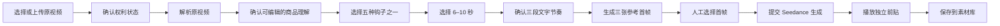

# 电商前贴 V2：原视频理解驱动的前端先行技术方案

> 日期：2026-08-10
>
> 范围：创意创作 → 视频创作 → 效果广告 → 前贴广告 → 电商前贴
>
> 交付顺序：**先完成可操作、可恢复、可演示的前端，再接真实后端**
>
> 状态：前端开发基线
>
> 非目标：本期不开发后端、不拼接原视频、不增加业务质检、不依赖策略包或 Brief

## 1. 结论

电商前贴 V2 应从当前 `CommerceHookWorkspace` 中独立出来，新增专属的
`src/features/commerce-preroll-v2/` 模块，采用：

```text
左侧局部流程轨道 + 中央当前步骤主工作区 + 按步骤出现的轻量辅助区
```

桌面端不再使用顶部横向步骤条。六个主步骤全部固定在工作区左侧：

1. 原视频；
2. 内容理解；
3. 钩子方向；
4. 生成设置；
5. 参考首帧；
6. 前贴成片。

“解析中”和“生成中”是步骤内部的异步状态，不额外增加导航节点，因此完整链路会呈现八个页面状态，但用户始终只面对六个稳定步骤。

该布局延续 Cookies 的现有工作台逻辑：任务页允许左侧列表或流程树、中央主工作区和右侧检查器；主工作区必须占主要视觉面积，不能把三栏做成同等权重。[S1]

前端一期使用稳定 Fixture 和可替换 Gateway 完成完整交互：原视频选择、解析进度、商品信息确认、五种钩子选择、时长与节奏配置、三张首帧选择、生成进度、结果播放、刷新恢复。页面中不能出现“Mock”字样，也不能出现只有按钮可点、结果却是空占位图的假闭环。

## 2. 本轮已冻结的产品边界

以下决策来自本轮围绕电商前贴链路的产品确认，是本方案的直接需求基线：

| 主题 | 冻结结论 |
|---|---|
| 前贴定义 | 为一条已经做好的电商视频生成独立的 6–10 秒开场前贴 |
| 核心输入 | 原电商视频；商品图优先从原视频提取，用户可更换或上传 |
| 策略依赖 | P0 不依赖策略包、Brief 或需求策略模块 |
| 原视频用途 | 用于理解商品、卖点、画面、字幕、口播、音频气质和开场方式 |
| Seedance 输入 | 自动 Prompt、用户确认的参考首帧、商品保真约束、时长和画幅；不把原视频直接当作生成输入 |
| 钩子 | 保留五种生产规则，但必须结合当前原视频生成具体方案，不能显示固定 Prompt |
| 用户输入 | 选择原视频、确认/编辑商品信息、选择钩子、选择 6–10 秒、选择首帧；可填写一句补充要求 |
| Prompt | 系统自动编译；默认只展示摘要，不要求用户手写完整 Prompt |
| 输出 | 一条独立前贴视频，能播放、重生成、保存到素材库 |
| 拼接 | P0 不把前贴与原视频拼接，也不伪装成已拼接预览 |
| 质检 | P0 不增加业务质检步骤；仍要有文件错误、任务失败、取消、重试和恢复等技术状态 |

### 2.1 与旧文档和当前代码的冲突处理

仓库 PRD 仍把视频前贴描述为“为原视频生成并拼接 4–10 秒开场”，当前
`CommerceHookWorkspace` 仍以 Brief/策略来源、娇兰 Fixture、右侧 Prompt 文本域和五模板为核心。[S2][S8]

本轮产品决策已经把 P0 收敛为“独立 6–10 秒前贴、原视频理解驱动、无策略依赖、无拼接、无质检”。因此：

- 本文是新前端模块的实现基线；
- 不继续扩展旧 `CommerceHookWorkspace`；
- 不删除旧实现，直到新工作区完成验收并显式切换入口；
- 后端阶段开始前，应单独更新 `docs/02-creative-studio-prd.md` 中的旧时长与拼接描述，避免两套产品定义长期并存。

## 3. 用户完整链路



前端必须让用户明确知道自己做了什么，同时把不需要用户判断的信息留在后台：

| 信息 | 默认呈现 | 后台记录 |
|---|---:|---:|
| 原视频播放器、名称、时长、画幅、权利状态 | 是 | 是 |
| 分辨率、文件大小、素材版本、技术探测详情 | 详情抽屉 | 是 |
| 解析阶段与当前状态 | 是 | 是 |
| 商品名称、品类、描述、卖点 | 是，可编辑 | AI 原值和用户确认值都保存 |
| 商品外观与 Logo 保真要求 | 是，可编辑 | 是 |
| 商品参考图 | 是，可更换/上传/重新提取 | 来源 Asset/时间点 |
| 事实来源时间点、OCR/ASR/画面来源、置信度 | 默认不显示 | 是 |
| 高风险事实，例如价格、折扣、功效数据 | 只显示需要确认的条目 | 完整证据 |
| 五种钩子的具体方案、推荐理由、使用卖点 | 是 | 模板版本与编译输入 |
| 完整模型 Prompt | 折叠摘要 | 完整结构化版本 |
| Provider 请求、轮询、临时 URL | 否 | 后端阶段记录 |

## 4. 信息架构与布局

### 4.1 全局导航保持不变

保留现有 Cookies 顶栏、Project 上下文、创意创作 L1 侧栏以及视频创作的现有 L2/L3 入口。局部流程轨道属于“当前电商前贴任务内部导航”，不新增第三条全局业务侧栏。[S1][S2]

### 4.2 电商前贴工作区

建议桌面布局：

```text
┌──────────────────────────────────────────────────────────────────────┐
│ 电商前贴任务标题 / 当前 Project / 自动保存状态                        │
├──────────────────┬───────────────────────────────────┬───────────────┤
│ 任务来源摘要      │ 当前步骤主工作区                  │ 当前步骤辅助区 │
│                  │                                   │               │
│ 01 原视频         │ 视频 / 表单 / 钩子 / 首帧 / 结果  │ 仅需要时出现   │
│ 02 内容理解       │                                   │ Prompt 摘要     │
│ 03 钩子方向       │ 主区不少于可用宽度的 55%          │ 生成依据        │
│ 04 生成设置       │                                   │ 当前任务状态    │
│ 05 参考首帧       │                                   │               │
│ 06 前贴成片       │                                   │               │
├──────────────────┴───────────────────────────────────┴───────────────┤
│ 当前异步状态 / 错误恢复 / 最后保存时间                               │
└──────────────────────────────────────────────────────────────────────┘
```

推荐列宽：

```css
grid-template-columns: 232px minmax(0, 1fr) minmax(260px, 300px);
```

右侧辅助区不是固定“参数墙”：

- 原视频、解析进度和成片页可以隐藏右栏，让媒体区域更大；
- 商品确认页右栏放商品参考图；
- 生成设置页右栏放 Seedance 生成依据与 Prompt 摘要；
- 首帧页可将“重新生成/上传”收进顶部工具栏；
- 当前步骤没有辅助内容时，中间主区占满剩余空间。

这比三个固定等宽面板更符合 Cookies 工作台“主画布优先、检查器从属”的原则。[S1]

### 4.3 左侧流程轨道

左侧由三部分组成：

1. 当前原视频的小型缩略图和名称；
2. 六个竖向步骤；
3. 自动保存、异步任务或失败恢复摘要。

步骤状态：

| 状态 | 视觉 | 行为 |
|---|---|---|
| `active` | 钴蓝实心节点、浅蓝外环、左侧 3px 指示条 | `aria-current="step"` |
| `completed` | 浅蓝节点和勾选图标 | 可返回修改 |
| `available` | 矿物灰节点 | 满足前置条件后可进入 |
| `locked` | 降低透明度 | 点击说明缺少什么，不静默跳转 |
| `running` | 节点内一次性进度动画 | 保持可离开页面 |
| `failed` | 危险色状态图标和短错误摘要 | 点击回到失败步骤 |

竖向连接线只表示流程关系，不做装饰性“电路板”。当前步骤允许 160–220ms 的节点填充、4px 位移和内容淡入；开启减少动效时取消位移和循环动画。[S7][S11]

### 4.4 响应式策略

| 宽度 | 布局 |
|---|---|
| `>= 1280px` | 232px 左轨 + 主区 + 按需右栏 |
| `1024–1279px` | 左轨收窄到 196px，右栏降到 260px |
| `768–1023px` | 左轨保留步骤编号与短标题；辅助区移到主区下方 |
| `< 768px` | 局部流程改为可展开的步骤抽屉；全局导航仍按现有系统规则处理 |

任何宽度都不能把播放器、三张首帧、主要按钮或错误恢复操作裁掉。

### 4.5 步骤深链与刷新恢复

左侧步骤不是只能依赖组件内存的视觉切换。当前项目路由只稳定解析一个对象 ID 和
`?view=`；新工作区应预留稳定的 `step` 查询参数或等价路由元数据，例如：

```text
/creative/video/performance/pre-roll?mode=commerce&task={clientTaskId}&step=direction
```

首期前端允许 `task` 指向本地会话 ID，但仍必须满足：

- 刷新后回到同一任务和同一步骤；
- URL 指向不可达步骤时，展示缺失条件并停留在最近可达步骤；
- 切换 Project 后不能恢复另一个 Project 的本地草稿；
- 后端接入后只把本地 `clientTaskId` 替换为权威 `CreativeTask.id`，不改变页面 URL 语义。

这符合 Kanon 导航架构对深层页面可直接恢复、不能依赖前序页面临时内存的要求。[S16]

## 5. 视觉系统：保持同源，但更圆润、更有科技感

### 5.1 必须继承的现有风格

当前项目使用 MiSans/PingFang、矿物灰背景、钴蓝主色、冷色边界和低饱和状态色；钴蓝只承担当前选择、主操作、链接和信息状态，工作台中的蓝色面积应受控。[S1][S12]

新模块不得引入紫色 AI 渐变、霓虹发光、玻璃拟态、巨大圆角卡片或另一套字体。

### 5.2 圆润程度

Cookies 设计系统现有圆角为 4/6/8/12px。[S1] 本模块建议：

| 对象 | 圆角 |
|---|---:|
| 小状态标签 | 4px 或真正状态胶囊 `999px` |
| 输入框、下拉框、按钮 | 8px |
| 步骤条目、钩子卡、首帧卡 | 10px |
| 视频、图片和主媒体容器 | 12px |
| 主工作区外框 | 12px |

不使用 16–32px 的大圆角，不把所有内容包成相同的浮动卡片。

### 5.3 科技感来源

科技感来自任务状态和精确反馈，不来自装饰：

- 左侧节点的连接轨迹和完成状态；
- 解析阶段的逐项点亮；
- 媒体画布中低对比度的点阵或坐标线背景，透明度不超过 4%；
- 选中首帧的双层细描边；
- 生成中使用非循环的阶段推进动画和细线进度；
- Prompt 摘要、来源版本、参考图来源以清晰的小型元数据表达；
- 媒体区域可使用局部深色播放器，页面导航和表单仍保持浅色。[S1]

推荐补充令牌，仅在 `.commerce-preroll-v2` 根节点作用域内定义：

```css
--cp2-radius-control: 8px;
--cp2-radius-panel: 12px;
--cp2-rail-width: 232px;
--cp2-inspector-width: 292px;
--cp2-focus-ring: 0 0 0 4px color-mix(in oklch, var(--cobalt) 14%, transparent);
--cp2-soft-shadow: 0 10px 28px color-mix(in oklch, var(--ink) 8%, transparent);
--cp2-motion-fast: 160ms;
--cp2-motion-normal: 220ms;
```

## 6. 六个步骤、八个页面状态

### 6.1 步骤 01：原视频

用户可见：

- 当前 Project 视频素材列表或上传入口；
- 选中视频的真实播放器；
- 视频名称；
- `32 秒 · 9:16` 这类紧凑基础信息；
- 权利状态；
- “素材详情”抽屉；
- 唯一主按钮“解析原视频”。

“素材详情”抽屉再显示分辨率、文件大小、素材版本、上传时间和技术探测状态，避免首屏堆满元数据。

空状态、视频加载失败、无权利状态和上传失败必须有真实页面，不允许按钮无反应。[S3]

### 6.2 步骤 02A：解析中

用户可见五个真实阶段：

1. 读取视频与音轨；
2. 提取关键画面；
3. 识别商品与卖点；
4. 分析字幕与口播；
5. 生成钩子建议。

页面显示“已完成 3/5”和当前阶段，不显示伪造的 67% 或倒计时。用户可以离开页面，状态说明明确告知任务会继续并可恢复。长任务必须覆盖排队、运行、失败、取消、结果未知和恢复状态。[S3][S4][S6]

### 6.3 步骤 02B：确认内容理解

中央可编辑字段：

- 商品名称；
- 品类；
- 商品描述；
- 核心卖点；
- 商品外观与 Logo 保真要求。

辅助区显示系统推荐商品参考图，并提供：

- 更换画面；
- 上传商品图；
- 重新提取。

系统推荐图是“从原视频提取的像素资产”；商品外观与 Logo 是“提交给生成模型的文字保真约束”，二者不能混为一个字段。

来源时间点、OCR/ASR/视觉来源和置信度默认不展示。只有价格、折扣、功效或数据等风险事实才显示“确认保留/删除”。前端状态同时保存 `ai_original` 和 `user_confirmed`，避免用户编辑后丢失来源。

### 6.4 步骤 03：钩子方向

继续保留五种钩子规则：

1. 商品切割；
2. 雾面橱窗揭幕；
3. 一键取物；
4. 微缩功效剧场；
5. 3C 设备召回。

每张卡展示：

- 模板名称；
- 针对当前原视频生成的一句话具体创意；
- 推荐理由；
- 使用的卖点；
- 动作摘要。

这一页不显示固定秒数。钩子不是五段硬编码 Prompt，而是五个 `VideoTemplateRecipe`：它们规定“建立异常/信息缺口、完成一次变化、商品定格、镜头规则和商品保真规则”，再由当前原视频分析结果实例化。

五张卡第一次渲染就必须有完整内容，重新推荐时显示骨架和保留旧结果，不能把整个页面清空。

### 6.5 步骤 04：生成设置

用户选择 6、7、8、9 或 10 秒，并看到三段**文字生成计划**：

```text
建立钩子 → 完成变化 → 商品定格
```

这里不是三段视频。成片生成后，它们才可以成为播放器时间轴上的语义标记。

右侧“Seedance 生成依据”展示：

- 已确认商品信息；
- 当前钩子规则；
- 时长与三段节奏；
- 原视频的光影、构图、镜头和开场节奏；
- 商品参考图；
- 商品外观、Logo 和禁止项。

完整 Prompt 默认折叠，只显示自然语言摘要。用户可填写一句补充要求，但不能被迫手写完整 Prompt。

### 6.6 步骤 05：参考首帧

首次进入显示三张可真实预览的首帧候选：

- 每张图有方案名称、视觉机制和与原视频的关系；
- 用户可以单选；
- 可以重新生成；
- 可以上传自定义首帧；
- 选择后明确说明该图会与 Prompt、商品参考图、保真规则和时长一起提交。

选中状态不能只靠蓝色，应同时有勾选图标、描边和文字状态。[S10]

### 6.7 步骤 06A：生成中

用户可见三段技术进度：

1. 提交 Prompt 与参考首帧；
2. Seedance 生成视频；
3. 保存成片与任务记录。

页面显示任务 ID、当前阶段、取消或离开提示。视频生成属于异步 Job，Provider 状态与业务草稿状态必须分离；前端后接真实服务时应读取 Job 资源，而不是用浏览器计时器伪造成功。[S4][S6]

### 6.8 步骤 06B：前贴成片

用户可见：

- 真实 `<video controls playsInline>` 播放器；
- 时长、画幅、来源原视频和钩子名称；
- “再生成一版”；
- “保存到素材库”。

结果页明确写“独立前贴视频”。不显示拼接成功、不显示质检通过，也不自动跳去素材库才能看结果。生成媒体以后必须通过资产回流形成稳定 Asset/Version，不能把厂商临时 URL 当成业务结果。[S5][S6]

## 7. 前端状态模型

### 7.1 使用 reducer，而不是继续增加布尔状态

当前短剧前贴专属模块已使用 `reducer + 独立 types + 独立 CSS`，并以选中 ID 派生对象、集中处理下游失效；这是电商前贴应复用的结构，不应复制旧页面中大量相互关联的 `useState`。[S7][S9][S13]

```ts
export type CommercePrerollStep =
  | 'source'
  | 'understanding'
  | 'direction'
  | 'settings'
  | 'first-frame'
  | 'video'

export type AsyncResource<T> =
  | { status: 'idle'; data: null; error: null }
  | { status: 'loading'; data: T | null; error: null; stage?: string }
  | { status: 'ready'; data: T; error: null }
  | { status: 'error'; data: T | null; error: CommercePrerollError }

export type PrerollDuration = 6 | 7 | 8 | 9 | 10

export type CommercePrerollState = {
  sessionVersion: 1
  clientTaskId: string
  activeStep: CommercePrerollStep
  source: SourceVideo | null
  analysis: AsyncResource<SourceAnalysisSnapshot>
  confirmedProduct: ConfirmedProductFacts | null
  productReference: ProductReference | null
  hooks: AsyncResource<HookProposal[]>
  selectedHookId: string
  duration: PrerollDuration
  extraInstruction: string
  generationDraft: GenerationDraft | null
  firstFrames: AsyncResource<FirstFrameCandidate[]>
  selectedFirstFrameId: string
  videoJob: AsyncResource<VideoJobSnapshot>
  output: GeneratedPreroll | null
  dirty: boolean
  lastSavedAt: string | null
}
```

React 官方建议在状态转换复杂、多个事件会共同修改状态时使用 reducer；同时应保存选中 ID 而不是复制一份选中对象，避免重复状态漂移。[S13]

### 7.2 可达性规则

```text
source        = 总是可达
understanding = 已选择且权利可用的原视频
direction     = 商品理解已经人工确认
settings      = 已选择钩子
first-frame   = 已生成 GenerationDraft
video         = 已选择参考首帧
```

已完成步骤允许返回。锁定步骤点击后显示缺失条件，不自动把用户送到其他页面。

### 7.3 下游失效矩阵

| 用户修改 | 保留 | 失效并清空 |
|---|---|---|
| 更换原视频 | 无 | 分析、确认信息、钩子、设置、首帧、视频 |
| 修改商品名称/品类/描述/卖点 | 原分析证据 | 钩子、GenerationDraft、首帧、视频 |
| 更换商品参考图 | 商品理解、钩子选择 | 首帧、视频 |
| 修改保真规则 | 商品理解、钩子选择 | GenerationDraft、首帧、视频 |
| 更换钩子 | 商品理解、商品图 | GenerationDraft、首帧、视频 |
| 修改时长 | 商品理解、钩子、已选首帧 | 三段时序、视频 Prompt、已生成视频 |
| 修改补充要求 | 上游确认结果 | GenerationDraft、首帧、视频 |
| 更换首帧 | 全部上游数据 | 已生成视频 |

任何失效都必须在 UI 上说明“哪些内容会保留、哪些需要重新生成”，不能静默丢数据。

## 8. 前端先行的 Gateway 与 Fixture

### 8.1 视图不能直接调用 `api`

页面只依赖垂直 Gateway：

```ts
export interface CommercePrerollGateway {
  listSourceVideos(projectId: string): Promise<SourceVideo[]>
  uploadSourceVideo(projectId: string, file: File): Promise<SourceVideo>
  analyzeSource(input: AnalyzeSourceInput): Promise<SourceAnalysisSnapshot>
  compileHookProposals(input: CompileHooksInput): Promise<HookProposal[]>
  compileGenerationDraft(input: CompileDraftInput): Promise<GenerationDraft>
  generateFirstFrames(input: GenerateFramesInput): Promise<FirstFrameCandidate[]>
  createVideoJob(input: CreateVideoInput): Promise<VideoJobSnapshot>
  getVideoJob(taskId: string, jobId: string): Promise<VideoJobSnapshot>
  saveOutputToLibrary(input: SaveOutputInput): Promise<SavedAssetReference>
}
```

第一阶段实现 `FixtureCommercePrerollGateway`；后端开发时再增加
`ApiCommercePrerollGateway`。React 页面、reducer 和步骤组件不因后端上线而重写。

### 8.2 Fixture 必须是真实可见的闭环

前端 Fixture 包至少包含：

```text
public/demo/commerce-preroll-v2/
├── source-guerlain.mp4
├── source-guerlain-poster.jpg
├── product-reference.jpg
├── hook-cut.jpg
├── hook-window-reveal.jpg
├── hook-grab.jpg
├── hook-miniature.jpg
├── hook-device-recall.jpg
├── first-frame-01.jpg
├── first-frame-02.jpg
├── first-frame-03.jpg
└── result-window-reveal.mp4
```

视频必须能在浏览器实际播放；图片必须显示真实商品画面。禁止用蓝色视频图标、空矩形或 CSS 渐变代替媒体结果。

Fixture 数据需要覆盖：

1. 首次无任务；
2. 已选择原视频；
3. 解析运行到 3/5；
4. 分析完成且有一条风险事实；
5. 五钩子已生成；
6. 三首帧已生成；
7. 视频生成中；
8. Provider 失败；
9. 视频生成成功；
10. 刷新后恢复到步骤 2、4、5、6。

“Fixture”只属于开发数据层。用户页面不能显示 `Mock`、`fixture:guerlain`、假 Provider 名称或调试 JSON。

### 8.3 前端本地恢复

第一阶段使用 Project 级 localStorage：

```text
cookies.commerce-preroll-v2:{projectId}
```

保存：

- `sessionVersion`；
- `clientTaskId`；
- 当前步骤；
- 原视频 Fixture 引用；
- 用户确认字段；
- 选中钩子、时长和首帧；
- 当前异步 Fixture 状态；
- 结果视频引用；
- 最后保存时间。

不把 `File`、Blob URL、完整视频二进制或 Provider 临时 URL写入 localStorage。前端阶段的本地恢复只是交互演示事实；真实后端接入后，服务端 Workspace/Job/AssetVersion 才是权威状态，本地只保留 task 定位提示和未提交输入。[S3][S4][S6]

## 9. 组件与文件边界

```text
src/features/commerce-preroll-v2/
├── index.ts
├── CommercePrerollWorkspace.tsx
├── commerce-preroll-v2.css
├── types.ts
├── reducer.ts
├── selectors.ts
├── invalidation.ts
├── gateway.ts
├── fixtureGateway.ts
├── sessionStore.ts
├── fixtures.ts
├── components/
│   ├── CommerceFlowRail.tsx
│   ├── WorkspaceHeader.tsx
│   ├── SourceVideoCard.tsx
│   ├── AnalysisProgress.tsx
│   ├── ProductReferencePanel.tsx
│   ├── HookProposalCard.tsx
│   ├── CreativeBeatTimeline.tsx
│   ├── FirstFrameCard.tsx
│   ├── AsyncTaskStatus.tsx
│   └── PrerollVideoPlayer.tsx
└── stages/
    ├── SourceStage.tsx
    ├── UnderstandingStage.tsx
    ├── DirectionStage.tsx
    ├── SettingsStage.tsx
    ├── FirstFrameStage.tsx
    └── VideoStage.tsx
```

职责：

- `CommercePrerollWorkspace`：组合布局和 Gateway，不持有复杂业务分支；
- `reducer/invalidation`：状态迁移、步骤跳转和下游失效；
- `selectors`：从 ID 派生选中对象和步骤可达性；
- `stages`：每个页面只读取自身需要的数据；
- `components`：无业务副作用的可复用界面；
- `fixtureGateway`：模拟延迟、失败和恢复，不向组件泄露 Fixture 细节；
- `sessionStore`：版本化本地草稿和迁移。

### 9.1 与当前并行修改的兼容策略

当前工作树中 `SpecializedPages.tsx`、`src/styles.css`、短剧前贴和视频剪辑均存在并行修改。新模块开发应遵循：

1. 不重写 `CommerceHookWorkspace`；
2. 不复用或覆盖 `.commerce-hook-*`、`.preroll-*`、`.short-drama-v2-*`；
3. 全部新样式使用 `.commerce-preroll-v2-*` 前缀；
4. `SpecializedPages.tsx` 只增加一个 import，并把电商前贴入口替换为新工作区；
5. 不顺手格式化 `SpecializedPages.tsx` 或 `src/styles.css`；
6. 若并行分支仍需旧实现，先用单一 feature flag 切换，不复制两套入口条件。

## 10. 后端接入时不应改变的前端契约

后端阶段只替换 Gateway，实现以下权威资源：

| 前端对象 | 后端权威对象 |
|---|---|
| `clientTaskId` | `CreativeTask.id` |
| `SourceVideo` | `AssetVersionRef` + 权利状态 |
| `SourceAnalysisSnapshot` | 原视频多模态分析 revision |
| `ConfirmedProductFacts` | AI 原值 + 用户确认 revision |
| `HookProposal[]` | Recipe 版本 + 编译批次 |
| `GenerationDraft` | PromptPackage/GenerationSpec revision |
| `FirstFrameCandidate[]` | 图片 Job + AssetVersionRef |
| `VideoJobSnapshot` | ProviderJob + GenerationAttempt |
| `GeneratedPreroll` | 受控 AssetVersion |

后端异步资源至少返回 `id/status/progress/result_ref/error/updated_at/cancellable`；前端按状态渲染，不自行猜测 Provider 是否完成。[S6]

Seedance 当前已确认的是文本 Prompt 和参考图片能力；`reference_image` 不能被前端命名成像素级锁定的“首帧/尾帧”能力。真实后端上线前仍要对当前账号执行 capability probe，并让 UI 文案与实际输入模式一致。[S14]

### 10.1 当前 Commerce API 不能直接作为新页面数据源

当前后端已经具备五模板注册、商品保真规则、三段时序 Prompt、工作区恢复、Revision、
Generation Attempt 和幂等生成任务，这些领域能力可以在后端阶段复用；但当前正式契约与本方案存在四个阻断性差距：[S17]

1. 来源类型只有 `confirmed_brief` 和 `strategy_package`，没有 `source_video`；
2. 商品事实中没有原视频画面、字幕、口播、音频、开场镜头和证据分析结果；
3. `prepare` 默认固定 6 秒、9:16、720p 和静音，后端校验也硬性要求 6 秒；
4. 当前 GenerationSpec 需要两张不同的首尾帧，新链路设计的是 Prompt 加一张用户确认的参考首帧。

因此前端一期不得直接调用当前 Brief-driven Commerce API，再用前端字段补丁伪装成原视频分析链路。正确做法是：

- 页面只依赖 `CommercePrerollGateway`；
- `FixtureCommercePrerollGateway` 完整实现本方案中的前端演示；
- 后端阶段在现有 Commerce 领域能力之上新增原视频分析快照、6–10 秒规格和对应生成输入；
- 新 API 达到 Gateway 契约后，再增加 `ApiCommercePrerollGateway`；
- 联调期间允许按 Project 或开发配置切换 Gateway，但不在视图组件里散落真假接口判断。

这不是把后端问题推迟到联调时再处理，而是提前固定前后端替换缝，保证本轮前端成果可保留。

## 11. 测试策略

### 11.1 纯逻辑测试

新增：

```text
test/commerce-preroll-v2-reducer.test.ts
test/commerce-preroll-v2-invalidation.test.ts
test/commerce-preroll-v2-session.test.ts
test/commerce-preroll-v2-fixture-gateway.test.ts
test/commerce-preroll-v2-wiring.test.ts
```

覆盖：

- 步骤可达性；
- 返回已完成步骤；
- 每种编辑行为的下游失效；
- 选中 ID 不指向已删除候选；
- localStorage 版本迁移和损坏回退；
- Fixture 成功、失败、取消和恢复；
- 切换 Project 不串任务；
- 快速重复点击不重复创建生成任务。

### 11.2 Playwright 页面验收

至少覆盖：

1. 从原视频到结果视频的完整 happy path；
2. 解析 3/5 时刷新，仍恢复同一阶段；
3. 编辑卖点后，旧钩子和下游内容失效；
4. 五个钩子都能选择且显示不同具体方案；
5. 6–10 秒都能选择；
6. 三张首帧可选择和重新生成；
7. 生成失败后保留所有上游输入并可重试；
8. 成功后刷新仍播放同一 Fixture 视频；
9. 360px、768px、1024px、1440px 不裁切主操作；
10. 键盘可完成步骤跳转、钩子选择、时长选择和首帧选择。

当前步骤使用 `aria-current="step"`；不能只用颜色表达选中状态。[S10]

### 11.3 交付检查

每次前端提交至少运行：

```powershell
npm test
npm run build
git diff --check
```

并对以下八个状态保存截图回归：

```text
source / analyzing / understanding-ready / hooks-ready /
settings / first-frames-ready / generating / video-ready
```

## 12. 前端实施顺序

### 阶段 F0：模块骨架与视觉系统

- 新建独立目录、types、reducer、Gateway；
- 完成左侧流程轨道和响应式框架；
- 建立圆角、状态、动效和减少动效规则；
- 接入 Fixture 媒体。

完成标志：六步可导航，布局与现有 Cookies 风格一致，没有业务空白页。

### 阶段 F1：原视频与内容理解

- 原视频列表、播放器、上传入口和权利状态；
- 五阶段解析进度；
- 可编辑商品信息；
- 商品参考图更换、上传和重新提取；
- 风险事实确认。

完成标志：从选择视频走到已确认商品理解，并能刷新恢复。

### 阶段 F2：钩子与生成设置

- 五个基于当前原视频的钩子方案；
- 推荐理由、卖点和动作摘要；
- 6–10 秒选择；
- 三段文字节奏；
- Prompt 摘要和补充要求。

完成标志：用户无需写 Prompt，也能理解系统将根据什么生成。

### 阶段 F3：首帧、生成和结果

- 三张真实首帧 Fixture；
- 选择、重新生成和上传；
- 三阶段视频生成进度；
- 错误、取消和重试；
- 真实结果视频播放器；
- 保存到素材库的前端成功状态。

完成标志：前端可以从头到尾演示完整闭环，刷新后不丢结果。

### 阶段 F4：后端替换准备

- 固定 `CommercePrerollGateway` 接口；
- 输出后端字段映射表；
- 在 dev-only 模式对比 Fixture 与 API 返回结构；
- 不在本阶段调用真实 Seedance。

完成标志：后端只需实现 Gateway，不要求重写页面和 reducer。

## 13. 前端 P0 验收清单

- [ ] 所有流程步骤统一在左侧；
- [ ] 不再显示顶部横向步骤条；
- [ ] 页面风格与 Cookies 的矿物灰/钴蓝体系一致；
- [ ] 控件、卡片和媒体容器更圆润，但没有巨型圆角和卡片堆叠；
- [ ] 科技感来自流程、状态、轨迹和媒体反馈，而不是紫色渐变；
- [ ] 用户能选择或上传原视频；
- [ ] 解析进度显示真实阶段；
- [ ] 商品名称、品类、描述、卖点和保真规则可编辑；
- [ ] 商品参考图可更换、上传和重新提取；
- [ ] 五个钩子都显示当前原视频的具体方案；
- [ ] 钩子页不锁死秒数；
- [ ] 用户可选择 6–10 秒；
- [ ] 三段节奏明确标为文字生成计划；
- [ ] 完整 Prompt 由系统生成，默认只显示摘要；
- [ ] 三张首帧可真实预览和选择；
- [ ] 生成进度可离开、失败可重试、刷新可恢复；
- [ ] 结果页直接播放独立前贴视频；
- [ ] 不展示拼接完成或质检通过；
- [ ] 页面不出现 `Mock`、Fixture ID 或调试 JSON；
- [ ] 前端模块不覆盖短剧前贴、游戏前贴和视频剪辑的并行修改。

## 14. 来源

| 编号 | 一手来源 | 支撑结论 |
|---|---|---|
| S1 | `DESIGN.md:10-25, 180-205, 219-226, 257-289, 319-389` | Cookies 色彩、布局比例、导航、圆角、媒体和动效原则 |
| S2 | `docs/02-creative-studio-prd.md:51-87, 232-256, 330-359, 432-448` | CreativeTask、效果广告、旧前贴定义、异步生成和验收边界 |
| S3 | `docs/15-prd-cross-cutting-requirements.md:13-42, 73-108, 122-123` | 页面状态、自动保存、失败恢复、可访问性 |
| S4 | `docs/07-unified-model-provider.md:20-40, 154-170, 209-230` | VLM/图片/视频能力、异步 Job、资产转存、Provider 与业务状态分离 |
| S5 | `docs/11-media-asset-platform.md:12-44, 62-86` | Asset/Version、上传、生成资产回流和权利边界 |
| S6 | `docs/13-api-event-contracts.md:22-77, 138-147` | 异步资源字段、幂等、进度、AI 前贴和生成资产回流 |
| S7 | `docs/research/short-drama-preroll-v2-vertical-workflow-frontend-technical-research-2026-08-05.md:13-42, 44-72, 113-210, 434-616` | 左侧流程工作台、专属模块、状态模型、Fixture 和恢复方案 |
| S8 | `src/components/SpecializedPages.tsx:1320-1645` | 当前电商前贴仍是 Brief/Fixture/Prompt 构建器与五模板三栏实现 |
| S9 | `src/features/short-drama-preroll-v2/types.ts:3-64`、`reducer.ts:4-80`、`ShortDramaPrerollWorkspace.tsx:12-80` | 现有短剧前贴的专属类型、reducer、步骤和本地恢复实现 |
| S10 | [W3C ARIA26：使用 `aria-current="step"`](https://www.w3.org/WAI/WCAG21/Techniques/aria/ARIA26) | 多步骤流程当前项的语义表达 |
| S11 | [MDN：`prefers-reduced-motion`](https://developer.mozilla.org/en-US/docs/Web/CSS/Reference/At-rules/%40media/prefers-reduced-motion) | 减少非必要动效 |
| S12 | `src/styles.css:1-22, 81-120, 862-867`、`src/features/short-drama-preroll-v2/short-drama-preroll-v2.css:1` | 当前字体、颜色令牌、全局壳层和现有前贴样式 |
| S13 | [React：Extracting State Logic into a Reducer](https://react.dev/learn/extracting-state-logic-into-a-reducer)、[Choosing the State Structure](https://react.dev/learn/choosing-the-state-structure) | reducer 和避免重复派生状态 |
| S14 | `docs/research/seedance-2-commerce-preroll-technical-research-2026-07-28.md:138-211, 359-442` | Seedance 参考图、首尾帧语义、Capability Probe 与前端可先完成范围 |
| S15 | `docs/23-ad-aigc-remix-development-knowledge.md:111-112, 160-172, 286-309` | 断点恢复、生成资产血缘、原视频结构复用和前贴衔接原则 |
| S16 | `docs/19-module-navigation-architecture.md:35-85, 231, 427-431`、`src/lib/router.ts:22-53` | 全局与局部导航边界、前贴正式位置、深链恢复和当前路由能力 |
| S17 | `internal/systems/creative/commerce_source.go:12-55, 125-178`、`internal/systems/creative/commerce_preroll.go:12-80, 108-248, 377-487`、`src/data/api.ts:758-856, 4731-4805` | 当前 Commerce 来源、固定六秒/首尾帧约束、模板规则、工作区和生成任务能力 |

## 15. 最终判断

这次前端开发不应再围绕“娇兰固定 Brief + 五个固定 Prompt”继续扩展，而应把电商前贴重构成一个独立、可恢复、原视频理解驱动的六步工作区。

左侧流程轨道解决长链路的方向感；中央媒体与当前决策保持主视觉；按需出现的辅助区解释 Seedance 将使用什么。Fixture Gateway 保证前端先行时每一步都有真实可见结果，后端上线时只替换数据来源，不推翻页面和状态机。
