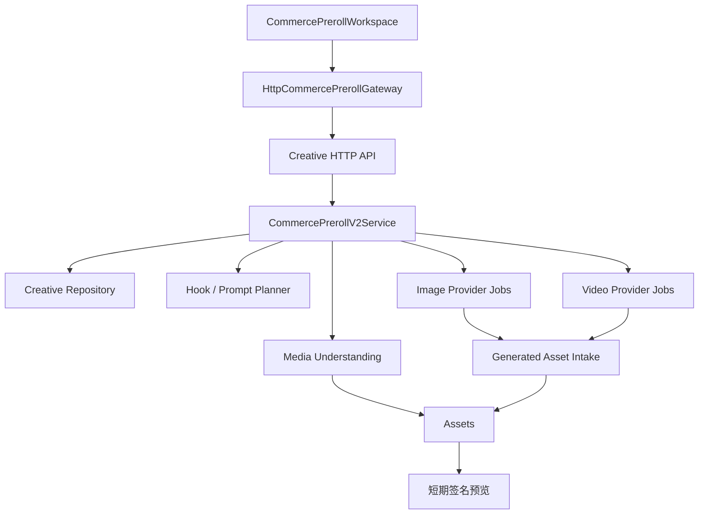
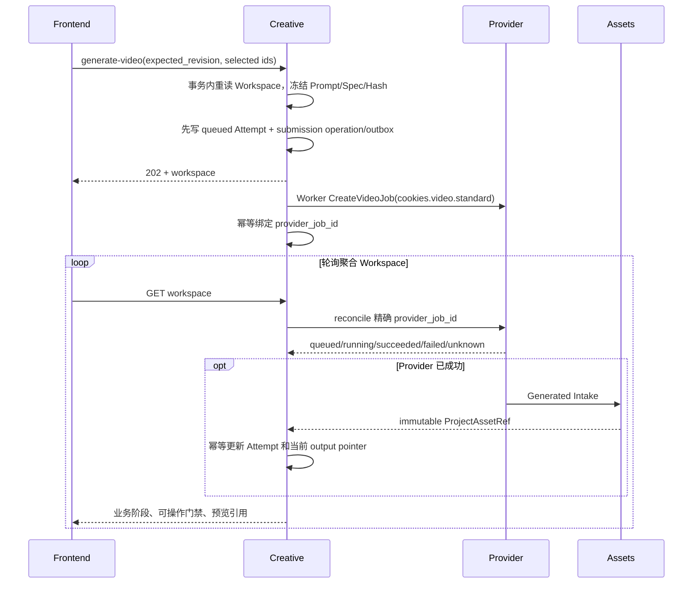

# 电商前贴 V2：原视频驱动的前后端开发技术方案

> 日期：2026-08-10
> 范围：创意创作 → 视频创作 → 效果广告 → 前贴广告 → 电商前贴
> 目标：在现有前端 V2 基础上完成真实后端闭环，并让前端改为消费服务端权威状态
> 状态：后端开发基线；本文不直接修改业务代码

## 1. 最终结论

电商前贴 V2 的权威输入不是 Brief 或策略包，而是**一条已经完成的电商原视频的不可变 AssetVersion**。系统分析原视频中的商品、卖点、画面、字幕、口播、音频气质和开场镜头，用户确认商品理解并选择一个钩子、6～10 秒时长和一张参考首帧，后端再编译完整 Prompt，调用 Seedance 生成一条独立前贴视频。

本期边界保持不变：

- 不要求策略包或 Brief；
- 不把前贴和原视频拼接；
- 不增加业务质检步骤；
- 不要求用户手写完整 Prompt；
- 生成结果必须可播放，并可显式保存到当前 Project 素材库；
- 五种钩子继续保留，但由后端根据当前原视频实例化，不能继续使用前端硬编码的娇兰 Prompt。

目标链路为：


其中，Seedance P0 不直接接收整条原视频。后端会把用户选择的创意首帧作为 `first_frame`，把从原视频开头提取的“稳定衔接锚点帧”作为 `last_frame`。这样输出仍是一条独立 6～10 秒视频，但结尾画面会收敛到原片开场语境，为以后拼接留出自然衔接条件。当前 Provider 已正式抽象 `first_last_frame`，且只接受不可变 Project Asset 引用。[S8]

## 2. 用户做什么，系统在后台做什么

| 阶段 | 用户需要做的事 | 前端呈现 | 后端静默记录与处理 |
|---|---|---|---|
| 原视频 | 选择项目视频或上传；确认有权用于生成 | 播放器、名称、时长、画幅、权利状态 | AssetVersion、SHA256、探测元数据、权利确认人和时间 |
| 内容理解 | 等待解析；编辑并确认商品名称、品类、描述、卖点和外观约束 | 5 个真实进度阶段、可编辑字段、商品参考图、仅高风险事实确认 | 抽帧、ASR、OCR/视觉证据、时间点、置信度、模型与 Prompt 版本 |
| 钩子方向 | 从五个候选中选择一个 | 具体创意、推荐理由、使用卖点、动作摘要；此处不锁定秒数 | Recipe ID/版本、分析版本、证据引用、候选批次 Hash |
| 生成设置 | 选择 6～10 秒；可填一句补充要求 | 建立钩子、完成变化、商品定格三段文字时序和 Prompt 摘要 | 完整 Provider Prompt、禁止项、音频策略、Prompt revision/hash |
| 参考首帧 | 选择 3 张候选之一；也可重新生成 | 真实图片、放大、选择和重试状态 | 每张图的 Provider Job、输入 Hash、输出 AssetVersion 和批次血缘 |
| 前贴成片 | 点击生成；成功后播放、重生成或保存 | 排队/运行/失败/结果未知/成功状态 | 冻结 GenerationSpec、Provider route revision、Job、输出 AssetVersion |

用户必填只有：原视频、权利确认、商品理解确认、钩子、时长、首帧。商品字段是“系统提取后可编辑”，完整 Prompt、证据定位、模型路由和 Job 信息不要求用户维护。

## 3. 当前代码基线与缺口

### 3.1 可以直接复用的能力

1. **Assets 上传、探测和不可变版本**
   - 视频上传后已经能保存时长、分辨率、视频/音频编码和海报帧；单视频上限当前是 200 MB。[S5]
   - 派生图片支持记录来源视频 AssetVersion 和稳定 `derivation_id`，适合存储商品参考帧与原片开场锚点帧。[S6]

2. **通用媒体理解骨架**
   - `platform/mediaunderstanding` 已有异步 Artifact、JobRuntime、均匀抽帧、结构化视觉结果、证据 Locator、模型 lineage 和 MySQL 持久化。[S7]
   - 当前 profile 只允许 15～90 秒视频，且视频路径仍标记 `transcript_unavailable`，因此不能直接满足目前 12 秒固定样例和 ASR 需求；应扩展 profile，而不是在 Creative 中再造一套无血缘的临时结果。[S7]

3. **短剧前贴 V2 工作流模式**
   - 短剧 V2 已实现 Workspace revision、上游修改后的下游失效、首帧批次、选择首帧、GenerationSpec、Provider Job 和 reconcile。[S9]
   - 可复用的是架构和基础服务，不复用短剧的剧情字段、四方向 Planner 或 CSS。

4. **Provider Gateway 与 Seedance Adapter**
   - Creative 只提交 `cookies.video.standard`，具体厂商、模型、Key、重试和路由版本由 Provider 管理。[S1][S8]
   - 当前视频统一输入支持 `text_only`、`reference_image`、`first_last_frame`，时长校验覆盖 4～15 秒，因此领域层可以安全收窄为 6～10 秒。[S8]
   - 当前本地配置脚本声明 9:16、480p/720p、首尾帧以及静音/生成音频能力，但正式环境必须通过烟测确认，不能只以脚本声明为成功。[S10]

5. **Provider 输出自动入库**
   - Provider 成功后已有 Generated Intake Worker 下载、校验并写入 Assets 的机制；Creative 不应把厂商临时 URL 当成永久素材地址。[S11]

### 3.2 不能继续沿用的旧电商实现

旧 `commerce_preroll` 是固定娇兰 Fixture 和 Brief/策略来源：

- 来源类型只有 `confirmed_brief` 和 `strategy_package`，没有源视频。[S2]
- Planner 把时长、画幅、分辨率、音频硬性限定为 `6 秒 + 9:16 + 720p + silent`。[S3]
- 工作区表以 `fixture_id + fixture_version` 为主键，不能表达用户创建的任意原视频任务。[S4]
- 旧 GenerationSpec 固定两张由商品图派生的首尾帧，不包含原视频分析、商品确认、钩子批次、参考首帧批次和开场衔接锚点。[S3]
- 当前 HTTP 只有来源、prepare、fixture workspace、草稿修改和生成确认；虽然领域层存在 Provider Input 与 Generation Attempt seam，但尚未接出电商首帧生成、真实视频生成和 reconcile 命令，因此不能把旧接口当成完整闭环。[S16]

因此 V2 应与 V1 并行读取，不能原地改变 V1 JSON 语义。前端 V2 接新契约；旧 fixture 路由保留到历史数据和测试迁移完成。

### 3.3 当前前端仍是 Fixture Gateway

现有 `CommercePrerollGateway` 已经把分析、钩子、Prompt、首帧、视频和素材保存隔离在接口后面，这是正确的接缝；但实现仍使用 `window.setTimeout` 和本地 Fixture，`clientTaskId` 与生成结果也只存浏览器。[S12]

后端接入时应保留页面布局和六步交互，替换状态权威来源：

- `FixtureCommercePrerollGateway` → `HttpCommercePrerollGateway`；
- 本地 reducer 不再伪造服务器事实，只映射 Workspace 聚合响应和保存未提交文本；
- `clientTaskId` → 服务端 `CreativeTask.id`；
- 分析/生成进度 → 服务端 Resource/Attempt 状态；
- 本地视频 URL → Assets 短期签名预览 URL。

## 4. 目标模块架构



所有权边界：

- **Creative**：拥有任务、工作区、人工选择、Recipe、Prompt、批次、失效规则和当前结果指针；
- **Assets**：拥有上传文件、派生帧、生成图片/视频、元数据、预览 URL 和血缘；
- **Provider**：拥有厂商路由、凭据、异步 Job、重试和输出拉取；
- **Media Understanding**：拥有对某一精确 AssetVersion 的通用证据 Artifact；
- **Strategy**：P0 不参与。未来只能通过版本化 Artifact 提供可选增强上下文，不能共享表或控制 Provider Job。Kanon 架构要求四个业务系统各自拥有领域模型，通过稳定 API/事件交换版本化产物。[S1]

## 5. 后端领域模型

### 5.1 Workspace 聚合

建议在 `VideoDraft` 增加：

```go
CommercePrerollV2 *CommercePrerollV2Workspace `json:"commerce_preroll_v2,omitempty"`
```

核心契约：

```text
creative-commerce-preroll-workspace/v2
```

建议字段：

```go
type CommercePrerollV2Workspace struct {
    ContractVersion string
    TaskID           string
    Stage            CommercePrerollV2Stage
    Source           CommerceSourceBinding
    Analysis         *CommerceSourceAnalysis
    HookBatch        *CommerceHookBatch
    SelectedHookID   string
    Settings         *CommerceGenerationSettings
    PromptDraft      *CommercePromptDraft
    FirstFrameBatch  *CommerceFirstFrameBatch
    GenerationSpec   *CommerceGenerationSpec
    VideoAttempt     *CommerceVideoAttemptSummary
    OutputAsset      *contract.ProjectAssetRef
    AdoptedAsset     *contract.ProjectAssetRef
    CreatedAt        time.Time
    UpdatedAt        time.Time
}
```

Workspace 自身随 `creative_video_drafts.revision` 版本化。GET 返回当前 revision；所有修改命令携带 `expected_revision`。浏览器上传的完整 Workspace、Prompt、厂商 URL 或模型 ID一律不可信。

### 5.2 源视频绑定

```go
type CommerceSourceBinding struct {
    Asset             contract.ProjectAssetRef
    AssetSHA256       string
    RightsStatus      string // confirmed
    RightsConfirmedBy contract.Principal
    RightsConfirmedAt time.Time
    DurationMS        int64
    WidthPixels       int
    HeightPixels      int
    AspectRatio       string
    OpeningAnchor     *CommerceOpeningAnchor
}
```

P0 输入约束建议：

- `video/mp4`；
- 6～180 秒；
- 最大 200 MB，沿用 Assets 上限；
- 画幅为 9:16；非 9:16 返回可操作的 `SOURCE_ASPECT_UNSUPPORTED`，不进行静默裁切；
- Assets probe 必须成功；
- 权利确认只记录用户声明，不代表平台完成法律审核。

### 5.3 分析结果

```go
type CommerceSourceAnalysis struct {
    Revision              int64
    Resource              AsyncResource
    MediaArtifactID       string
    AIOriginal            CommerceProductFacts
    UserConfirmed         *CommerceProductFacts
    VisualStyle           string
    SubtitleSummary       string
    VoiceSummary          string
    AudioMood             string
    OpeningShot           string
    ProductReferences     []CommerceProductReference
    SelectedReference     *contract.ProjectAssetRef
    RiskFacts             []CommerceRiskFact
    Evidence              []CommerceEvidence
    HookInputsHash        string
}
```

必须同时保存 `ai_original` 和 `user_confirmed`，不能在用户编辑后覆盖 AI 原值。证据包含 `timestamp_ms`、模态（frame/OCR/ASR）、置信度和派生帧引用；默认不全部返回到主页面，但必须保留用于审计、重算和风险提示。

### 5.4 五种 Hook Recipe

`VideoTemplateRecipe` 是后端的生产规则，不是一个要求用户填写的前端表单。建议存为版本化代码/JSON 配置：

```go
type CommerceHookRecipe struct {
    ID                 string
    Version            int64
    Name               string
    Preconditions      []string
    HookGrammar        string
    ChangeGrammar      string
    LockupGrammar      string
    CameraRules        []string
    FidelityRules      []string
    ProhibitedPatterns []string
}
```

首版五个固定 ID：

1. `product_cut/v1`：商品切割；
2. `frosted_window_reveal/v1`：雾面橱窗揭幕；
3. `one_tap_pickup/v1`：一键取物；
4. `micro_efficacy_theater/v1`：微缩功效剧场；
5. `device_recall/v1`：3C 设备召回。

后端每次基于当前 `analysis_revision + confirmed_product_hash + recipe_version` 生成五个 `HookProposal`。卡片返回的是具体方案、理由、使用卖点和动作摘要；完整模板语法和 Provider Prompt 不直接暴露。即使某个 Recipe 不适合当前品类，也保留卡片并返回 `applicability=low` 和明确原因，不伪造“推荐”。

### 5.5 Prompt Draft 与三段节奏

Prompt Draft 由后端编译：

```go
type CommercePromptDraft struct {
    Revision         int64
    AnalysisRevision int64
    HookBatchID      string
    HookID           string
    RecipeVersion    int64
    DurationSeconds  int
    Beats            []CommerceBeat
    Summary          string
    ProviderPrompt   string
    PromptHash       string
    ExtraInstruction string
    AudioPolicy      provider.VideoAudioPolicy
}
```

三段时间不能使用固定秒数模板，而应由时长函数计算：

```text
hook_end   = clamp(round(duration * 0.25), 2, 3)
lockup_len = 2
change_end = duration - lockup_len
```

最终 Prompt 至少包含：创作用途、商品身份、已确认卖点、视觉与镜头规则、三段精确时序、商品保真、开场首帧描述、结尾衔接锚点描述、音频策略和禁止项。用户的一句话补充要求只能进入受限字段，不能覆盖商品保真、权利或安全规则。

## 6. 原视频分析实现

### 6.1 扩展 Media Understanding Profile

不要直接调用 `ViralAnalyzer` 并冒充电商结果。应把它已经具备的媒体暂存、FFmpeg 抽音轨、ASR 和抽帧能力下沉为公共组件，再为 `mediaunderstanding` 增加：

```text
profile = creative.commerce-preroll-source.v1
profile_version = v1
prompt_version = commerce-source-understand.v1
schema_version = commerce-source-analysis/v1
```

处理阶段与前端进度一一对应：

1. `probing_source`：读取 probe、音轨和画幅；
2. `extracting_frames`：均匀抽帧、商品候选帧和开头密集抽帧；
3. `understanding_product`：识别商品、品类、卖点、外观和 Logo；
4. `understanding_copy_audio`：OCR、ASR、字幕、口播和音频气质；
5. `preparing_creative_context`：生成风险事实、商品参考图候选和 Hook 输入摘要。

进度使用已完成阶段数，例如 `3/5`，不伪造百分比和倒计时。

### 6.2 抽帧策略

至少产生三组帧：

- **全片理解帧**：按时长均匀选 6～10 帧；
- **商品参考候选**：优先选择清晰、正面、无遮挡、Logo/标签可辨识的帧；
- **开场衔接候选**：在原视频 `0～1500ms` 内密集采样。

“原片开场锚点”不应机械取第 0 帧。很多视频第 0 帧是黑场、淡入或模糊转场。后端应在开头候选中选择最早满足以下条件的帧：

- 非黑场、非纯色过渡；
- 清晰度超过阈值；
- 与后续 300～500ms 画面稳定；
- 没有被大面积转场遮挡；
- 能代表原片第一个有效镜头。

结果保存 `timestamp_ms + frame_asset_ref + selector_version + metrics`，并作为 Seedance 的 `last_frame`。这一步默认后台执行，前端只显示“小型状态：已从原片开头提取衔接锚点”，不增加新的用户步骤。

### 6.3 商品、字幕和音频

- 商品名称、品类、描述、卖点和外观约束必须由结构化 Schema 输出；
- 可见文字与口播分开保存，不能把 ASR 结果当成画面字幕；
- 价格、折扣、功效数值、绝对化承诺等进入 `RiskFact`，必须引用证据；
- 没有音轨时分析仍可成功，写入 `audio_track_absent` warning；
- P0 只把音频气质转成生成提示，不把原视频音频作为 Seedance 输入；
- 默认不生成新的商品功效、价格、折扣、认证或口播文案。

## 7. 首帧图片与 Seedance 视频生成

### 7.1 参考首帧批次

确认 Hook 与设置后，后端用：

```text
已确认商品参考图
+ Hook Recipe/Proposal
+ 商品保真规则
+ 开场构图与环境规则
+ 9:16 输出画布
```

创建 3 个独立图片 Provider Job。每个候选必须持久化：`candidate_id`、`batch_id`、`variant_index`、`prompt_hash`、`provider_job_id`、状态、输出 AssetVersion 和错误。允许部分成功；只重试失败候选，不清空成功图片。

### 7.2 GenerationSpec

用户选择首帧后，服务端重新读取 Workspace 并冻结：

```go
type CommerceGenerationSpec struct {
    ContractVersion   string
    WorkspaceRevision int64
    AnalysisRevision  int64
    HookBatchID       string
    HookID            string
    PromptRevision    int64
    PromptHash        string
    DurationSeconds   int
    AspectRatio       string // 9:16
    Resolution        string // 720p
    AudioPolicy       provider.VideoAudioPolicy
    InputMode         provider.VideoInputMode // first_last_frame
    FirstFrame        contract.ProjectAssetRef
    LastFrame         contract.ProjectAssetRef
    SourceVideo       contract.ProjectAssetRef
    SpecHash          string
}
```

映射到 Provider：

```go
provider.VideoGenerationInput{
    Prompt:          spec.ProviderPrompt,
    DurationSeconds: spec.DurationSeconds,
    AspectRatio:     "9:16",
    Resolution:      "720p",
    AudioPolicy:     spec.AudioPolicy,
    InputMode:       provider.VideoInputFirstLastFrame,
    ConditioningAssets: []provider.VideoConditioningAsset{
        {Role: provider.VideoConditioningFirstFrame, Reference: spec.FirstFrame},
        {Role: provider.VideoConditioningLastFrame, Reference: spec.LastFrame},
    },
}
```

完整原视频只用于分析、抽帧和血缘，不作为 P0 Seedance conditioning asset。虽然 Seedance 2.0 官方能力展示包含参考视频、参考图片、音频和时序 Prompt，但当前仓库 Provider 契约尚无 `reference_video`/`reference_audio` 角色；不应绕过 Provider 直接拼厂商请求。[S8][S15]

### 7.3 音频策略

建议规则：

- 原片无音轨：`silent`；
- 原片有音轨且路由支持：`generated_audio`，Prompt 只描述节奏、环境声和情绪，不生成未经确认的口播；
- 路由不支持所需音频策略：生成前 capability preflight 返回明确错误，不静默换模型；
- P1 若 Provider 增加参考音频角色，再考虑以原片开头音频作为节奏参考。

### 7.4 保存到素材库的真实语义

Provider 成功不等于浏览器拿到一个长期 URL。正确顺序是：

1. Provider Job 成功并产生 OutputHandle；
2. Generated Intake Worker 拉取并校验 MP4；
3. Assets 创建带 Provider Job、Prompt/Spec Hash、源视频与首尾帧血缘的 AssetVersion；
4. Workspace `output_asset` 指向该 AssetVersion，前端获得短期预览 URL；
5. 用户点击“保存到素材库”调用 `:adopt-output`，只更新 Creative 当前结果指针和素材可见分类，不重复复制文件；
6. 保存后素材库按 `owner_system=assets + relation=commerce_preroll_output` 展示。

P0 不因为没有业务质检而阻止入库；文件损坏、类型不符、输出过期等技术校验仍由 Generated Intake 执行。

这里必须额外处理一处血缘差异：原视频在 P0 不属于 Seedance conditioning asset，Generated Intake 默认只能从 Provider Job 的 conditioning/source resources 自动推导关系。Creative 在提交 Job 时应显式把 `source_video + media_understanding_artifact + prompt/spec hashes` 作为来源资源/业务关系传给 Intake，或在入库后幂等补写 `commerce_preroll_derived_from` 关系；否则素材库只能看到“由首帧生成”，会丢失“由哪条原视频分析驱动”的关键来源。[S17]

## 8. HTTP API 契约

所有路径均在当前 Project 和 CreativeTask 范围内。创建 Job/批次的写请求必须带：

```http
Idempotency-Key: commerce-preroll-v2:{task_id}:{operation_id}
```

修改已有 Workspace 的请求必须带：

```json
{"expected_revision": 7}
```

### 8.1 建议端点

| 方法 | 路径 | 用途 | 成功 |
|---|---|---|---:|
| POST | `/api/creative/v1/projects/{project_id}/commerce-preroll-tasks` | 用精确原视频 AssetVersion 创建 V2 Task | 201 |
| GET | `/api/creative/v1/projects/{project_id}/commerce-preroll-tasks/latest` | 恢复当前 Project 最近任务 | 200/404 |
| GET | `/api/creative/v1/projects/{project_id}/creative-tasks/{task_id}/commerce-preroll-v2` | 获取权威聚合 Workspace | 200 |
| PUT | `.../commerce-preroll-v2/source` | 更换源视频并使所有下游失效 | 200 |
| POST | `.../commerce-preroll-v2:analyze-source` | 创建/复用 Media Understanding Artifact | 202 |
| PATCH | `.../commerce-preroll-v2/understanding` | 保存用户编辑和风险决策 | 200 |
| POST | `.../commerce-preroll-v2:confirm-understanding` | 冻结当前商品理解 | 200 |
| POST | `.../commerce-preroll-v2:generate-hooks` | 生成五个 HookProposal | 202/200 |
| POST | `.../commerce-preroll-v2:select-hook` | 选择 Hook | 200 |
| PUT | `.../commerce-preroll-v2/settings` | 保存时长、补充要求和商品参考图 | 200 |
| POST | `.../commerce-preroll-v2:first-frames` | 创建三图批次 | 202 |
| POST | `.../commerce-preroll-v2:select-first-frame` | 选择一张 ready 首帧 | 200 |
| POST | `.../commerce-preroll-v2:generate-video` | 冻结 Spec 并创建 Seedance Job | 202 |
| POST | `.../commerce-preroll-v2:adopt-output` | 保存当前输出为素材库可见产物 | 200 |

图片与视频 Job 状态不要求前端分别扫描 Provider API。前端只轮询聚合 Workspace；后端 reconcile 精确 Job 并返回业务状态。

### 8.2 创建任务示例

```json
{
  "source_asset": {"asset_id": "asset_source", "version": 3},
  "rights_attestation": {
    "confirmed": true,
    "statement_version": "commerce-generation-rights/v1"
  }
}
```

返回 `task_id + workspace_revision + workspace`。服务端必须重新验证 Asset 属于当前 Organization/Project、是 ready 视频且版本完全匹配。

### 8.3 Workspace 聚合响应

GET 是刷新恢复的唯一业务权威来源，至少返回：

```json
{
  "contract_version": "creative-commerce-preroll-workspace/v2",
  "task_id": "creative_task_x",
  "revision": 8,
  "stage": "first_frame_ready",
  "source": {},
  "analysis": {},
  "hook_batch": {},
  "settings": {},
  "prompt_draft": {},
  "first_frame_batch": {},
  "video_attempt": {},
  "output_asset": {},
  "adopted_asset": null,
  "presentation": {
    "can_analyze": false,
    "can_confirm_understanding": false,
    "can_generate_hooks": false,
    "can_generate_first_frames": false,
    "can_generate_video": true,
    "can_adopt_output": false
  }
}
```

预览 URL 在读取时由 Assets 签发，不能写入 `content_payload`。响应不得包含 API Key、上游模型 ID、内部 Base URL、对象存储长期地址或完整厂商错误体。

### 8.4 错误语义

| HTTP | 业务含义 |
|---:|---|
| 400 | JSON、枚举、长度或格式错误 |
| 403 | Project/Asset 无权限或权利声明缺失 |
| 404 | Task、AssetVersion、Batch、Candidate 不存在 |
| 409 | Workspace revision、幂等 Hash 或批次血缘冲突 |
| 422 | 当前阶段不可执行；源视频/风险事实/首帧未满足门禁 |
| 429 | Provider 限流，返回 `retry_after` |
| 502/503 | Provider、Assets Intake 或运行依赖暂不可用 |

错误响应必须包含稳定 `code`、用户可理解 `message`、`retryable`、保留了什么以及 `request_id`。例如版本冲突返回“任务内容已在其他页面更新，请刷新后重试”，不能把 Go/SQL 原始错误直接显示给用户。

## 9. 状态机与失效规则

建议主阶段：

```text
source_ready
→ analyzing
→ understanding_ready
→ understanding_confirmed
→ hooks_ready
→ hook_selected
→ first_frames_generating
→ first_frame_ready
→ video_generating
→ video_ready
→ output_adopted
```

`failed` 不应成为摧毁整个 Workspace 的全局终态。Analysis、HookBatch、FirstFrameBatch 和 VideoAttempt 各自持有 `queued/running/ready/partial/failed/cancelled/unknown`，以便精确重试并保留上游结果。

失效矩阵：

| 用户修改 | 必须失效 | 保留历史 |
|---|---|---|
| 更换源视频 | 分析、确认、Hook、Prompt、首帧、视频 | 是 |
| 编辑商品/卖点/外观 | 商品确认、Hook、Prompt、首帧、视频 | AI 原值、旧批次和旧产物 |
| 更换商品参考图 | 首帧批次、选中首帧、视频 | 旧图与旧结果 |
| 更换 Hook | Prompt、首帧、视频 | 旧 Hook 批次 |
| 修改时长 | Prompt 精确时序、GenerationSpec、视频 | 已生成首帧可保留 |
| 修改补充要求 | Prompt、首帧、视频 | 旧 Prompt revision |
| 更换选中首帧 | GenerationSpec、视频 | 旧视频 Attempt |

旧异步任务成功时只能更新自己的 Attempt/Asset 历史；如果其 `workspace_revision/input_hash/batch_id` 已不是当前值，不得重新成为当前结果。

## 10. 持久化方案

### 10.1 Workspace

延续短剧 V2：聚合状态写入版本化 `creative_video_drafts.content_payload`，使用 `contract_version` 分流。不要把 V2 强塞进旧 fixture workspace 表。

任务使用现有：

- `creative_intakes`；
- `creative_tasks`；
- `creative_video_drafts`。

V2 创建任务可扩展现有 manual intake：

```text
manual_commerce_preroll_v2
route_manual_commerce_preroll_v2
performance_mode = commerce_preroll
```

旧 `manual_commerce_preroll` 与 `route_fixture_commerce_preroll_v1` 保持可读。

### 10.2 异步事实

- 视频理解：复用 `platform_media_understanding_artifacts` 和 JobRuntime；
- 图片/视频厂商执行：复用 `provider_jobs`、output handles 和 generated intake；
- 图片批次与当前选择：保存在 Workspace revision；
- 视频业务 Attempt：新增 `creative_commerce_preroll_v2_generation_attempts`，不要破坏旧 V1 表。

建议新表字段：

```text
id, organization_id, project_id, task_id
workspace_revision, analysis_revision
hook_batch_id, hook_id, recipe_id, recipe_version
prompt_revision, prompt_hash
first_frame_batch_id, first_frame_asset_id, first_frame_asset_version
last_frame_asset_id, last_frame_asset_version
source_asset_id, source_asset_version
duration_seconds, generation_spec_hash
operation_id, idempotency_key, request_hash, submission_state
provider_job_id, generated_intake_id
status, error_code, error_message, retry_of_attempt_id
output_asset_id, output_asset_version
adopted_at, created_at, updated_at
```

索引和约束：

- Provider Job ID 在 Organization 内唯一；
- `(organization_id, project_id, task_id, created_at)`；
- `(organization_id, task_id, operation_id, operation_kind)` 唯一；
- 相同 idempotency key 必须绑定相同 request hash；
- Asset ID 与 Version 成对为空或成对存在；
- `duration_seconds BETWEEN 6 AND 10`；
- 外键指向 CreativeTask，重试指向同表 Attempt。

## 11. 异步执行与恢复



P0 可沿用短剧当前的 GET 驱动 reconcile，但必须只对 Workspace 记录的精确 Job 操作。P1 应改为后台 worker/事件推进，让用户关闭页面后任务仍会完成；GET 最终只读。

提交 Provider Job 不能简单复制当前短剧 Handler 的“先建 Provider Job、后登记领域状态”顺序：如果第二步遇到 revision 冲突，会留下已扣费但 Workspace 不认识的孤儿 Job。Commerce V2 应先在同一数据库事务中写入带唯一 operation identity 的 queued Attempt 和 outbox/submission operation，再由 Worker 幂等创建 Provider Job并回绑；至少也要有可恢复的 `submission_pending/submission_unknown` 状态。[S18]

重试规则：

- 同一个幂等 key + 相同请求返回同一结果；相同 key + 不同请求返回 409；
- 用户点击“重试”复用失败 Attempt 的冻结输入；
- 用户点击“重新生成”创建新 Batch/Attempt 和新 operation ID；
- 图片批次支持部分成功，只重试失败候选；
- Provider `succeeded` 但 Assets 未完成入库时展示“正在保存生成结果”，不能提前显示成功；
- `unknown` 保留任务和诊断 ID，允许继续查询，不能自动重复扣费提交。

## 12. 前端配合改造

现有视觉和六步页面保留，不重新设计。主要代码改动应集中在 `src/features/commerce-preroll-v2/`：

1. 新增 `HttpCommercePrerollGateway`，调用本文 API；Fixture Gateway 仅保留 Story/测试。
2. 新增 `workspaceMapper.ts`，把后端聚合响应转换成页面 ViewModel，组件不直接解释 Provider Job。
3. `SourceVideo` 改为精确 Asset 引用与服务端预览信息；上传调用既有 Assets upload session。
4. 页面加载优先根据 URL `cpTask` GET；没有 task 时才读取 `latest` 或进入空任务。
5. `localStorage` 只保存 `task_id`、`active_step` 和尚未提交的文本草稿，不保存分析结果、Job、Asset 或视频 URL。
6. 解析和生成进度来自后端 `resource.stage/completed_steps`，删除 Fixture 定时器。
7. 用户编辑商品字段采用显式保存/确认，或者 500～800ms debounce 后串行 autosave；每次带当前 revision，409 后刷新并提示冲突。
8. Hook、首帧和视频按钮只读 `presentation.can_*`，不在前端复制完整门禁逻辑。
9. “保存到素材库”调用 `:adopt-output`；成功后使用服务端 `adopted_asset`，不生成本地假 Asset ID。
10. 所有预览 URL 视为短期值；刷新后从 Workspace 重新获取。

Gateway 建议接口：

```ts
interface CommercePrerollGateway {
  createTask(input: CreateTaskInput, key: string): Promise<Workspace>
  getLatest(projectId: string): Promise<Workspace | null>
  getWorkspace(taskId: string): Promise<Workspace>
  replaceSource(taskId: string, command: ReplaceSourceCommand): Promise<Workspace>
  analyzeSource(taskId: string, command: RevisionCommand): Promise<Workspace>
  updateUnderstanding(taskId: string, command: UpdateUnderstandingCommand): Promise<Workspace>
  confirmUnderstanding(taskId: string, command: RevisionCommand): Promise<Workspace>
  generateHooks(taskId: string, command: RevisionCommand): Promise<Workspace>
  selectHook(taskId: string, command: SelectHookCommand): Promise<Workspace>
  updateSettings(taskId: string, command: UpdateSettingsCommand): Promise<Workspace>
  generateFirstFrames(taskId: string, command: RevisionCommand): Promise<Workspace>
  selectFirstFrame(taskId: string, command: SelectFrameCommand): Promise<Workspace>
  generateVideo(taskId: string, command: GenerateVideoCommand): Promise<Workspace>
  adoptOutput(taskId: string, command: RevisionCommand): Promise<Workspace>
}
```

## 13. 安全、成本与观测

### 13.1 安全

- Ark/Seedance、Vision、Image 和 ASR 凭据只存 Provider Credential Broker 或服务端 Secret；不进入前端、Creative JSON、日志、文档或 Git。[S1]
- Creative 提交 Provider 前重新验证每个 AssetVersion 的 Organization、Project、ready 状态与授权。
- 签名预览 URL 不持久化、不写审计 payload。
- Prompt、ASR 全文、用户上传画面和厂商原始响应不写普通 info 日志。
- 用户补充要求设长度上限，并经过控制字符与 Prompt 注入边界处理；它不能覆盖系统禁止项。
- 返回前端的错误过滤 Key、内部 URL、SQL、厂商完整响应和对象存储路径。

### 13.2 成本与限流

一次完整链路大致包含：一次视频理解、一次 Hook/Prompt 规划、三次图片生成、一次视频生成。后端需要记录：

- capability alias、route revision、耗时和 Provider usage；
- 单 Project 并发分析数；
- 单 Task 图片并发与视频并发；
- 每日图片/视频生成次数；
- 分析、图片和视频超时；
- 用户明确重生成次数。

不要在前端显示虚构费用；只有 Provider 返回可信 usage 且产品确认计费口径后再展示。

### 13.3 指标

至少记录：

- `commerce_preroll_analysis_duration_seconds`；
- `commerce_preroll_analysis_failure_total{code}`；
- `commerce_preroll_first_frame_jobs_total{status}`；
- `commerce_preroll_video_jobs_total{status,route_revision}`；
- `commerce_preroll_generated_intake_duration_seconds`；
- `commerce_preroll_revision_conflict_total`；
- `commerce_preroll_output_adopt_total`。

## 14. 测试与验收门槛

### 14.1 领域单元测试

- 只接受 6、7、8、9、10 秒；
- 五种 Recipe 都能输出结构完整候选，并引用当前 analysis revision；
- 商品事实、Hook、时长、参考图、补充要求和首帧修改触发正确失效范围；
- 相同输入生成稳定 Prompt/Spec Hash；
- 旧 Job 完成不能覆盖新 revision；
- 非当前 Batch 的 Hook/首帧选择返回冲突；
- 风险事实未决时不能确认理解；
- V1 Draft 仍可读取。

### 14.2 Assets/Provider 集成测试

- 12 秒 9:16 MP4 可以上传、probe、抽帧和分析，覆盖当前娇兰固定样例；
- 开场为黑场/淡入时能选择后续稳定锚点；
- 有声、无声视频都能分析；
- 商品参考帧与开场锚点均记录源 AssetVersion；
- 三个首帧 Job 可聚合 ready/partial/failed；
- 视频请求严格为 `first_last_frame + 9:16 + 720p + 6～10 秒`；
- Provider 成功而 Intake 未完成时不标记成片成功；
- reconcile 重放不创建重复 Asset；
- 输出 MP4 可播放，时长误差在 Provider/Assets 允许范围内。

### 14.3 HTTP 契约测试

- 写命令校验 `Idempotency-Key` 与 `expected_revision`；
- 同 key 同请求重放、同 key 异请求冲突；
- Workspace GET 一次恢复六步所有状态；
- 响应不含 Key、上游模型 ID、长期 URL；
- 403/409/422/429/503 映射为稳定错误码；
- Project 与 Asset 越权失败关闭。

### 14.4 浏览器端到端

使用一条有声和一条无声的授权 9:16 电商视频，完成：

1. 上传/选择并刷新恢复；
2. 看到 5 阶段真实解析进度；
3. 编辑并确认商品信息；
4. 获得五个非固定文案的 HookProposal；
5. 选择 6～10 秒和补充要求；
6. 生成三张真实首帧并选择；
7. 生成一条独立前贴并在页面播放；
8. 刷新后恢复精确任务、进度和结果；
9. 点击保存后在素材库看到同一 AssetVersion，不产生重复文件；
10. 任一上游编辑后旧结果不再被标为当前结果。

## 15. 推荐开发顺序

### P0-A：契约和持久化骨架

1. 定义 `CommercePrerollV2Workspace`、阶段、资源、批次和 GenerationSpec；
2. 扩展 manual intake、`VideoDraft` 和 Validate；
3. 新增 V2 generation attempt migration；
4. 实现创建任务、GET 聚合、revision、幂等和失效规则；
5. 保持 V1 路由与数据可读。

### P0-B：源视频与真实分析

1. 接入既有 Assets 上传和精确 AssetVersion；
2. 扩展 `creative.commerce-preroll-source.v1` profile；
3. 抽取公共 FFmpeg/ASR/抽帧能力；
4. 实现商品、卖点、OCR/ASR、风险和参考图候选；
5. 实现稳定开场锚点提取与派生图入库。

### P0-C：Hook 与 Prompt

1. 把五种 Recipe 从前端/旧 Planner 收拢到版本化后端注册表；
2. 实现五候选 Planner、证据门禁和有限修复；
3. 实现商品确认、Hook 选择、6～10 秒节奏和 Prompt Draft；
4. 完成 Prompt/Spec Hash 与失效测试。

### P0-D：首帧与 Seedance

1. 创建三图 Batch 和独立 Provider Job；
2. Generated Intake 后聚合 AssetVersion；
3. 实现首帧选择；
4. 用选中首帧 + 原片开场锚点冻结 `first_last_frame` Spec；
5. 创建 Seedance Job、reconcile、输出入库和 adopt。

### P0-E：前端联调

1. 增加 HTTP Gateway 与 Workspace Mapper；
2. 替换本地任务/定时器/假 Asset ID；
3. 对接真实上传、轮询、冲突、错误和恢复；
4. 保持现有页面布局与视觉；
5. 完成全链路浏览器验收。

### P1：生产化

1. GET 驱动 reconcile 改为后台 worker/事件；
2. 取消、超时、配额、成本与运维面板；
3. 增加非 9:16 的显式画布适配流程；
4. Provider 增加参考视频/参考音频角色后再评估直接多模态输入；
5. 策略 Artifact 作为可选上下文接入，不改变核心工作流。

## 16. 开发前需要确认的外部条件

这些条件不影响先完成 P0-A，但会影响真实联调：

1. `cookies.video.standard` 在目标环境实际映射到 Seedance 2.0，并通过 `first_last_frame + 9:16 + 720p + 6～10 秒` 烟测；
2. `cookies.image.standard` 可以稳定生成 9:16 首帧，明确单任务并发和超时；
3. `cookies.vision.standard` 支持多图结构化 JSON；
4. ASR 当前仍是本地限制配置，需确认正式运行方式；没有 ASR 时必须允许视觉部分成功，而不是阻塞全部分析。[S14]
5. 部署环境包含可执行的 FFmpeg/ffprobe；
6. 至少两条可用于模型输入的授权 9:16 测试视频：一条有声、一条无声；
7. Provider/Assets Worker 在用户关闭页面后仍持续运行；
8. 产品侧确认原视频时长上限、并发、重生成次数和费用提示口径。

不需要把 API Key 提供给前端，也不应在本文或提交中记录任何 Key。

## 17. 一手依据

- [S1] [Kanon Cookies README](https://github.com/shikanon/cookies#readme)：领域边界、版本化 Artifact、Provider 凭据只在服务端、前端只使用逻辑别名。
- [S2] [`commerce_source.go`](../../internal/systems/creative/commerce_source.go#L12-L105)：旧电商来源只有 Brief/Strategy，商品事实结构不含视频理解。
- [S3] [`commerce_preroll.go`](../../internal/systems/creative/commerce_preroll.go#L37-L77)：旧 Planner 固定 6 秒/9:16/720p/静音；[`commerce_preroll.go`](../../internal/systems/creative/commerce_preroll.go#L188-L267)：旧首尾帧 GenerationSpec。
- [S4] [`20260730122000_creative_commerce_preroll_workspaces.up.sql`](../../migrations/creative/20260730122000_creative_commerce_preroll_workspaces.up.sql)：旧 fixture workspace 和 generation attempt 表。
- [S5] [`assets/model.go`](../../internal/platform/assets/model.go#L11-L14)：视频 200 MB 上限；[`video_probe.go`](../../internal/platform/assets/video_probe.go)：真实视频探测。
- [S6] [`assets/upload_service.go`](../../internal/platform/assets/upload_service.go#L353-L427)：派生图片按来源视频和 derivation ID 不可变入库。
- [S7] [`mediaunderstanding/model.go`](../../internal/platform/mediaunderstanding/model.go)：证据、时间点、关键帧和模型 lineage；[`service.go`](../../internal/platform/mediaunderstanding/service.go#L63-L176)：当前 profile/时长限制；[`job.go`](../../internal/platform/mediaunderstanding/job.go#L87-L184)：异步抽帧与结构化视觉理解。
- [S8] [`provider/video.go`](../../internal/platform/provider/video.go#L16-L159)：统一视频输入、首尾帧、6～10 秒所需基础校验；[`ark_video_adapter.go`](../../internal/platform/provider/ark_video_adapter.go#L150-L177)：Seedance 2.0 输入模式门禁。
- [S9] [`short_drama_preroll_v2.go`](../../internal/systems/creative/short_drama_preroll_v2.go)：V2 Workspace 模型；[`short_drama_v2_media_workflow.go`](../../internal/systems/creative/short_drama_v2_media_workflow.go#L114-L595)：图片批次、选择、GenerationSpec 与 reconcile 模式。
- [S10] [`configure-ark-video.ps1`](../../scripts/configure-ark-video.ps1#L89-L119)：本地 `cookies.video.standard` route constraints；[`verify-ark-video.ps1`](../../scripts/verify-ark-video.ps1)：真实路由验证入口。
- [S11] [`generated_intake_service.go`](../../internal/platform/assets/generated_intake_service.go#L17-L270)：Provider 输出拉取、校验和 Assets 入库 Worker。
- [S12] [`commerce-preroll-v2/gateway.ts`](../../src/features/commerce-preroll-v2/gateway.ts)：当前 Fixture Gateway；[`types.ts`](../../src/features/commerce-preroll-v2/types.ts)：当前六步前端状态；[`reducer.ts`](../../src/features/commerce-preroll-v2/reducer.ts)：当前失效规则。
- [S13] [`2026-08-10-commerce-preroll-v2-frontend-first-technical-design.md`](./2026-08-10-commerce-preroll-v2-frontend-first-technical-design.md)：已确认的页面、用户输入和产品边界。
- [S14] [`config.go`](../../internal/platform/config/config.go#L186-L190) 与 [`config.go`](../../internal/platform/config/config.go#L712-L733)：ASR 目前仍是 local-only 预配置；[`viral_analyzer.go`](../../internal/integrations/creativeprovider/viral_analyzer.go#L139-L224)：已有 FFmpeg/ASR 实现可抽取公共能力。
- [S15] [火山方舟 Seedance 2.0 官方能力说明](https://developer.volcengine.com/articles/7606009619928449070)：多模态参考、最长 15 秒、时序 Prompt、参考图/视频与生成音频能力。具体 API 参数仍以目标环境 Route 烟测为准。
- [S16] [`creative_handlers.go`](../../internal/platform/httpserver/creative_handlers.go#L753-L844) 与 [`commerce_workspace.go`](../../internal/systems/creative/commerce_workspace.go#L645-L700)：当前 Commerce HTTP 与未接出的 Provider/Attempt seam。
- [S17] [`provider/service.go`](../../internal/platform/provider/service.go#L330-L413) 与 [`generated_intake_service.go`](../../internal/platform/assets/generated_intake_service.go#L230-L245)：生成输出入库和默认来源关系推导。
- [S18] [`creative_handlers.go`](../../internal/platform/httpserver/creative_handlers.go#L1531-L1551)：当前短剧先建 Provider Job、后登记领域状态的顺序；[`jobruntime/mysql_store.go`](../../internal/platform/jobruntime/mysql_store.go#L52-L80)：可复用的幂等 JobRuntime 持久化基础。

## 18. 决策摘要

后端开发的第一步不是先写一次 Seedance HTTP 调用，而是先落下 V2 Workspace、Revision、AssetVersion 血缘、批次和 Attempt。完成这层以后：

```text
真实 Project 视频 Asset
→ Media Understanding Artifact
→ 可编辑并确认的商品理解
→ 五个版本化 HookProposal
→ 三段 Prompt Draft
→ 三张真实首帧 Assets
→ 选中首帧 + 原片开场锚点
→ cookies.video.standard / Seedance
→ Generated Intake
→ 可恢复、可播放、可保存的独立前贴 Asset
```

验收重点不是“接口返回 200”，而是任意刷新、重试、并发编辑和旧 Job 回调都不会把错误版本、错误素材或过期结果当成当前成片。
