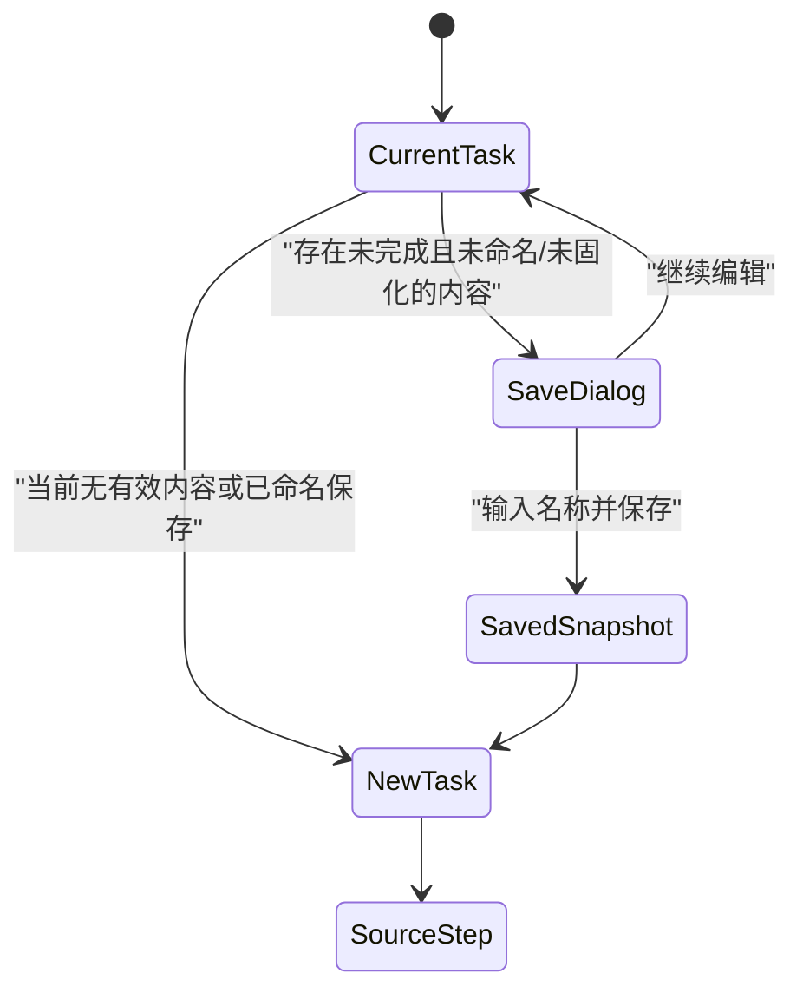
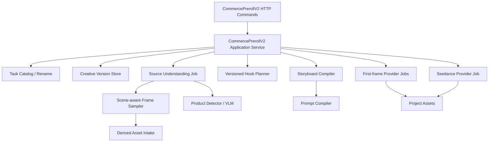

# 电商前贴：任务版本、商品图提取、钩子方案与可编辑故事板/Prompt 技术方案

> 日期：2026-08-11
> 状态：待评审方案，不修改业务代码
> 范围：创意创作 → 视频创作 → 效果广告 → 电商前贴 V2
> 基线：当前分支 `codex/kanon-frontend-local-backend-integration` 的未提交工作区
> 前置文档：`2026-08-10-commerce-preroll-v2-frontend-first-technical-design.md`、`2026-08-10-commerce-preroll-v2-fullstack-backend-technical-design.md`

## 1. 结论

本轮不推翻现有六步电商前贴 V2，而是在它上面补四个深模块：

1. **任务目录与用户版本**：支持“新建电商前贴”、未完成任务命名保存、任务下拉找回，以及同一任务的方案版本切换。
2. **全片商品候选提取**：默认从原视频开头、中部和尾部寻找商品正面清晰帧，返回多个真实候选；用户上传只作为替换和补充。
3. **商品化钩子方案**：保留五类 Recipe，但每张卡必须呈现针对当前商品和原视频生成的完整创意方案，而不是固定名称加一句话。
4. **可编辑故事板与 Prompt**：三段 Beat 升级为分秒级镜头故事板；普通用户编辑结构化字段，高级用户可编辑完整创意 Prompt；品牌保真、画幅和安全约束仍由系统锁定合并。

目标链路如下：


P0 仍然交付**独立 6～10 秒前贴视频**，不拼接原视频、不增加业务质检、不依赖策略包或 Brief。

## 2. 本轮冻结需求

### 2.1 用户必须能做的事

- 点击“新建电商前贴”。
- 从顶部任务下拉框找回历史任务。
- 当前任务做到一半时点击新建，必须先弹窗保存并命名；不能静默丢失。
- 在同一任务中查看和恢复用户可理解的历史方案版本。
- 上传一条已经完成的电商正片，并看到真实解析阶段进度。
- 编辑商品名称、品类、描述、卖点、商品外观与 Logo 保真规则。
- 优先从整条原视频取得商品正面图，包括商品只在中部或尾部出现的情况。
- 比较多个系统提取的商品图，选择任意候选；也能自行上传商品图或要求重新提取。
- 查看五类钩子针对本次商品形成的具体方案、推荐理由、动作、视觉特点、衔接方式和风险。
- 选择 6～10 秒，不在钩子卡上预先锁死时长。
- 查看并编辑这几秒内的镜头故事板。
- 展开查看完整 Prompt，并在高级模式下编辑创意部分。
- 生成、选择参考首帧，最后生成独立前贴并在当前页面播放和保存。

### 2.2 后台必须默默记录的内容

- Project、CreativeTask、原视频精确 AssetVersion 和权利确认。
- 原视频技术元数据、抽帧计划、候选时间点、候选裁切区域和提取算法版本。
- 每条商品事实来自画面、OCR 或 ASR 的证据与置信度。
- AI 原始理解值、用户确认值及两者差异。
- 钩子 Recipe 版本、Planner 版本、推荐分、推荐理由和输入证据。
- 故事板版本、Prompt 编译器版本、用户手工修改来源和内容 Hash。
- 系统锁定约束、Seedance GenerationSpec、Provider Job、原始输出和最终素材血缘。

这些证据默认不堆在主页面。只有高风险事实、错误诊断和版本详情需要按需展示。

## 3. 当前代码事实与缺口

| 能力 | 当前实现 | 结论 |
|---|---|---|
| 创建任务 | `CreateCommercePrerollV2Workspace` 要求创建时已经有 `source_video` 和权利确认；默认 8 秒 | 已有真实创建能力，但没有空任务、新建交互和命名参数。[S1] |
| 历史恢复 | 有 `GET :latest`，前端 Gateway 只恢复最新任务；URL 中的 `cpTask` 仍是浏览器 UUID，初始化也不按服务端 Task ID hydrate | 能刷新恢复部分本地状态，但没有权威任务目录、历史下拉和精确服务端任务恢复。[S1][S8][S13] |
| 任务名称 | 通用 `CreativeTask.display_name`、任务列表和重命名能力已经存在 | 应复用，不能新建 Commerce 专属名称表。[S2] |
| 工作区修订 | `creative_video_drafts` 以 `task_id + revision` 追加保存，并以 ExpectedRevision 乐观锁更新 | 可恢复内部状态，但每次异步状态变化都是修订，不能直接展示为用户版本。[S3] |
| 原视频分析 | FFmpeg 每 3 秒抽 1 帧，最多 10 帧；把转写和帧交给模型 | 能覆盖约前 30 秒，但长视频尾部可能完全不采样，场景切换和商品特写也可能漏检。[S4] |
| 商品参考图 | 分析只返回一个 `product_frame_ms`；随后只提取这一帧 | 已有真实源帧提取和用户上传绑定，但不是多候选、没有评分或裁切框。[S5] |
| 商品事实编辑 | 名称、品类、描述、卖点、外观与 Logo 规则可编辑 | 已满足基础字段编辑。[S6] |
| 钩子 | 后端固定构建五类 Recipe，并结合商品名称和卖点生成 concept/rationale/action | 已不是纯前端 Fixture，但表达仍短，缺少适用品类、视觉过程、衔接方案、风险、匹配分和预览资产。[S7] |
| 故事板 | PromptDraft 只有三条 Beat，每条只有 label、起止时间和 detail | 只是节奏摘要，不足以表达镜头、动作、场景、字幕、音频和尾部稳定要求。[S7] |
| Prompt | 后端在选钩子时确定性编译，并保存 compiled_prompt/hash；前端只显示摘要且明确“不需手写” | 已具备正确的编译与谱系起点，但不支持故事板编辑和完整 Prompt 编辑。[S7][S8] |
| 首帧/视频 | 有真实首帧 Job、选择、Seedance Job、reconcile、输出归一化和素材入库 | 延续现有链路，本轮只改变其输入版本和失效规则。[S5] |
| 首帧商品约束 | FirstFrame Job 请求带商品参考 Asset，但当前 `image.generate` 只发送 Prompt/尺寸；参考 Asset 只进入请求 Hash | 页面不能声称图片模型已经真正使用商品参考图；启用前必须有支持 reference/edit 的真实 Route。[S14] |
| Seedance 图片输入 | 页面写“单张参考图”，当前 Provider Input 实际是生成首帧 + 原片开场锚点的 `first_last_frame` | 必须改成事实一致的单图主路径或明确显示双图；近期版权过滤表明默认提交原片商业开场锚点风险较高。[S5][S8] |
| 异步进度 | 分析请求同步执行，前端人为推进 1/2/4/5；首帧和视频由当前浏览器轮询 reconcile | 现有进度不是可恢复的后台阶段事实，任务切换/关闭页面后的可靠恢复仍需落地。[S13] |

### 3.1 不能直接把现有 revision 当“版本”

现有工作区在分析完成、生成 Hook、首帧 Job reconcile、视频 Job reconcile 时都会追加 `VideoDraft.revision`。用户需要的“版本 1 / 版本 2”是创意决策快照，不是技术状态流水。

因此必须区分：

- `workspace_revision`：内部乐观并发和恢复使用，每次持久化变化都可能增加。
- `creative_version`：只在用户显式保存方案或提交生成时形成，供下拉框比较和恢复。
- `provider_attempt`：一次图片或视频模型调用，不等于方案版本。

## 4. 信息架构与页面流程

保留左侧六步流程轨道，在工作区标题上方增加紧凑任务工具栏：

```text
┌ 当前 Project ─────────────────────────────────────────────────────┐
│ [任务：白金眼霜·设备召回·8秒 v] [版本：V3 v] [已自动保存] [新建] │
└───────────────────────────────────────────────────────────────────┘
┌ 左侧六步轨道 ┐  ┌ 当前步骤主工作区 ──────────────────────────────┐
│ 01 原视频     │  │                                                 │
│ 02 内容理解   │  │ 原视频 / 商品候选 / 钩子方案 / 故事板 / Prompt │
│ 03 钩子方向   │  │                                                 │
│ 04 生成设置   │  │                                                 │
│ 05 参考首帧   │  │                                                 │
│ 06 前贴成片   │  │                                                 │
└───────────────┘  └─────────────────────────────────────────────────┘
```

### 4.1 任务下拉

每项显示：

- 任务名称；
- 草稿、解析中、可生成、生成中、已完成或失败；
- 原视频名称；
- 当前创意版本；
- 最近更新时间。

默认按最近更新时间倒序，只列当前 Project、`performance_mode=commerce_preroll` 且未归档的任务。

### 4.2 点击“新建”的拦截规则



弹窗字段与按钮：

- 标题：“先保存当前电商前贴”。
- 名称输入，默认值为“商品名 + 已选钩子 + 月日时分”；没有商品时使用“电商前贴 + 月日时分”。
- “保存并新建”：校验名称、持久化当前任务、形成一个创意版本，然后进入新任务。
- “继续编辑”：关闭弹窗。
- 可选的“删除此草稿”放入次级菜单，并再次确认；不提供无提示放弃。

新任务在用户选择原视频前可以先作为前端临时壳层；一旦选择了源 Asset 并确认权利，立即调用服务端创建。这样不需要放宽当前后端“Workspace 必须有源视频”的有效性不变量，也不会产生大量空 CreativeTask。

### 4.3 自动保存与命名不是同一件事

- 每次可编辑字段离焦或停止输入 500～800ms 后，自动保存工作草稿。
- 顶部显示“保存中 / 已保存 / 保存失败”。
- 自动保存解决刷新恢复；任务命名和创意版本解决人工找回与比较。
- 自动保存失败时不能允许用户误以为“保存并新建”已经成功。

## 5. 任务和版本领域模型

### 5.1 复用现有 CreativeTask

`CreativeTask` 继续作为一次独立电商前贴创作：

```text
CreativeTask
  id
  display_name
  project_id
  performance_mode = commerce_preroll
  status
  version                 # 任务元数据乐观锁
  latest_workspace_revision
  latest_creative_version
```

名称直接复用通用任务重命名接口，不创建 Commerce 专属重命名命令。[S2]

### 5.2 新增用户可见创意版本

建议新增 append-only 表：

```sql
creative_commerce_preroll_v2_versions
  organization_id
  project_id
  task_id
  version_no
  display_name
  based_on_workspace_revision
  status                 -- draft | generated | adopted | superseded
  snapshot_payload       -- 商品、参考图、钩子、故事板、Prompt、GenerationSpec
  content_hash
  source_asset_id
  source_asset_version
  output_asset_id        -- 可空
  output_asset_version   -- 可空
  created_by
  created_at
```

唯一键：`organization_id + project_id + task_id + version_no`。
幂等键：`task_id + based_on_workspace_revision + content_hash`。

版本形成时机：

1. 用户点击“保存并新建”；
2. 用户点击“保存版本”；
3. 提交 Seedance 前自动冻结本次输入；
4. 生成结果被采用时，把结果 Asset 关联到同一版本，不另造内容版本。

版本恢复不能覆盖历史记录。恢复 V1 后继续编辑，应基于 V1 新建 V4，而不是改写 V1。

### 5.3 脏状态和下游失效

| 用户修改 | 保留 | 失效 |
|---|---|---|
| 商品事实或商品参考图 | 原视频、分析证据 | Hook、故事板、Prompt、首帧、GenerationSpec、当前结果标记 |
| 钩子 | 商品理解与所有 Hook 候选 | 故事板、Prompt、首帧、GenerationSpec、当前结果标记 |
| 时长或故事板 | 商品、Hook | Prompt、首帧、GenerationSpec、当前结果标记 |
| 完整创意 Prompt | 商品、Hook、故事板 | 首帧、GenerationSpec、当前结果标记 |
| 首帧选择 | 上游所有文本 | GenerationSpec、当前结果标记 |

历史生成 Asset 不删除，只标记为“来自旧版本”，仍可在版本详情中播放。

## 6. 全片商品正面图提取

### 6.1 设计原则

商品参考图的默认来源必须是原视频真实像素，不默认重绘：

- 商品形状、标签和 Logo 以原视频真实帧为准；
- AI 负责识别、定位、排序和描述，不负责默认改画商品；
- “重新提取”表示重新抽帧、重新检测和换候选，不等于生成一张虚构商品图；
- 用户上传图进入同一候选集合，但来源标记为 `user_upload`。

### 6.2 两阶段抽帧

当前 `fps=1/3 + 最多 10 帧` 对长视频尾部覆盖不足。[S4] 建议改为：

#### 阶段 A：全局侦察

- 首 3 秒密集采样：0、0.5、1、1.5、2、2.5、3 秒；
- 全片均匀采样：按视频时长取 12～20 个时间点；
- 场景切换采样：FFmpeg scene score 超阈值处取帧；
- 尾部密集采样：最后 5 秒至少取 4 帧；
- 总候选硬上限，避免把整条视频全部传给视觉模型。

#### 阶段 B：商品局部精采

视觉模型先返回商品可能出现的时间窗与 bounding box；服务再在每个高分时间窗前后 ±500ms 细采样，使用原分辨率提取候选，并根据商品区域裁切出派生 Asset。

### 6.3 候选评分

每个候选保存可解释评分：

```json
{
  "candidate_id": "product_candidate_03",
  "source_timestamp_ms": 18240,
  "source_asset": {"asset_id": "...", "version": 2},
  "full_frame_asset": {"asset_id": "...", "version": 1},
  "crop_asset": {"asset_id": "...", "version": 1},
  "bounding_box": {"x": 0.31, "y": 0.34, "width": 0.39, "height": 0.51},
  "scores": {
    "frontality": 0.91,
    "sharpness": 0.88,
    "completeness": 0.95,
    "logo_readability": 0.79,
    "occlusion": 0.04,
    "product_consistency": 0.93,
    "overall": 0.89
  },
  "source_kind": "video_extract",
  "extractor_version": "commerce-product-candidate/v2"
}
```

排序重点：完整度、正面程度、清晰度、Logo/标签可读性、遮挡、商品占比、与主商品一致性。不得只凭“画面好看”推荐。

### 6.4 前端商品图区域

主区展示：

- 当前推荐图大图；
- 3～8 张候选缩略图；
- 每张候选的原视频时间点；
- “系统推荐”“正面清晰”“尾部商品特写”“用户上传”等来源标签；
- “设为商品参考图”“在原视频定位”“重新提取”“上传商品图”。

技术评分默认收进“为什么推荐”抽屉，只把易懂结论放在卡片上。用户选择某张图后，后台记录 Candidate ID 和精确 AssetVersion。

## 7. 钩子方向升级为商品化创意方案

### 7.1 保留 Recipe，生成 Proposal

五类 Recipe 是稳定生产规则：商品切割、雾面橱窗揭幕、一键取物、微缩功效剧场、3C 设备召回。每次任务基于 Recipe、已确认商品、原视频风格和开场锚点生成本次 `HookProposal`。

```text
Versioned Hook Recipe
+ confirmed product facts
+ selected product reference
+ source visual/audio/opening understanding
= task-specific HookProposal
```

### 7.2 HookProposal 契约

```json
{
  "id": "hook_frosted_reveal_01",
  "recipe_id": "frosted-reveal",
  "recipe_version": "commerce-hook-recipe/v3",
  "name": "雾面橱窗揭幕",
  "mechanism": "从不可见到清晰可见",
  "match_score": 0.92,
  "recommendation_level": "primary",
  "concept": "暖金雾面玻璃后出现白金眼霜轮廓……",
  "visual_signature": "雾面遮挡、一次擦拭、暖金反射、正面定格",
  "suitable_for": ["高端护肤", "强调仪式感与包装质感"],
  "why_for_this_source": ["原片为暖金低饱和光线", "商品包装有金属反光"],
  "selling_points": ["紧致修护"],
  "opening_state": "商品轮廓被雾面遮挡",
  "primary_action": "一次从中央向两侧的揭幕",
  "result_state": "商品正面清晰、Logo 可辨并稳定停留",
  "continuity_plan": "尾段回到原片暖金色温和中央构图",
  "camera_plan": ["中近景固定机位", "轻微推进后停止"],
  "risk_notes": ["擦拭过程不得遮挡标签", "避免新增人物脸部"],
  "preview_asset": null
}
```

### 7.3 前端展现

卡片首屏显示：视觉预览、名称、匹配分、具体概念、视觉标签、推荐理由。点击卡片后在详情区展开：

- 开场状态；
- 唯一主动作；
- 商品如何出现；
- 最终定格；
- 与原视频的衔接思路；
- 使用卖点；
- 风险提醒；
- 适用品类与不适用情况。

默认给出 1 个主推荐、2 个备选，其他两类仍可查看。匹配分只表示输入适配度，不宣称转化效果。

P1 可增加“一句话自定义方向”，再把用户描述编译成同一 `HookProposal` 结构；P0 不要求用户从零写 Prompt。

## 8. 可编辑镜头故事板

### 8.1 StoryboardShot 代替单字段 Beat

保留“建立钩子 → 完成变化 → 商品定格”的三段认知，但每段升级为可编辑 Shot：

```json
{
  "shot_id": "shot_02",
  "phase": "change",
  "start_ms": 2000,
  "end_ms": 6000,
  "title": "完成揭幕",
  "visual_description": "雾气从商品中央向两侧退开，完整露出瓶身",
  "subject_action": "只执行一次揭幕动作",
  "camera": "固定中近景，轻微推进后停止",
  "scene_and_lighting": "暖金橱窗，右侧柔光，背景光斑轻微变化",
  "product_state": "瓶型和标签位置不变，正面始终朝向镜头",
  "transition_in": "承接首段模糊轮廓",
  "transition_out": "动作减速并准备定格",
  "on_screen_text": "",
  "audio_instruction": "轻微擦拭声，可无口播",
  "locked_fields": ["product_state"]
}
```

用户可编辑画面、动作、镜头、光线、字幕、音频和转场；系统校验：

- 三段必须连续覆盖所选总时长；
- `start_ms < end_ms`；
- 最后一段必须包含稳定商品状态；
- P0 只允许一个主动作；
- 商品保真和禁止项不能通过删除某段绕过。

### 8.2 页面形态

生成设置页改成：

```text
[6秒] [7秒] [8秒] [9秒] [10秒]

01 建立钩子  0.0-2.0s   [编辑]
   分镜缩略图 / 画面描述 / 镜头 / 动作 / 字幕音频摘要

02 完成变化  2.0-6.0s   [编辑]
   分镜缩略图 / 画面描述 / 镜头 / 动作 / 字幕音频摘要

03 商品定格  6.0-8.0s   [编辑]
   分镜缩略图 / 商品状态 / 尾部稳定与原片连续性

[展开完整 Prompt]
```

修改时长时系统重新建议分段，不能静默截断用户文字。若已经人工编辑，弹窗说明哪些时间会变化，再确认重排。

## 9. Prompt 查看与编辑

### 9.1 分成三层

1. **故事板层**：大多数用户编辑，结构化且可理解。
2. **创意 Prompt 层**：高级用户可直接编辑，将提交给模型的创意描述。
3. **系统约束层**：商品保真、Logo、禁止项、画幅、安全区和 Provider 必需参数；可查看但不可删除。

最终提交不是一个未经约束的自由文本：

```text
Final Seedance Prompt
= editable creative prompt
+ locked product identity constraints
+ locked negative constraints
+ canvas/duration/input-mode requirements
```

### 9.2 PromptDraft V3

```json
{
  "revision": 3,
  "storyboard_revision": 2,
  "hook_proposal_id": "hook_frosted_reveal_01",
  "duration_seconds": 8,
  "edit_mode": "storyboard_compiled",
  "creative_prompt": "……用户可编辑的完整创意描述……",
  "locked_constraints": ["瓶型比例不变", "Logo 与标签位置不变", "输出 8 秒"],
  "final_compiled_prompt": "……实际提交文本……",
  "compiler_version": "commerce-preroll-prompt/v3",
  "content_hash": "sha256:...",
  "edited_by": "user_...",
  "edited_at": "2026-08-11T...Z"
}
```

`edit_mode`：

- `storyboard_compiled`：故事板改变后由编译器生成创意 Prompt。
- `manual_creative_override`：高级用户直接编辑创意 Prompt。

用户切回故事板编辑时，系统要提示“重新编译会覆盖完整 Prompt 的手工修改”，允许取消或另存新版本。

### 9.3 Prompt 编辑接口

- `PATCH .../storyboard`：修改结构化镜头，必须带 ExpectedRevision。
- `POST ...:compile-prompt`：根据当前故事板重新编译。
- `PATCH .../prompt-draft`：只修改 `creative_prompt`，服务端重新附加 locked constraints 并计算 Hash。
- 前端永远展示服务端返回的 `final_compiled_prompt`，不得在浏览器独立拼出最终 Seedance 输入。

## 10. API 方案

保留现有 `/commerce-preroll-v2:*` 命令，增量增加：

| 方法 | 路径 | 用途 |
|---|---|---|
| GET | `/projects/{project}/creative-tasks?performance_mode=commerce_preroll&limit=50&cursor=...` | 任务下拉目录 |
| PATCH | `/projects/{project}/creative-tasks/{task}/metadata` | 复用通用任务命名 |
| GET | `/projects/{project}/creative-tasks/{task}/commerce-preroll-v2/versions` | 用户创意版本列表 |
| POST | `/projects/{project}/creative-tasks/{task}/commerce-preroll-v2:save-version` | 显式冻结方案版本 |
| POST | `/projects/{project}/creative-tasks/{task}/commerce-preroll-v2:restore-version` | 基于历史版本创建新工作草稿 |
| POST | `/projects/{project}/creative-tasks/{task}/commerce-preroll-v2:extract-product-candidates` | 全片抽取/重新抽取商品候选 |
| POST | `/projects/{project}/creative-tasks/{task}/commerce-preroll-v2:select-product-candidate` | 选择视频提取候选 |
| POST | `/projects/{project}/creative-tasks/{task}/commerce-preroll-v2:bind-product-reference` | 保留用户上传商品图绑定 |
| PATCH | `/projects/{project}/creative-tasks/{task}/commerce-preroll-v2/storyboard` | 编辑故事板 |
| POST | `/projects/{project}/creative-tasks/{task}/commerce-preroll-v2:compile-prompt` | 编译 Prompt |
| PATCH | `/projects/{project}/creative-tasks/{task}/commerce-preroll-v2/prompt-draft` | 高级编辑创意 Prompt |

所有写接口要求：

- `Idempotency-Key`；
- `expected_revision`；
- Project/Task/AssetVersion 归属校验；
- 返回完整 TaskDetail 或统一 Workspace DTO；
- 409 返回服务器当前 revision，前端提供刷新恢复，不自动覆盖。

## 11. 后端模块边界



应新建或深化：

- `CommercePrerollProductCandidateExtractor`：抽帧计划、精采、裁切和排序。
- `CommercePrerollHookPlanner`：从版本化 Recipe 生成任务级 Proposal。
- `CommercePrerollStoryboardCompiler`：Recipe + Product + Source → Storyboard。
- `CommercePrerollPromptCompiler`：Storyboard + 锁定约束 → Final Prompt。
- `CommercePrerollVersionRepository`：只负责用户创意版本，不混入异步 Job 状态。

现有 Provider、Generated Intake、派生 Asset、视频 Draft 乐观锁和输出归一化继续复用。[S3][S5]

## 12. 前端实现边界

当前 `src/features/commerce-preroll-v2/` 保持独立，不把新状态塞回旧的 `SpecializedPages`。

建议拆分：

```text
src/features/commerce-preroll-v2/
  CommercePrerollWorkspace.tsx
  task-catalog/
    TaskSwitcher.tsx
    SaveBeforeCreateDialog.tsx
    VersionSwitcher.tsx
  source/
    SourceStage.tsx
  understanding/
    ProductFactsEditor.tsx
    ProductCandidateGallery.tsx
  hooks/
    HookProposalCard.tsx
    HookProposalDetail.tsx
  storyboard/
    StoryboardEditor.tsx
    StoryboardShotEditor.tsx
    PromptEditor.tsx
  first-frame/
    FirstFrameStage.tsx
  video/
    VideoStage.tsx
  api/
    httpGateway.ts
    mappers.ts
  state/
    reducer.ts
    selectors.ts
```

服务端任务 ID 成为唯一持久身份；`clientTaskId` 只允许在未选择源视频的临时壳层中存在。`localStorage` 只能存最后打开的 Task ID、Step 和未提交表单备份，不能作为任务和版本事实源。

## 13. Seedance 输入冻结

用户确认故事板、Prompt 和首帧后，后端冻结 GenerationSpec：

- Creative Version ID；
- Prompt revision/hash；
- Storyboard revision/hash；
- Hook Proposal/Recipe version；
- 选中的商品参考 AssetVersion；
- 选中的首帧 AssetVersion；
- 源视频 AssetVersion 和分析 InputHash；
- 6～10 秒、模型画布、输出画布和音频策略；
- 最终 Prompt。

原视频仍用于理解、商品提取、连续性描述和血缘，不直接作为当前 Ark Video Adapter 的视频输入。

当前代码和页面存在事实冲突：页面显示“Prompt + 单张参考图”，但 GenerationSpec 实际把所选生成首帧作为 first frame、原视频开场锚点作为 last frame，提交 `first_last_frame`。[S5][S8] 最近原片开场锚点触发 Provider `content[2]` 版权过滤，也说明商业成片帧不能默认作为第二张条件图。

P0 推荐冻结为：

1. **单参考图主路径**：只把用户选中的前贴参考首帧提交 Seedance。
2. **软连续性约束**：原视频开场的构图、色温、光线、主体、运动和音频气质只进入 Storyboard/Prompt。
3. **尾段稳定规则**：最后 1～1.5 秒停止主动作，回到商品居中、光线稳定和可衔接状态。
4. **可选中性锚点**：只有目标 Route 验证通过且锚点不包含可识别人脸、商业标题或受限内容时，才允许启用首尾帧实验。

首帧图片生成也必须如实描述：当前商品参考 Asset 仅进入请求 Hash，并没有传给 `image.generate`。[S14] 在图片 Provider 支持 reference/edit 前，真实商品图用于用户确认、Prompt 保真、血缘和 Seedance 条件；UI 不应宣称它已经直接约束了首帧图片模型。

任何输入模式都必须通过目标环境 Route capability 验证，不能仅靠前端文案假设 Provider 支持。[S9]

## 14. 并发、幂等与恢复

- 编辑命令统一使用 ExpectedRevision，冲突返回 409。
- 商品候选抽取批次以 `source AssetVersion + sampler version + analyzer version` 计算输入 Hash。
- Hook、Storyboard、Prompt 都记录上游 Hash；上游变化时旧资源保留但不再是 active。
- 创建 Provider Job 前先冻结 Creative Version 和 Operation ID，旧 Job 完成时只能挂到原版本。
- 页面刷新以 GET Workspace 为准，并根据 active operation 恢复轮询。
- 任务切换不会取消后台 Job；切回任务后继续展示进度。
- “保存并新建”必须等待保存成功再导航，失败时留在原任务。

## 15. 开发顺序

### P0-1：任务目录和用户版本

1. 接通筛选后的 Task List、Rename 和 Task Switcher。
2. 实现新建按钮与“保存并命名”拦截弹窗。
3. 新增用户创意版本表、保存、列表和恢复接口。
4. 把本地 session 身份迁移为服务端 Task ID。

### P0-2：全片商品候选

1. 定义 Candidate/Batch 契约和派生 Asset 血缘。
2. 实现场景感知全片采样与商品时间窗细采。
3. 返回多候选、评分、时间点和裁切图。
4. 接入候选图库、选择、重新提取和现有上传接口。

### P0-3：钩子方案深化

1. HookRecipe 版本化。
2. 扩展 HookProposal 字段和生成器。
3. 完成主推荐/备选排序与丰富卡片。
4. 上游商品变更后正确失效旧方案。

### P0-4：故事板与 Prompt 编辑

1. 新增 StoryboardShot/StoryboardRevision。
2. 实现时长重排和结构校验。
3. 升级 Prompt Compiler V3。
4. 完成结构化编辑、完整创意 Prompt 编辑和锁定约束展现。

### P0-5：首帧和视频回归

1. 让现有首帧、GenerationSpec 和 Seedance 使用新版本 Hash。
2. 把分析、首帧和视频的权威阶段进度放入后台 Job/Attempt，不依赖页面存活推进 reconcile。
3. 验证修改任一上游字段会失效下游但保留历史结果。
4. 验证版权敏感参考图失败、单参考图主路径、中性锚点实验、重试和任务切换恢复。
5. 完成全链路 E2E。

## 16. P0 验收标准

- [ ] 当前 Project 可新建多个电商前贴任务并通过下拉切换。
- [ ] 未完成任务点击新建时必须先命名保存或继续编辑。
- [ ] 刷新后恢复准确任务、步骤、表单、生成进度和结果。
- [ ] 页面关闭后分析/首帧/视频任务仍由后台推进，重新打开后显示服务端真实阶段。
- [ ] 用户看到的方案版本不包含轮询/reconcile 产生的技术修订。
- [ ] 使用商品只在视频中部出现的样例，系统仍返回至少一个真实正面候选。
- [ ] 使用商品只在尾部出现的样例，系统仍返回至少一个真实正面候选。
- [ ] 商品候选能定位回原视频时间点，用户可替换和上传。
- [ ] 五类钩子均显示针对当前商品的视觉特点、动作、定格、衔接、推荐理由和风险。
- [ ] 用户可编辑三段故事板的画面、动作、镜头、光线、字幕/音频和转场。
- [ ] 用户可查看完整最终 Prompt，并可高级编辑创意部分。
- [ ] 锁定商品保真和系统约束不能被高级编辑删除。
- [ ] 修改商品、钩子、故事板或 Prompt 后，旧首帧和旧成片不会继续被标记为当前版本。
- [ ] 每条生成视频能追溯到源视频、商品候选、Hook Recipe、Storyboard、Prompt 和 Seedance Job。
- [ ] 最终仍交付独立 6～10 秒前贴，不宣称已经拼接或质检通过。

## 17. 测试方案

### 17.1 领域单测

- 工作区 revision 与 creative version 分离。
- 保存版本幂等、历史恢复产生新版本。
- 商品候选综合评分和稳定排序。
- 全片采样覆盖首、中、尾与场景变化。
- 故事板连续、总时长、单主动作和尾部定格校验。
- Prompt 手工编辑后系统约束仍存在。
- 上游变化的下游失效矩阵。

### 17.2 Repository/HTTP 集成测试

- Task List 只返回当前 Project 的 Commerce 任务。
- Rename/Save Version 的乐观锁冲突。
- Product Candidate Asset 的 Project/Version 越权拒绝。
- 同一 Idempotency-Key 不产生重复候选批次或版本。
- 旧 Provider Job 不能覆盖新版本结果。

### 17.3 前端测试

- 未完成任务点击新建弹窗。
- 保存失败不导航。
- 任务和版本切换恢复准确状态。
- 候选图选择、上传、重新提取。
- Hook 详情和故事板字段编辑。
- Prompt 模式切换及覆盖警告。
- 409 冲突、异步失败、刷新和离开页面恢复。

### 17.4 浏览器 E2E

准备三条已授权样例：

1. 商品在开头清晰出现；
2. 商品只在中部清晰出现；
3. 商品只在尾部清晰出现。

每条至少完成：创建 → 解析 → 选商品图 → 选 Hook → 编辑故事板 → 编辑 Prompt → 选首帧 → 生成 → 保存版本 → 新建 → 下拉恢复。

## 18. 非目标与风险

### 非目标

- 本轮不拼接原视频。
- 本轮不增加业务质检流程。
- 本轮不依赖策略包、Brief 或用户手写完整 Prompt。
- 本轮不把 AI 重绘商品图作为默认商品参考。
- 本轮不承诺钩子匹配分等于投放转化预测。

### 风险

- 长视频多帧理解会增加 VLM 成本，必须采用两阶段采样和候选硬上限。
- 商品反复出现或多 SKU 时可能选错主商品，需要用户确认和“同一商品”聚类。
- OCR 无法保证包装小字完全准确，像素参考图和文字约束必须同时保留。
- 完整 Prompt 开放编辑会产生不可控输入，因此只开放创意层，系统约束始终由服务端合并。
- 当前 Ark 对某些商业画面可能触发版权/敏感内容拒绝，应保留单参考图策略与可解释错误，不尝试绕过 Provider 安全策略。

## 19. 一手依据

- [S1] [`commerce_preroll_v2_workflow.go`](../../internal/systems/creative/commerce_preroll_v2_workflow.go#L11-L128)：当前 Workspace 创建需要源视频与权利确认，已有按 Project 获取最新 Commerce V2 任务。
- [S2] [`model.go`](../../internal/systems/creative/model.go#L555-L584)、[`mysql_repository.go`](../../internal/systems/creative/mysql_repository.go#L358-L420)：通用 CreativeTask 已有 display name、列表、重命名和归档能力。
- [S3] [`mysql_repository.go`](../../internal/systems/creative/mysql_repository.go#L308-L355)、[`20260727092000_creative_preroll_video.up.sql`](../../migrations/creative/20260727092000_creative_preroll_video.up.sql#L13-L23)：视频 Draft 是 append-only revision，并使用乐观锁。
- [S4] [`commerce_preroll_v2_analyzer.go`](../../internal/integrations/creativeprovider/commerce_preroll_v2_analyzer.go#L56-L125)：当前分析抽取 ASR，按每 3 秒一帧、最多 10 帧采样；[`commerce_preroll_v2_analyzer.go`](../../internal/integrations/creativeprovider/commerce_preroll_v2_analyzer.go#L128-L192)：帧与证据时间点提交给视觉模型。
- [S5] [`commerce_preroll_v2_media.go`](../../internal/systems/creative/commerce_preroll_v2_media.go#L117-L165)：当前只按一个 product timestamp 与一个 opening timestamp 提取派生图；[`commerce_preroll_v2_media.go`](../../internal/systems/creative/commerce_preroll_v2_media.go#L181-L385)：首帧批次、选择和 GenerationSpec。
- [S6] [`commerce_preroll_v2.go`](../../internal/systems/creative/commerce_preroll_v2.go#L88-L116)、[`CommercePrerollWorkspace.tsx`](../../src/features/commerce-preroll-v2/CommercePrerollWorkspace.tsx#L149-L166)：商品事实字段、证据和当前编辑页面。
- [S7] [`commerce_preroll_v2.go`](../../internal/systems/creative/commerce_preroll_v2.go#L118-L157)、[`commerce_preroll_v2_planning.go`](../../internal/systems/creative/commerce_preroll_v2_planning.go)：当前五类 Hook、三段 Beat 和确定性 Prompt Compiler。
- [S8] [`CommercePrerollWorkspace.tsx`](../../src/features/commerce-preroll-v2/CommercePrerollWorkspace.tsx#L169-L191)、[`httpGateway.ts`](../../src/features/commerce-preroll-v2/httpGateway.ts#L186-L197)：当前钩子卡、三段摘要、Prompt 摘要及 HTTP 映射。
- [S9] [`provider/video.go`](../../internal/platform/provider/video.go)、[`ark_video_adapter.go`](../../internal/platform/provider/ark_video_adapter.go)：统一视频输入模式与当前 Ark payload 边界。
- [S10] [`docs/策略/06-电商广告前贴与钩子视频生成策略.md`](../策略/06-电商广告前贴与钩子视频生成策略.md)：商品保真、单一主动作、首尾变化、商品定格和五类场景生产规则。
- [S11] [`docs/02-creative-studio-prd.md`](../02-creative-studio-prd.md)：效果广告、视频前贴、版本、素材授权和异步任务的产品边界。
- [S12] [Kanon Cookies README](https://github.com/shikanon/cookies#readme)：Project、版本化 Artifact、Provider 与前端边界的仓库架构原则。
- [S13] [`sessionStore.ts`](../../src/features/commerce-preroll-v2/sessionStore.ts)、[`CommercePrerollWorkspace.tsx`](../../src/features/commerce-preroll-v2/CommercePrerollWorkspace.tsx#L222-L345)、[`httpGateway.ts`](../../src/features/commerce-preroll-v2/httpGateway.ts#L119-L180)：当前任务身份、本地恢复、latest 回落和前端模拟分析进度。
- [S14] [`commerce_preroll_v2_jobs.go`](../../cmd/cookies-api/commerce_preroll_v2_jobs.go#L14-L42)：商品参考 Asset 当前只进入首帧请求 Hash，实际 `image.generate` 输入只有 Prompt、宽和高。

## 20. 评审结论

如果本方案通过，下一轮开发不应先改 Seedance 调用，而应按以下顺序开始：

```text
任务目录/命名/用户版本
→ 全片商品候选提取
→ 商品化 HookProposal
→ Storyboard V1
→ Prompt Compiler V3 与高级编辑
→ 复接现有首帧/Seedance/素材入库
```

这样既保留当前已经跑通的原视频理解和生成闭环，又把用户刚确认的“可新建找回、商品自动提取、钩子可理解、故事板与 Prompt 可编辑”变成可独立验收的模块，不会把任务版本、后台轮询修订和 Provider 尝试混在一起。
