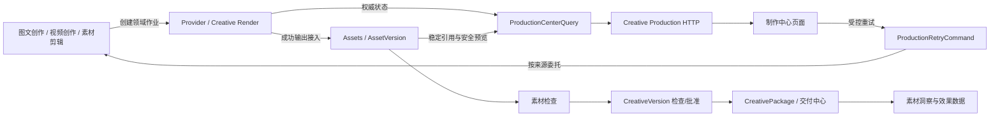

# 制作中心：前后端一体化技术设计

> 日期：2026-08-11
> 状态：待评审技术基线；本文不修改业务代码
> 范围：创意创作 → 制作中心（建议展示名“生成与渲染队列”）
> 目标：基于 Kanon 现有架构补齐真实的生成/渲染控制台，并保持 Provider、Assets、素材检查、交付中心和素材洞察的领域所有权不变

配套的一手来源逐条核验记录见 [`production-center-primary-source-findings-2026-08-11.md`](./production-center-primary-source-findings-2026-08-11.md)。本文中的设计建议以该记录和第 22 节来源索引为事实基线。

## 1. 最终结论

制作中心不是新的图片或视频编辑器，也不是素材库、质检中心或交付中心。它是 Creative 垂直系统内面向当前 Project 的**生成与渲染运行控制台**，只负责把已经由图文创作、视频创作和素材剪辑发起的后台作业统一呈现出来，并提供受控的失败恢复入口。[S1][S2][S3][S4]

本设计冻结以下原则：

1. **制作中心只拥有查询投影和页面交互，不拥有作业状态。** Provider Job、Creative RenderJob、EditingRenderJob 继续由各自来源 module 持久化和推进。
2. **制作中心不直接创建脱离业务任务的生成。** 新生成仍从图文创作、视频创作或素材剪辑发起；制作中心回答“运行到哪里、产出了什么、为何失败、如何恢复”。
3. **制作中心不跨库直接读取其他 bounded context 的表。** 后端通过小 interface 调用 Provider、Creative Render 和 Assets 的只读 adapter，再组装页面投影。
4. **重试必须回到原工作流。** 制作中心只发出统一重试命令，具体 adapter 委托图片槽位、GenerationUnit、视频候选或 EditingRender 的既有重试逻辑；禁止绕过原领域约束重新 POST 一个裸 Provider Job。
5. **成功输出必须先成为稳定 AssetVersion。** 厂商临时 URL、对象存储 Bucket/Key、Provider 外部任务 ID 不成为制作中心的长期业务引用。[S5][S6]
6. **不向下游写业务结论。** 制作中心不创建 QualityCheckRun、MaterialConfirmation、CreativePackage、AssetIndex、Insight 或投放记录。

目标数据流：



## 2. 需求依据与文档冲突处理

### 2.1 已冻结的页面范围

正式导航和当前前端配置一致，制作中心包含六个视图：[S2][S7]

| 视图 | 页面对象 | P0 责任 |
| --- | --- | --- |
| 图片生成 | Creative 来源的图片 Provider Job | 状态、输入、参数、输出、成本、错误、日志、来源任务 |
| 视频生成 | Creative 来源的视频 Provider Job | 状态、进度、输入素材、输出 AssetVersion、失败恢复 |
| 音频生成 | Creative 来源的音频生成 Attempt/Job | 只展示真实持久化来源；当前缺少通用异步列表时不得伪造记录 |
| 渲染队列 | Creative RenderJob、EditingRenderJob，后续可接 AudioMixRenderJob | 预览/导出、不可变输入版本、进度、输出、失败和重试 |
| 源素材 | 上述作业引用的输入 AssetVersion | 预览、用途、来源与生产血缘；不承担通用文件管理 |
| 失败任务 | 所有来源中失败、过期或部分成功的作业 | 失败原因、是否可重试、既有 Attempt 和新 Attempt 关系 |

页面主体采用架构指定的“队列表 + 状态筛选 + 任务预览抽屉”；详情展示输入、参数、输出、模型、成本和运行日志。[S3]

### 2.2 3D 范围差异

《四大模块子板块分析》在制作中心能力描述中包含 3D，但《创意创作系统 PRD》《导航与信息架构》和当前 `navigation.ts` 均没有 3D 视图。[S1][S2][S3][S7]

本设计采用最小且不扩张产品范围的处理：

- P0 不增加 3D 标签、路由或创建入口；
- 查询 DTO 的 `media_kind` 不用前端穷举阻断未来类型，但未知类型进入“其他”仅供诊断，不作为新产品入口；
- 若 Kanon 后续确认 3D，需要先修改 IA/PRD，再增加 adapter 和可见视图。

### 2.3 名称

整改文档建议将“制作中心”更名为“生成与渲染队列”，原因是现名称容易与视频创作混淆，并明确页面只管理模型任务、输入、输出、成本、失败原因、重试和日志。[S4]

技术路由和 module 名称使用 `production`，不依赖最终中文展示名；UI 文案是否立即更名由产品评审决定，不阻塞后端实现。

## 3. 当前代码基线与关键缺口

| 能力 | 当前事实 | 影响与结论 |
| --- | --- | --- |
| 导航 | 已配置六个制作中心视图 | 可复用 IA，不新增分类。[S7] |
| 页面 | `creative/production` 未挂专用页面，最终落入通用 `OperationsSurface` | 当前截图只是运营模板，必须新增专用页面。[S8] |
| Provider 创建/详情 | 已有 Project-scoped 创建和单 Job 查询 | 可复用权威状态；不能再建一套 production job 表。[S9] |
| Provider 列表 | OpenAPI、HTTP interface 和 `provider.JobStore` 均没有 Project 级 List | 制作中心必须新增只读列表 seam。[S9][S10][S11] |
| 前端 Job 列表 | `listKanonJobs` 从已落盘 Artifact 反推，并把所有记录写成 `succeeded` | 看不到 queued/running/failed/partial，不能用于制作中心。[S12] |
| Provider 状态映射 | 当前前端把 `partially_succeeded` 归并成 `succeeded` | 会隐藏失败项；制作中心必须保留“部分成功”。[S12][S13] |
| Provider 详情 | 公共 `ProviderJob` 有双状态、进度、输出 Asset refs、错误和 Attempt；无输入摘要、模型、成本和日志 | 列表可先真实接入；详情需要 Provider 提供安全诊断投影。[S13] |
| Provider 私有记录 | 已持久化 model alias、实际 Provider/model、source system/task、input payload、错误、Attempt 等 | 不需要复制主数据；只需在 Provider 内新增安全查询 DTO。[S10][S14] |
| 生成资产入库 | Provider 输出通过 Generated Asset Intake 成为稳定 AssetVersion | 制作中心只消费 ProjectAssetRef 和签名预览。[S5][S9] |
| Creative Render | 已有 Creative RenderJob、EditingRenderJob 及单条查询；EditingRender 已有 retry/cancel | 应统一读取，不能统一改写状态。[S15][S16][S17] |
| Render 列表 | 现有 repository 主要按 ID 或 Task 查询，没有 Project 级统一列表 | 需要 Creative 内部的只读 run-source adapter。[S15][S16] |
| 音频 | 架构要求音频视图，代码存在 AudioMixRenderJob/音频 Attempt，但当前通用 Provider OpenAPI只公开 image/video | 标签保留，后端只返回真实可列举记录；不做 Fixture。[S9][S18] |
| 成本 | Provider PRD 要求 Usage & Cost Meter；当前异步媒体 Job 尚未形成公共成本记录 | 不能由前端估算；需要 Provider 侧补齐后再展示真实值。[S19] |
| 运行日志 | 架构要求运行日志；当前公开模型只有当前状态/错误，JobRuntime 只有当前进度消息 | 需要来源 module 持久化安全的结构化状态事件，不能返回原始服务日志。[S3][S20] |
| 素材检查 | 已有独立 QualityCheckRun、MaterialConfirmation 和交付版本门禁 | 制作中心不得重复或写入这些对象。[S21] |

最重要的当前缺陷是：**只从 Artifact 反推 Job 会让失败任务永远无法出现在失败任务页**。制作中心上线前，前端 `api.listJobs` 必须切换到新的服务端生产查询，而不是继续复用 `listKanonJobs`。[S12]

## 4. 领域所有权与禁止写入矩阵

| 对象/事实 | 权威 Owner | 制作中心允许 | 制作中心禁止 |
| --- | --- | --- | --- |
| CreativeTask/EditTask | Creative | 展示来源、深链回编辑器 | 修改草稿、脚本、Timeline 或业务状态 |
| ProductionJob 引用 | Creative | 展示 Task → Provider Job 血缘 | 把 Provider 状态当成 Task 业务状态 |
| Provider Job | Provider | 按 Project 读取状态、进度、模型摘要、成本和安全日志 | 修改厂商路由、凭据、外部任务 ID、直接写状态 |
| RenderJob | 对应 Creative 工作流 | 读取、展示、通过原命令重试 | 直接 UPDATE render 表或替换输入快照 |
| Asset/AssetVersion | Assets | 读取稳定引用、技术元数据、权利摘要和签名预览 | 保存 Bucket/Key、复制文件、修改版本、认定业务有效 |
| QualityCheckRun | 素材检查/Workbench | 仅可深链到已有检查记录 | 自动创建或伪造“质检通过” |
| MaterialConfirmation | 素材检查/Workbench | 只读展示是否已确认（若详情需要） | 在制作中心确认素材或设交付版本 |
| CreativeVersion | Creative | 展示输出是否已冻结/批准 | 从 Job 成功推断批准 |
| CreativePackage | Creative 交付流程 | 不读取也不创建；只提供前往交付中心的链接 | 生成发布包/投放包 |
| AssetIndex/Insight | Insights | 不直接读写 | 从生成成功推断素材效果，触发分析结论 |

Creative 的领域说明已经明确：ProductionJob 只是 CreativeTask 到 Provider Job 的引用；Candidate 生成成功不等于批准；Delivery 和 Insights 只能接收从已批准 CreativeVersion 形成的稳定 CreativePackage。[S22]

## 5. 目标后端架构

### 5.1 外部 seam：ProductionCenterQuery

制作中心应是一个 deep module：调用方只学习两个查询方法，来源发现、权限、状态归一化、跨来源排序、资产解析和字段脱敏都隐藏在 implementation 内。

```go
type ProductionCenterQuery interface {
    ListRuns(
        context.Context,
        contract.ActorContext,
        contract.ProjectID,
        ListProductionRunsRequest,
    ) (ProductionRunPage, error)

    GetRun(
        context.Context,
        contract.ActorContext,
        contract.ProjectID,
        ProductionRunRef,
    ) (ProductionRunDetail, error)
}
```

Interface 不暴露 Provider/MySQL/Render repository 类型。调用方必须知道的只有：

- 所有结果严格限定当前 Actor 可访问的 organization/project；
- 排序默认为 `created_at DESC, run_id DESC`；
- cursor 不透明，调用方不得解析；
- 来源暂时不可用时返回明确的 `source_health`，不能用空列表伪装成功；
- 输出引用只返回 AssetVersionRef 和安全预览，不返回存储位置或厂商临时 URL；
- `normalized_status` 只用于展示，`native_status` 保留诊断事实。

### 5.2 内部 read-source seams

`ProductionCenterQuery` implementation 内部依赖三个可替换 interface：

```go
type ProductionRunSource interface {
    Source() ProductionRunSourceKind
    List(context.Context, ProductionSourceScope) (ProductionSourcePage, error)
    Get(context.Context, ProductionSourceKey) (ProductionSourceDetail, error)
}

type ProductionAssetReader interface {
    Resolve(context.Context, contract.ActorContext, contract.ProjectID, []contract.AssetVersionRef) ([]ProductionAssetView, error)
}

type ProductionSourceLinkReader interface {
    Resolve(context.Context, contract.ActorContext, contract.ProjectID, []ProductionSourceRef) ([]ProductionSourceLink, error)
}
```

Production adapters：

1. `ProviderRunAdapter`：调用 Provider module 的 Project-scoped query interface；只纳入 `source_system` 属于 Creative 的作业。
2. `CreativeRenderRunAdapter`：读取 `creative_render_jobs`。
3. `EditingRenderRunAdapter`：读取 `creative_edit_render_jobs`。
4. `AudioProductionRunAdapter`：只在当前音频 Attempt/RenderJob 有可靠 Project 列表能力后启用。
5. `AssetReadAdapter`：调用 Assets interface 解析输入/输出元数据与短期预览。

production module 不持有这些来源的 DB handle。生产环境使用 in-process adapter；测试使用 in-memory adapter。这样测试和生产穿过同一个外部 query seam。

### 5.3 为什么 P0 不建立 production_center_runs 表

P0 采用查询时聚合，不建立新的权威或复制表：

- 当前事件目录只有完成类 `model.job.completed.v1` 和 `asset.ready.v1`，不能覆盖 queued/running/progress/failed 的完整实时投影。[S23]
- 建投影表会引入双写、补偿和重建，且容易把复制状态误当权威状态。
- Provider 和 Render 数据量在 Project 维度可控；通过来源列表、keyset 分页和 k-way merge 可以满足 P0。

当单 Project 作业量或来源数量达到性能阈值后，可以新增可重建的只读 projection，但必须满足：

- projection 可全部从 owner 状态重建；
- projection 不接受业务写操作；
- UI 仍通过同一个 `ProductionCenterQuery` interface，调用方无需变化。

### 5.4 跨来源分页

每个 adapter 返回按 `(created_at DESC, native_id DESC)` 排序的页面；query implementation 使用 k-way merge 生成统一结果。

统一 cursor 编码：

```json
{
  "v": 1,
  "watermark_created_at": "2026-08-11T10:20:30.123456Z",
  "watermark_key": "provider:job_123",
  "source_cursors": {
    "provider": "opaque-provider-cursor",
    "creative_render": "opaque-render-cursor",
    "editing_render": "opaque-edit-render-cursor"
  }
}
```

cursor 由服务端签名或完整 base64url 编码并校验版本；前端只原样回传。不得使用前端页码对全部记录做内存切片。

## 6. 统一查询模型

### 6.1 Run 引用

```go
type ProductionRunRef struct {
    Source ProductionRunSourceKind `json:"source"`
    ID     string                  `json:"id"`
}

const (
    ProductionSourceProvider       = "provider"
    ProductionSourceCreativeRender = "creative_render"
    ProductionSourceEditingRender  = "editing_render"
    ProductionSourceAudioRender    = "audio_render"
)
```

不能只用裸 `job_id`，因为不同来源可能发生 ID 碰撞，也不能把 Provider 外部任务 ID 当业务主键。[S19]

### 6.2 列表 DTO

```go
type ProductionRunSummary struct {
    Ref              ProductionRunRef       `json:"ref"`
    ProjectID        contract.ProjectID     `json:"project_id"`
    MediaKind        ProductionMediaKind    `json:"media_kind"` // image/video/audio/render
    OperationKind    string                 `json:"operation_kind"`
    SourceTask       *ProductionSourceLink  `json:"source_task,omitempty"`
    NormalizedStatus ProductionDisplayState `json:"normalized_status"`
    NativeStatus     ProductionNativeStatus `json:"native_status"`
    ProgressPercent  int                    `json:"progress_percent"`
    Model            *ProductionModelView   `json:"model,omitempty"`
    OutputCount      int                    `json:"output_count"`
    Cost             *ProductionCostView    `json:"cost,omitempty"`
    Error            *ProductionErrorView   `json:"error,omitempty"`
    Actions          ProductionActions      `json:"actions"`
    CreatedAt        time.Time              `json:"created_at"`
    UpdatedAt        time.Time              `json:"updated_at"`
}
```

`ProductionRunSummary` 是页面 DTO，不可持久化为领域对象，不可被素材检查、交付或 Insights 作为事实源。

### 6.3 详情 DTO

```go
type ProductionRunDetail struct {
    ProductionRunSummary
    InputAssets   []ProductionAssetView `json:"input_assets"`
    OutputAssets  []ProductionAssetView `json:"output_assets"`
    Parameters    map[string]any        `json:"parameters"`
    PromptRef     *contract.ResourceRef `json:"prompt_ref,omitempty"`
    Attempt       ProductionAttemptView `json:"attempt"`
    RetryChain    []ProductionRunRef    `json:"retry_chain"`
    RunEvents     []ProductionRunEvent  `json:"run_events"`
    Lineage       ProductionLineageView `json:"lineage"`
    SourceHealth  []SourceHealthView    `json:"source_health"`
}
```

安全约束：

- `Parameters` 只允许 schema 白名单字段，如尺寸、时长、画幅、分辨率、音频策略、渲染规格；
- 默认不返回完整 Prompt；返回 `prompt_ref`、哈希和受控摘要，完整内容仍从拥有它的 Creative 工作流读取；
- 不返回凭据、请求头、Provider 临时 URL、Bucket/Key、外部任务 ID或原始 SDK 响应；
- 错误信息经过长度限制和敏感字段清洗；
- 预览 URL 由 Assets 临时签发，不能存入 DTO 缓存或业务表。[S5][S6][S19]

## 7. 状态归一化

### 7.1 保留双层状态

Provider 已明确区分共享 worker 的 `execution_status` 与 Provider 领域的 `provider_status`。[S13]

制作中心必须同时保留：

- `native_status.execution`：queued/running/succeeded/failed/cancelled；
- `native_status.provider`：submitted/running/outputs_ready/ingesting/succeeded/partially_succeeded/failed/cancelled/expired；
- `normalized_status`：仅供跨来源列表和筛选。

推荐映射：

| 来源状态 | normalized_status | UI 文案 |
| --- | --- | --- |
| Provider submitted | queued | 排队/已提交 |
| Provider running | running | 生成中 |
| Provider outputs_ready | ingesting | 产物待入库 |
| Provider ingesting | ingesting | 产物入库中 |
| Provider succeeded | succeeded | 已完成 |
| Provider partially_succeeded | partially_succeeded | 部分完成 |
| Provider failed | failed | 失败 |
| Provider expired | expired | 已过期 |
| Provider cancelled | cancelled | 已取消 |
| Render queued/running/succeeded/failed/cancelled | 同名归一状态 | 排队/渲染中/完成/失败/取消 |

规则：

- `partially_succeeded` 绝不能折叠为 `succeeded`；
- `outputs_ready/ingesting` 不能显示为“生成失败”，此时可能只是 Assets 入库尚未结束；
- Provider 成功但没有 ProjectAssetRef 时，详情显示“产物尚未成为稳定资产”，不能显示可交付；
- `normalized_status` 不反向写回任一 owner。

### 7.2 失败任务筛选

“失败任务”包含：

- `failed`；
- `expired`；
- `partially_succeeded` 且存在失败输出；
- 调度创建后补偿为失败的 RenderJob，例如 `SCHEDULER_ENQUEUE_FAILED`。[S16]

取消不是失败，默认不进入失败任务页；可在状态筛选中查看。

## 8. 重试 command seam

### 8.1 Interface

```go
type ProductionRetryCommand interface {
    Retry(
        context.Context,
        contract.RequestContext,
        contract.ProjectID,
        RetryProductionRunRequest,
        contract.IdempotencyKey,
    ) (RetryProductionRunResult, error)
}
```

内部按来源注册 adapter：

```go
type ProductionRetryAdapter interface {
    Supports(ProductionRunDetail) bool
    Retry(context.Context, RetryContext) (ProductionRunRef, error)
}
```

### 8.2 不变量

只有全部满足时才返回 `actions.retry=true`：

1. 原作业处于 failed、expired 或 partially_succeeded；
2. 标准错误声明 `retryable=true`，或原工作流显式允许重新生成；
3. 原工作流的不可变输入仍存在；
4. 输入 AssetVersion 权利和可用性仍满足原工作流要求；
5. 当前 Actor 具有 Creative 写权限；
6. 有对应的来源 adapter；
7. Idempotency-Key 有效。

执行规则：

- 创建新 Attempt/新 RenderJob，绝不覆盖旧作业；
- 新记录保留 `retry_of` 或等价血缘；
- 部分成功只重试失败单元，保留已成功输出；
- 返回新 `ProductionRunRef`，前端打开新作业，同时在详情保留完整 retry chain；
- 没有 adapter 时显示“请回到来源任务重试”，不能降级为直接创建裸 Provider Job。

现有可复用命令包括 AI Native GenerationUnit retry、图片槽位 retry 和 EditingRender retry；EditingRender 已实现“失败后创建新 Job，并写入 RetryOf”。[S16][S17][S24]

### 8.3 暂不提供统一取消

Provider PRD 与部分 Creative 工作流有取消能力，但制作中心整改 P0 明确列出的操作是失败原因、重试和日志，没有统一取消要求。[S4][S19]

不同来源的取消语义并不一致，因此本设计不把统一取消列为 P0。已有编辑器或业务工作区中的取消操作继续保留；后续只有在各来源取消不变量对齐后，才可按与 retry 相同的委托模式接入。

## 9. 建议的 HTTP 契约

以下为新增的 Creative 查询/控制接口；它们是对现有 owner interface 的聚合，不替代 Provider、Render 或 Assets 原接口。

### 9.1 列表

```http
GET /api/creative/v1/projects/{project_id}/production-runs
    ?media_kind=image|video|audio|render
    &status=queued|running|ingesting|succeeded|partially_succeeded|failed|expired|cancelled
    &source_task_id=...
    &created_after=...
    &created_before=...
    &cursor=...
    &limit=50
```

约束：

- `limit` 默认 50，范围 1～100；
- 只返回 `source_system` 属于 Creative 或由 Creative Render adapter 提供的记录；
- 不允许 organization/project 由 query 参数覆盖；
- 返回 `items`、`next_cursor`、`source_health`；
- 搜索 P0 只匹配服务端允许的 ID、来源任务名和错误码，不对完整 Prompt 建索引。

### 9.2 详情

```http
GET /api/creative/v1/projects/{project_id}/production-runs/{source}/{run_id}
```

`source` 为稳定枚举，`run_id` 为 owner 内部稳定 ID。接口先做 Project 授权，再调用对应 adapter；不得只凭全局 ID 查询。

### 9.3 重试

```http
POST /api/creative/v1/projects/{project_id}/production-runs/{source}/{run_id}:retry
Idempotency-Key: production-retry-...
```

成功返回 `202 Accepted` 和新 `ProductionRunRef`。如果必须回来源页面处理，返回 `409 PRODUCTION_RETRY_REQUIRES_SOURCE_WORKFLOW`，并提供稳定的来源对象引用，不返回由后端拼接的任意跳转 URL。

### 9.4 源素材

```http
GET /api/creative/v1/projects/{project_id}/production-assets
    ?role=input|output
    &media_kind=image|video|audio
    &run_source=...
    &cursor=...
    &limit=50
```

该接口返回生产血缘中的 AssetVersion 视图，不是 Assets 全库列表。相同 AssetVersion 被多个作业使用时返回一个资产条目和 `used_by_runs` 摘要，不复制文件或新建 Asset。

## 10. Provider 侧最小改造

### 10.1 新增只读 query interface

不要扩大当前 worker 所依赖的 `JobStore`。参考 JobRuntime 已采用“Reader/Canceller 是可选控制面 seam，不扩张 Store 以保持 worker 和 test doubles 兼容”的做法，Provider 新增独立 query interface：[S20]

```go
type JobQuery interface {
    ListJobs(context.Context, ListJobsRequest) (JobRecordPage, error)
    GetJobDetail(context.Context, contract.OrganizationID, contract.ProjectID, string) (SafeJobDetail, error)
}
```

`MySQLStore` 可以实现 `JobQuery`，但 `provider.Service` 将其作为独立依赖接收。这样现有 Create/Get/Update 测试替身不必全部增加 List 方法。

### 10.2 列表字段

Provider 对 production adapter 暴露：

- 公共 ProviderJob；
- operation、model alias、actual model；
- source system、source task ID；
- 输入参数白名单和输入 AssetVersionRef；
- 输出状态与 ProjectAssetRef；
- Attempt/最大 Attempt；
- 标准错误；
- usage/cost；
- 安全的状态事件。

禁止暴露：

- principal 凭据或密钥；
- external task ID；
- ProviderOutputRef 临时取回地址；
- 原始 SDK 请求/响应；
- 请求头；
- 未脱敏的完整 input payload。

### 10.3 SQL 与索引

现有 `provider_jobs` 已有 `(organization_id, project_id, created_at)` 索引，并持久化 source、model、input、错误和 Attempt，可直接支持第一阶段列表。[S14]

建议补充 keyset/筛选索引：

```sql
KEY idx_provider_jobs_production_list
  (organization_id, project_id, created_at, id),
KEY idx_provider_jobs_production_status
  (organization_id, project_id, provider_status, updated_at, id),
KEY idx_provider_jobs_production_source
  (organization_id, project_id, source_system, source_task_id, created_at, id)
```

迁移只增加索引，不改变既有列语义。

### 10.4 成本和运行日志

Provider PRD 要求 Usage & Cost Meter，但当前异步媒体作业未提供完整公共记录。[S19]

建议由 Provider owner 增加两个附属模型，而不是由制作中心自行估算：

```text
ProviderJobUsage
  provider_job_id
  unit_kind        // image_count, video_seconds, audio_seconds
  requested_units
  billed_units
  currency
  actual_cost_minor nullable
  measured_at

ProviderJobEvent
  provider_job_id
  ordinal
  stage
  safe_message
  error_code nullable
  occurred_at
```

要求：

- append-only；
- `safe_message` 最大 512 字符并经过敏感信息清洗；
- 不记录完整 Prompt、请求头、临时 URL或凭据；
- actual cost 不可得时返回 `null + unavailable_reason`，前端不得伪造 0；
- 估算成本和实际成本必须明确区分，P0 页面默认显示实际成本或“尚不可用”。

## 11. Creative Render 侧最小改造

### 11.1 Project 级只读列表

Creative 内部新增 `CreativeProductionRunSource`，列举：

- `creative_render_jobs`：前贴与主视频合成；
- `creative_edit_render_jobs`：素材剪辑预览/导出；
- 可可靠恢复的 AudioMixRenderJob；
- 后续 Creative 新增的 durable render 类型。

P0 不要求把所有 RenderJob 改成一个表。adapter 负责归一化，原 repository 继续拥有写入。

现有 render 表主要按 task 建索引，建议增加 Project 级列表索引：[S15][S16]

```sql
KEY idx_creative_render_project_list
  (organization_id, project_id, created_at, id),
KEY idx_creative_edit_render_project_list
  (organization_id, project_id, created_at, edit_render_job_id)
```

### 11.2 不可变输入

- Creative RenderJob 继续引用精确的输入 AssetVersion；
- EditingRenderJob 继续冻结 TimelineVersion，后续编辑不能改变已排队 Job 输入；
- retry 创建新 Job，并保留 `retry_of`；
- 输出继续由 Assets 写入稳定 ProjectAssetRef。[S15][S16]

制作中心详情可以展示这些事实，但不得在页面里编辑 Timeline 或替换输入。

## 12. Assets 交接

Provider 成功并不代表制作中心可以直接使用厂商结果。现有唯一持久化链路是：

```text
Provider output
→ Generated Asset Intake
→ 下载/校验/MIME 与 SHA-256 验证
→ 扫描
→ AssetVersion ready
→ ProjectAssetRef
```

Assets 继续拥有：

- 二进制对象；
- 技术元数据；
- AssetVersion；
- 派生文件；
- 访问控制；
- 权利元数据；
- 预览和下载 token。[S5][S6]

制作中心“源素材”页只显示与生产 run 有血缘关系的输入/输出 AssetVersion，不扩张为通用网盘。Creative、Insights 和 Delivery 必须继续引用同一个 Asset ID/Version，不制造无血缘副本。[S5]

## 13. 与其他板块的隔离策略

### 13.1 素材检查

生产输出成为稳定 AssetVersion 后，既有 Workbench/Assets 机制可以让该版本进入素材检查。制作中心不得：

- 自动创建 QualityCheckRun；
- 构造一个默认 passed 结果；
- 创建 MaterialConfirmation；
- 设置 deliveryVersion；
- 根据 Provider succeeded 显示“已质检”。

如果详情展示检查状态，只能读取 `asset_id + version` 对应的现有检查摘要，并深链到素材检查页。素材检查的预览、批注、质检、人工确认和交付版本门禁保持原样。[S21]

### 13.2 交付中心

制作中心不生成 CreativePackage。只有已批准的不可变 CreativeVersion 才能生成交付安全的 CreativePackage；Delivery 和 Insights 不接收可变 CreativeTask。[S22]

制作中心成功状态只表示“机器作业与资产入库完成”，不能显示“可交付”。交付入口是否可用由现有 CreativeVersion/MaterialConfirmation/权利门禁决定。

### 13.3 素材洞察

Insights 消费 `creative.approved.v1`、`delivery.executed.v1` 和 `delivery.metrics.updated.v1`，拥有 AssetIndex、特征、分析任务、洞察和经验。[S25]

因此制作中心：

- 不发布新的“生成成功即分析”业务事件；
- 不创建 AssetIndex；
- 不展示转化预测、好素材判断或模型效果结论；
- 只保证输出 AssetVersion 及其生成血缘稳定，供批准后的版本和后续效果数据引用。

### 13.4 Provider 管理台

垂直系统只展示自身任务相关的模型状态与费用，不复制 Provider 管理台的凭据、全局路由、模型目录或全局诊断页面。[S19]

制作中心列表必须限定 Creative 来源。即使 Actor 是管理员，也不能在此混入 Strategy、Insights 或平台评测任务。

## 14. 前端架构

### 14.1 页面与 gateway seam

新增独立 feature：

```text
src/features/production-center/
  ProductionCenterPage.tsx
  ProductionRunTable.tsx
  ProductionRunDrawer.tsx
  ProductionAssetList.tsx
  ProductionFilters.tsx
  gateway.ts
  httpGateway.ts
  types.ts
  production-center.css
```

页面只依赖一个小 interface：

```ts
export interface ProductionCenterGateway {
  listRuns(projectId: string, query: ProductionRunQuery): Promise<ProductionRunPage>
  getRun(projectId: string, ref: ProductionRunRef): Promise<ProductionRunDetail>
  retryRun(projectId: string, ref: ProductionRunRef, idempotencyKey: string): Promise<RetryResult>
  listAssets(projectId: string, query: ProductionAssetQuery): Promise<ProductionAssetPage>
}
```

生产使用 `HttpProductionCenterGateway`，测试使用 in-memory adapter。页面测试穿过 gateway interface，不 mock 页面内部 hooks。

### 14.2 路由接线

在 `Pages.tsx` 专用页面分发中增加：

```text
system.key === 'creative' && item.id === 'production'
→ <ProductionCenterPage ... />
```

然后删除该路由对 `OperationsSurface` 的依赖；通用模板继续服务其他尚未专用化的页面，不做全局重构。[S8]

已有六个 `views` 保持不变。[S7]

### 14.3 页面结构

```text
┌ 筛选：状态 / 类型 / 时间 / 来源任务 / 搜索 ─────────────────────┐
│ 当前视图 · 总数/是否还有下一页                    [刷新]       │
├─────────────────────────────────────────────────────────────────┤
│ 任务       来源任务       状态/进度    输出    成本    更新时间 │
│ ...                                                             │
├─────────────────────────────────────────────────────────────────┤
│ [上一页] [下一页]                                               │
└─────────────────────────────────────────────────────────────────┘
                                      ┌ 详情抽屉 ─────────────────┐
                                      │ 概览 / 输入 / 参数         │
                                      │ 输出 / 成本 / 运行日志     │
                                      │ 错误 / Attempt / 血缘      │
                                      │ [返回来源任务] [受控重试]  │
                                      └────────────────────────────┘
```

各视图行为：

- 图片/视频/音频：预置 `media_kind`，不改变底层数据源；
- 渲染队列：只显示 render adapters；
- 源素材：调用 `listAssets`，不调用全量素材库；
- 失败任务：预置失败状态集合；
- 详情抽屉以 `source + run_id` 深链，刷新后可恢复；
- 返回来源任务使用稳定对象路由，不通过浏览器历史猜测来源。

### 14.4 状态与刷新

- Project 切换立即取消旧请求并清空旧 Project 数据；
- 列表筛选、cursor 和当前详情进入 URL，可刷新恢复；
- queued/running/ingesting 作业启用可配置轮询，建议前台 5 秒；终态停止轮询；
- 页面重新获得焦点时立即刷新一次；
- 使用 `AbortController` 取消旧 Project/旧筛选请求；
- 不做终态乐观更新，服务端返回新状态后再改变 UI；
- 单一来源暂时失败时保留其他来源数据并显示 `source_health`，全来源失败才进入整页错误态。

轮询周期是实现参数，不属于领域状态；上线前应以真实负载压测调整。

### 14.5 前端必须删除/修正的旧逻辑

制作中心不能复用：

- `listKanonJobs` 从 Artifact 反推列表；
- 把 `partially_succeeded` 映射为 `succeeded`；
- 浏览器内 `jobProjects` Map 作为 Job 所属 Project 的权威来源；
- 通用 `OperationsSurface` 的运营记录；
- 前端自行计算成本或伪造运行日志。[S8][S12]

这些旧函数仍可暂时服务尚未迁移的局部创作页面，但制作中心接入后应建立迁移清单，避免两个页面对同一状态给出矛盾展示。

## 15. 权限、安全与审计

### 15.1 权限

- 列表/详情/源素材：`creative.read` 且必须通过 Project access；
- 重试：`creative.write`，同时重新校验当前 ProjectContext；
- Provider query adapter 再次使用 organization/project 条件，不能只依赖 HTTP 中间件；
- Assets 预览继续由 Assets 做组织、Project 和权利校验；
- 跨 Project 的 AssetVersion 即使 ID 可猜测，也不得出现在结果中。

### 15.2 敏感信息

不得返回或记录：

- API Key、AK/SK、Authorization Header；
- Provider 外部任务 URL；
- 对象存储 Bucket/Key；
- 永久可访问的媒体 URL；
- 未脱敏厂商错误响应；
- 完整 Prompt 作为普通日志字段。[S5][S6][S19]

### 15.3 审计

查询本身不产生业务事件。人工重试需要记录 Project 审计事件，至少包含：

- Actor；
- Project；
- 原 run ref；
- 新 run ref；
- retry adapter；
- error code/reason；
- idempotency key hash；
- timestamp。

审计不得携带 Prompt、凭据或临时 URL。

## 16. 错误处理

建议新增稳定错误码：

| 错误码 | HTTP | 含义 | 前端处理 |
| --- | --- | --- | --- |
| `PRODUCTION_RUN_NOT_FOUND` | 404 | 当前 Project 下不存在该来源作业 | 关闭抽屉并刷新列表 |
| `PRODUCTION_SOURCE_UNAVAILABLE` | 503 | 某个来源 adapter 不可用 | 显示来源健康，不清空其他来源 |
| `PRODUCTION_CURSOR_INVALID` | 400 | cursor 版本或签名无效 | 清除 cursor 回第一页 |
| `PRODUCTION_RETRY_NOT_ALLOWED` | 409 | 当前状态/错误不允许重试 | 刷新详情并展示原因 |
| `PRODUCTION_RETRY_REQUIRES_SOURCE_WORKFLOW` | 409 | 必须回来源任务补输入或确认 | 提供来源对象深链 |
| `PRODUCTION_INPUT_ASSET_UNAVAILABLE` | 409 | 原输入版本不可用或权利不满足 | 阻止重试，展示具体 AssetVersion |
| `PRODUCTION_IDEMPOTENCY_CONFLICT` | 409 | 同 key 对应不同请求 | 生成新 key 前要求用户重新确认 |

来源错误不能转换成空数组；空数组只表示成功查询且确实无记录。

## 17. 测试策略

### 17.1 Backend interface tests

通过 `ProductionCenterQuery` 外部 interface 验证行为：

1. 只返回当前 organization/project 的 Creative 来源作业；
2. queued/running/failed 作业即使没有 Artifact 也能被列出；
3. 多来源结果稳定排序、cursor 不重不漏；
4. `partially_succeeded` 不被归并为 succeeded；
5. outputs_ready/ingesting 正确显示资产入库阶段；
6. 输出只含稳定 AssetVersionRef；
7. 一个来源失败不抹掉其他来源结果；
8. 跨 Project 详情返回 404/forbidden，不泄漏存在性；
9. 敏感字段不会进入 DTO；
10. Project 切换不会复用旧缓存。

### 17.2 Retry command tests

1. 非 retryable 错误不允许重试；
2. 幂等 key 重放只产生一个新 Attempt；
3. 同 key 不同请求返回 conflict；
4. EditingRender retry 生成新 ID、保留旧 Job、写入 `retry_of`；
5. 部分成功只委托失败单元；
6. 找不到来源 adapter 时不创建裸 Provider Job；
7. 输入 AssetVersion 失效时阻断；
8. 重试不创建 QualityCheckRun、MaterialConfirmation、CreativePackage 或 AssetIndex。

### 17.3 Repository/adapter tests

- Provider list 使用 organization/project/source/status/keyset 条件；
- Creative render list 覆盖普通 render 和 editing render；
- MySQL 与 in-memory adapter 对同一 interface fixture 返回一致排序；
- Assets reader 不返回 Bucket/Key 和临时 Provider URL；
- 预览 URL 过期后可刷新，不被持久化。

### 17.4 Frontend tests

- 六个视图切换使用真实 filter；
- 列表 loading/empty/error/forbidden/partial-source-error 状态；
- 详情抽屉刷新恢复；
- Project 切换取消旧请求；
- 部分成功和资产入库中有独立状态；
- 重试按钮受 `actions.retry` 控制；
- 重试成功跳到新 run，旧 run 仍可查看；
- 源素材页复用同一个 AssetVersion，不显示复制品；
- 不出现质检确认、交付包或效果结论操作。

### 17.5 E2E 闭环

最小 E2E：

```text
视频创作创建 Provider Job
→ 制作中心立即看到 queued（此时没有 Artifact）
→ running/progress 可见
→ output ingesting 可见
→ AssetVersion ready 后可以预览
→ 同一 AssetVersion 出现在素材检查队列
→ 制作中心未创建任何检查或确认记录
```

失败 E2E：

```text
创建可控失败 Job
→ 失败任务页出现 error code/retryable
→ 点击重试委托原工作流
→ 产生新 Attempt/Job 和 retry_of
→ 旧 Job 保持 failed
→ 成功项未重复生成
```

## 18. 实施拆分

### Phase 0：契约冻结

实施状态（2026-08-11）：已完成。冻结结果位于 `api/openapi/creative-v1.yaml`、`api/contracts/creative-production-center-v1.schema.json` 和四份 `api/fixtures/creative-production-*-v1.json`；契约测试已纳入 `test/strategy-creative-contracts.test.ts`。

- 评审本文的所有权矩阵、六视图范围、3D 暂缓和名称；
- 在 `creative-v1.yaml` 增加 production runs/assets 查询与 retry 契约；
- 为 DTO 增加 JSON Schema 示例；
- 冻结状态映射和错误码。

验收：OpenAPI lint/schema/破坏性检查通过；不修改现有接口语义。

### Phase 1：真实只读队列

实施状态（2026-08-11）：已完成后端只读队列。Provider 已提供 Project-scoped `JobQuery` 安全投影；Creative 已通过只读 adapter 聚合 Provider、`creative_render_jobs` 与 `creative_edit_render_jobs`，并实现权限校验、状态归一化、跨来源 keyset cursor、来源健康、Assets 稳定版本解析以及 production runs 列表/详情 GET handler。音频来源在缺少可靠列表能力时明确报告 unavailable；cost 与 run events 仍按本阶段约定返回 null/空数组。实现未建立 production 权威表，也未写入素材检查、交付或 Insights 对象。

- Provider 增加独立 `JobQuery`；
- Creative 增加 render source list；
- 实现 `ProductionCenterQuery`、跨来源分页和权限；
- 先返回当前可用的模型/输入摘要；cost/run events 不可用时明确为 null；
- 增加列表索引。

验收：queued/running/failed 在无 Artifact 时可见；不建立 production 权威表。

### Phase 2：专用前端

实施状态（2026-08-11）：已完成。已新增 feature-local 类型、Gateway、六视图映射、筛选、权威队列表、详情抽屉与生产血缘源素材页；`Pages.tsx` 已改为懒加载专用页面，不再通过 `OperationsSurface` 或 Artifact 反推任务。运行中任务每 5 秒刷新，窗口重新聚焦会刷新，Project/筛选/详情切换会阻止过期响应覆盖新状态，筛选与详情深链可刷新恢复。为支持冻结的源素材视图，后端补齐只读 `production-assets` handler：仅聚合生产 Run 已引用的稳定 AssetVersion，不写入或改变 Assets、素材检查、交付与 Insights。Phase 3 的重试命令未在本阶段开放。

- 新建 production-center feature 与 HTTP gateway；
- `Pages.tsx` 接入专用页面；
- 完成队列表、筛选、详情抽屉、源素材、失败任务；
- 移除制作中心对 Artifact 反推和 `OperationsSurface` 的依赖。

验收：六视图使用服务端权威数据，刷新和 Project 切换正确。

### Phase 3：受控重试

- 实现 `ProductionRetryCommand` 与来源 adapter registry；
- 接入现有 AI Native、图片槽位、EditingRender 等重试命令；
- 增加审计、幂等和 retry chain；
- 无 adapter 的来源只提供返回原任务入口。

验收：重试永远产生新 Attempt，不覆盖旧结果、不绕过来源工作流。

### Phase 4：成本与结构化运行日志

- Provider/Creative Render owner 增加 usage/cost 和安全 run events；
- 制作中心详情展示真实值；
- 增加敏感信息扫描和日志长度限制测试。

验收：成本不由前端估算，日志不含 Prompt、凭据、临时 URL或存储地址。

实施状态（2026-08-11）：已完成。Provider owner 通过 `provider_job_usage` 与 `provider_job_events` 保存计量事实和 append-only 安全事件；Creative Render owner 分别为普通渲染与 Editing Render 保存 usage/cost 事实和事务内生命周期事件。制作中心只读取 owner 投影：实际成本存在时展示 `actual`，未计量时返回 `amount_minor: null + unavailable_reason`，不会由前端推算或伪造为 0。Provider/Render 的事件与错误投影均执行敏感标记清洗和 512 字符上限测试；实现没有向素材检查、交付中心或 Insights 写入任何对象。

### Phase 5：跨板块回归与灰度

- 素材检查、CreativeVersion、交付中心和 Insights 回归；
- 大 Project 分页和轮询压测；
- 灰度开启 production route；
- 观察请求量、来源错误率、列表 P95 和重试成功率。

验收：其他板块的写模型、事件和页面行为不变。

## 19. 预计修改位置

以下是实现落点建议，不代表本文已修改这些文件：

| 层 | 位置 | 变更 |
| --- | --- | --- |
| 契约 | `api/openapi/creative-v1.yaml` | 新增 production runs/assets/retry |
| Provider | `internal/platform/provider/service.go` | 独立 JobQuery interface 与安全详情 DTO |
| Provider MySQL | `internal/platform/provider/mysql_store.go` | Project-scoped list/keyset 查询 |
| Creative | `internal/systems/creative/production_center.go` | ProductionCenterQuery 与归一化 |
| Creative Render | `internal/systems/creative/*render*.go` | 只读 source adapter，不改写现有状态机 |
| HTTP | `internal/platform/httpserver/production_handlers.go` | 列表、详情、源素材、重试 handler |
| Composition root | `cmd/cookies-api/main.go` | 注入 Provider/Creative/Assets adapters |
| Migration | `migrations/provider/*`、`migrations/creative/*` | 只读列表索引；后续 usage/events 表 |
| Frontend | `src/features/production-center/*` | 专用 feature 与 gateway |
| Router | `src/components/Pages.tsx` | 接入 ProductionCenterPage |
| API client | `src/data/api.ts` 或 feature-local client | 新契约映射；不再由 Artifact 反推 |
| Tests | `internal/.../*test.go`、`test/*`、`e2e/*` | interface、集成、前端和 E2E |

## 20. 完成定义

制作中心达到架构完成标准，必须同时满足：

- [ ] 六个正式视图存在，未擅自增加 3D；
- [ ] 页面不再使用通用 OperationsSurface；
- [ ] 排队、运行、入库、部分成功、失败、过期、取消状态真实可见；
- [ ] 无 Artifact 的失败/运行 Job 也可见；
- [ ] 输入、参数、输出、模型、成本、错误和安全日志有真实来源；
- [ ] 输出只引用稳定 AssetVersion；
- [ ] 源素材页不扩张为通用文件管理；
- [ ] 重试委托原工作流并新建 Attempt；
- [ ] 制作中心不写素材检查、交付或 Insights 对象；
- [ ] Provider 凭据、临时 URL、Bucket/Key、外部任务 ID 和完整 Prompt 不泄漏；
- [ ] Project/organization 权限测试通过；
- [ ] OpenAPI、Go tests、前端 tests、build 和相关 E2E 全部通过；
- [ ] `git diff --check` 无空白错误；
- [ ] PR 所有 required GitHub Actions checks 通过。

## 21. 待 Kanon 评审的决策

只有以下事项需要架构/产品明确；其余可按本文直接拆分开发：

1. UI 是否立即将“制作中心”更名为“生成与渲染队列”；
2. 3D 是否进入后续正式 IA；P0 默认不进入；
3. 音频视图 P0 接入哪些已有 durable Attempt/RenderJob，还是先展示真实空态；
4. 异步媒体实际成本的结算来源和可用时间；不可用时页面显示 null，不显示估算为实际；
5. 哪些来源工作流首批开放中央重试；无 adapter 时默认返回原任务处理。

这些决策不会改变核心所有权：制作中心始终是 Creative 的只读运行投影和委托控制面，不成为 Provider、Assets、检查、交付或 Insights 的事实源。

## 22. 一手来源索引

| 编号 | 来源 | 支持事实 |
| --- | --- | --- |
| S1 | [`docs/02-creative-studio-prd.md`](../02-creative-studio-prd.md) | Creative 边界、制作中心职责、长任务记录、版本/检查/交付状态 |
| S2 | [`docs/19-module-navigation-architecture.md`](../19-module-navigation-architecture.md) | 六个制作中心视图、详情字段、任务内部流程 |
| S3 | [`docs/20-module-submodule-analysis.md`](../20-module-submodule-analysis.md) | 制作中心 P0 价值、队列表/筛选/抽屉、成本与日志 |
| S4 | [`docs/22-project-centered-navigation-remediation-plan.md`](../22-project-centered-navigation-remediation-plan.md) | 更名建议及“只管理模型任务、输入、输出、成本、失败、重试、日志” |
| S5 | [`docs/11-media-asset-platform.md`](../11-media-asset-platform.md) | Assets 所有权、Provider 输出转存、稳定 AssetVersion、禁止临时 URL/Bucket Key |
| S6 | [`internal/platform/contract/provider.go`](../../internal/platform/contract/provider.go) | Provider 双状态、ProjectAssetRef、ProviderOutputRef 不暴露 URL/Key |
| S7 | [`src/data/navigation.ts`](../../src/data/navigation.ts) | 当前六视图导航配置 |
| S8 | [`src/components/Pages.tsx`](../../src/components/Pages.tsx) | 制作中心仍落入通用 OperationsSurface；素材检查已有专用页面 |
| S9 | [`api/openapi/platform-v1.yaml`](../../api/openapi/platform-v1.yaml) | Provider 创建/单条查询、Generated Asset Intake、当前 image/video 能力和公开 schema |
| S10 | [`internal/platform/provider/service.go`](../../internal/platform/provider/service.go) | JobRecord 私有字段、JobStore 只有 Create/Get/Update、Assets intake seam |
| S11 | [`internal/platform/httpserver/server.go`](../../internal/platform/httpserver/server.go) | HTTP ProviderJobs interface 只有 Create/Get；Creative/Editing 现有命令路由 |
| S12 | [`src/backend/kanon-api.ts`](../../src/backend/kanon-api.ts) | 当前 Artifact 反推 Job、状态硬写成功、partial 被归并成功 |
| S13 | [`api/openapi/platform-v1.yaml`](../../api/openapi/platform-v1.yaml) | ProviderJob 公开双状态、进度、Asset refs、错误、Attempt |
| S14 | [`migrations/provider/20260722133000_provider_jobs.up.sql`](../../migrations/provider/20260722133000_provider_jobs.up.sql) | Provider 已持久化 source/model/input/error/attempt 和 Project 索引 |
| S15 | [`internal/systems/creative/render.go`](../../internal/systems/creative/render.go) | Creative RenderJob 状态、输入/输出和单条查询 |
| S16 | [`internal/systems/creative/editing_render.go`](../../internal/systems/creative/editing_render.go) | EditingRender 冻结 Timeline、状态、失败补偿、retry 新建与 RetryOf |
| S17 | [`internal/platform/httpserver/editing_handlers.go`](../../internal/platform/httpserver/editing_handlers.go) | EditingRender 已有 get/cancel/retry HTTP command seam |
| S18 | [`internal/systems/creative/brand_film_audio.go`](../../internal/systems/creative/brand_film_audio.go) | AudioMixRenderJob/音频 Attempt 的现有模型 |
| S19 | [`docs/07-unified-model-provider.md`](../07-unified-model-provider.md) | Provider 状态、Usage & Cost、日志安全、垂直系统限制、取消和重试约束 |
| S20 | [`internal/platform/jobruntime/controls.go`](../../internal/platform/jobruntime/controls.go) | 通过独立 Reader/ProgressReporter/Canceller 保持 Store 和 test doubles 稳定的 seam 模式 |
| S21 | [`docs/plans/2026-07-27-agency-workbench-requirements.md`](../plans/2026-07-27-agency-workbench-requirements.md) | 素材检查工作区、QualityCheckRun、MaterialConfirmation 和人工确认语义 |
| S22 | [`internal/systems/creative/CONTEXT.md`](../../internal/systems/creative/CONTEXT.md) | ProductionJob、Candidate、CreativeVersion、CreativePackage 的领域不变量 |
| S23 | [`api/events/README.md`](../../api/events/README.md) | 当前已登记的 model.job.completed 与 asset.ready 事件范围 |
| S24 | [`api/openapi/creative-v1.yaml`](../../api/openapi/creative-v1.yaml) | AI Native/图片槽位/Render 等既有生成、查询和重试命令 |
| S25 | [`docs/03-asset-management-prd.md`](../03-asset-management-prd.md) | Insights 所有权及消费 approved/delivery 事件，不承担通用文件管理 |
